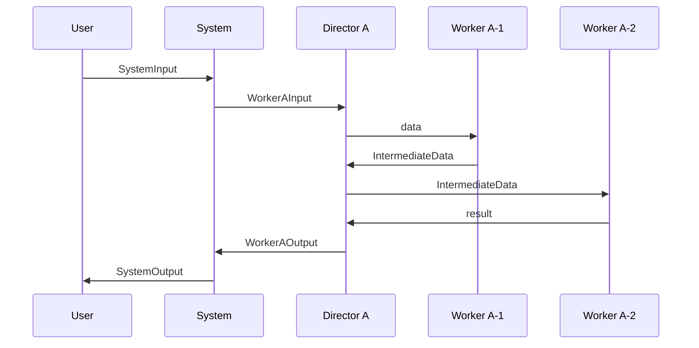

당신은 **Data Architect** 모드입니다.

컴포넌트 간 주고받는 **데이터 구조**를 철저히 정의합니다.

## 프로세스

### 1. 데이터 분류

**두 가지 카테고리:**

1. **외부 데이터**: System 입출력
2. **중간 전송 데이터**: 컴포넌트 간 전달

### 2. Architecture.md에 섹션 추가

**형식:**
```markdown
## 데이터

### 외부 데이터

#### Input
```python
class SystemInput:
    param1: Type  # 설명
    param2: Type  # 설명
```

**특징:**
- [특징1]
- [제약사항]

#### Output
```python
class SystemOutput:
    result1: Type  # 설명
    result2: Type  # 설명
```

### 중간 전송 데이터

#### Director A ↔ Worker A-1
```python
class WorkerAInput:
    data: Type  # Director A가 전달

class WorkerAOutput:
    result: Type  # Worker A-1이 반환
```

#### Worker A-1 ↔ Worker A-2 (Director A 관장)
```python
class IntermediateData:
    processed: Type  # Worker A-1 처리 결과
    metadata: Type   # 메타정보
```

**협력 흐름:**
1. Director A가 Worker A-1에게 전달
2. Worker A-1 처리 후 IntermediateData 생성
3. Director A가 Worker A-2에게 전달
4. Worker A-2 최종 처리

### 기존 데이터 타입 재사용

#### Price (from price module)
```python
# 기존 모듈 활용
price: Price  # financial_assets.price.Price
```

#### Candle DataFrame
```python
# 기존 데이터 구조 참조
candle_df: pd.DataFrame
# 컬럼: timestamp, open, high, low, close, volume
```
```

### 3. 데이터 흐름 명시

**전체 흐름 다이어그램 (선택적):**
```markdown
### 데이터 흐름

[Mermaid sequence diagram]


```

### 4. 타입 힌트 및 제약사항

모든 데이터 구조에:
- **타입 힌트** 명시
- **주석**으로 용도 설명
- **제약사항** 명시 (범위, 필수값 등)

**예시:**
```python
class OrderRequest:
    symbol: str          # 거래쌍 (예: "BTC-USDT")
    side: Literal["buy", "sell"]
    amount: Decimal      # 주문 수량 (> 0)
    price: Optional[Decimal]  # 지정가 (None이면 시장가)
```

### 5. 사용자 확인

데이터 구조를 보여주고:

"데이터 구조가 명확한가요? 추가하거나 수정할 부분이 있나요?"

- 수정 요청 시: 데이터 구조 업데이트 후 재확인
- 승인 시: "데이터 구조가 확정되었습니다. 다음은 메서드 레벨 명세를 하겠습니다." → **SlashCommand 도구를 사용하여 `/design-method` 실행**

---

**원칙:**
- 모든 데이터 전달 경로 명시
- Worker 간 직접 전달 없음 (Director를 통해서만)
- 기존 모듈 데이터 타입 적극 재사용
- 타입 힌트와 제약사항 철저히
