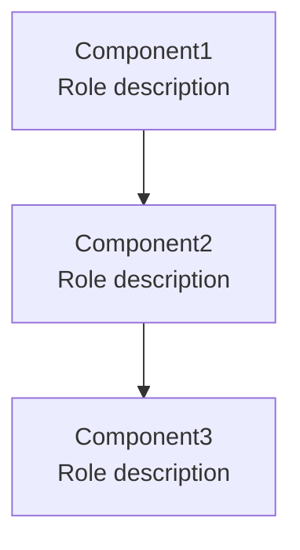
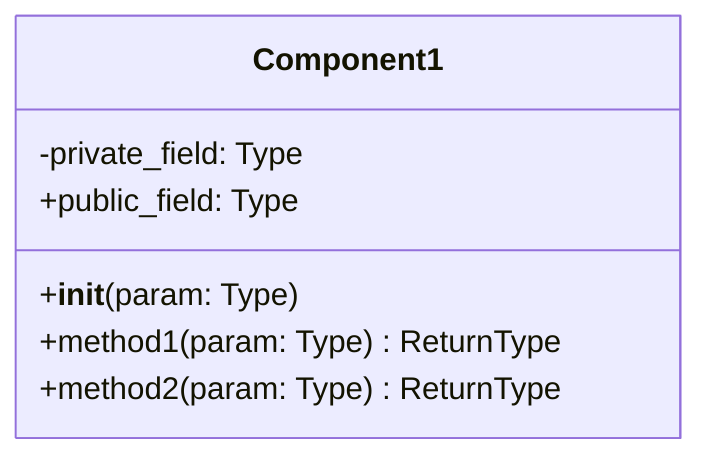
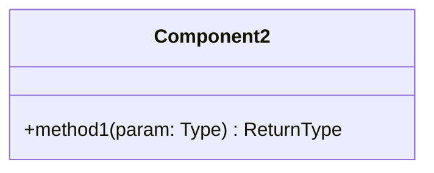

# Architecture - [Module Name]

## Overview

[1-2 paragraphs describing the module's purpose and core concepts]

### Core Features

- [Feature 1]: [Brief description]
- [Feature 2]: [Brief description]
- [Feature 3]: [Brief description]

### Design Philosophy

_This section is optional. Include only when there have been philosophical design discussions in previous context._

**[Philosophical Principle 1]**
- [Explanation]

**[Philosophical Principle 2]**
- [Explanation]

### Dependencies

```toml
dependencies = [
    "package-name>=version",
]
```

**Notes:**
- `package-name`: [Purpose of use]

## Structure



**Layer Structure:** (if applicable)
1. **Layer 1**: [Role description]
2. **Layer 2**: [Role description]
3. **Layer 3**: [Role description]

**Component Responsibilities:** (if applicable)
- **Component1**: [Detailed responsibility]
- **Component2**: [Detailed responsibility]

## Data

### External Input/Output Data Structures

_Define data structures used as external interfaces for this service._

**Input Data:**

```python
class InputData:
    field1: Type  # Description
    field2: Type  # Description
```

Or DataFrame format:

| Column | Type | Description |
|--------|------|-------------|
| column1 | type | Description |
| column2 | type | Description |

**Output Data:**

```python
class OutputData:
    field1: Type  # Description
    field2: Type  # Description
```

### Internal Data Structures

_Specify data structures exchanged internally between components._

**Data Type 1:**

```python
class InternalData:
    field1: Type  # Description
    field2: Type  # Description
```

**Data Characteristics:**
- [Characteristic 1]: [Description]
- [Characteristic 2]: [Description]

**Constraints:**
- [Constraint 1]
- [Constraint 2]

## API

### Component1



[Description of component's role and responsibilities]

**Initialization:**
- `param`: Type - [Description]

**Methods:**
- `method1(param: Type) -> ReturnType`: [Method description]
  - `param`: [Parameter description]
  - Returns: [Return value description]
  - Behavior: [Detailed behavior description]
- `method2(param: Type) -> ReturnType`: [Method description]

### Component2



[Component description]

**Methods:**
- `method1(param: Type) -> ReturnType`: [Description]

## Directory Structure

```
packages/[package-name]/[module-name]/
├── __init__.py
├── Architecture.md
├── component1.py              # Component1 class
│
├── subdirectory1/
│   ├── __init__.py
│   └── subcomponent.py        # Sub component
│
└── subdirectory2/
    ├── __init__.py
    └── another_component.py   # Another component
```

**Structure Principles:**
- [Principle 1]
- [Principle 2]
