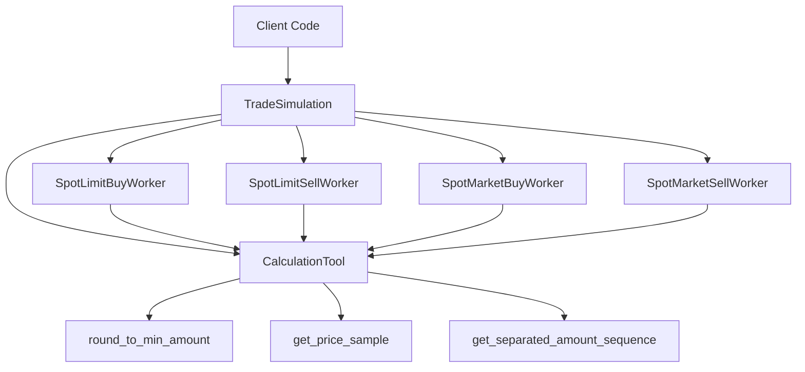

# Design: TradeSimulation System Implementation

## Architecture Overview



## Component Design

### CalculationTool

**책임**: 시뮬레이션에 필요한 수치 계산 제공

**메서드**:

1. `round_to_min_amount(amount: float, min_amount: float) -> float`
   - 최소 거래 단위의 배수로 내림
   - 예: amount=1.234, min_amount=0.01 → 1.23

2. `get_price_sample(min: float, max: float, mean: float, std: float, min_z: float = -2.0, max_z: float = 2.0) -> float`
   - 정규분포 N(mean, std)에서 샘플링
   - z-score를 [min_z, max_z]로 제한
   - 결과를 [min, max]로 클리핑
   - 용도: 체결가 생성, 슬리피지 시뮬레이션

3. `get_separated_amount_sequence(base: float, min_trade_amount: float, split_to: int) -> list[float]`
   - base를 split_to 개로 랜덤 분할
   - 각 조각은 min_trade_amount의 배수
   - 합계는 정확히 base (반올림 오차 마지막에 흡수)
   - 용도: 부분 체결, 분할 Trade 생성

**구현 상세**:
- numpy 사용 (정규분포, Dirichlet 분포)
- stateless (모든 메서드는 순수 함수)
- 입력 검증 포함 (음수, 0 체크)

### Worker Design Pattern

**공통 시그니처**: `__call__(order: SpotOrder, price: Price) -> List[SpotTrade]`

각 워커는 TradeSimulation 없이 독립적으로 동작할 수 있도록 설계하되, CalculationTool을 주입받아 사용합니다.

#### SpotLimitBuyWorker

**체결 로직**:

1. **가격 조건**: `price.c <= order.price`
2. **가격 범위 판단**:
   - Body: `price.bodybottom() <= order.price <= price.bodytop()`
   - Head: `price.bodytop() < order.price <= price.h`
   - Tail: `price.l <= order.price < price.bodybottom()`

3. **체결 전략**:
   - **Body**: 100% 전량 체결, 가격 = order.price
   - **Head/Tail**:
     - 30% → 체결 실패 (빈 리스트)
     - 30% → 전량 체결
     - 40% → 부분 체결 (1~3개 Trade)

4. **부분 체결 시**:
   - `calc_tool.get_separated_amount_sequence()`로 수량 분할
   - 각 Trade마다 독립적인 fill_id

#### SpotLimitSellWorker

**체결 로직**: LimitBuy와 유사하지만 가격 조건 반대
- **가격 조건**: `price.c >= order.price`
- 나머지는 LimitBuy와 동일

#### SpotMarketBuyWorker

**체결 로직**:

1. **항상 체결** (시장가는 무조건 체결)
2. **슬리피지**: Head 범위(`price.head_sample()`)에서 가격 샘플링
   - 매수는 상위 꼬리 → 불리한 가격
3. **분할 체결**: 1~3개 Trade로 랜덤 분할
4. **각 Trade마다 다른 가격** (head 범위 내 재샘플링)

#### SpotMarketSellWorker

**체결 로직**:

1. **항상 체결**
2. **슬리피지**: Tail 범위(`price.tail_sample()`)에서 가격 샘플링
   - 매도는 하위 꼬리 → 불리한 가격
3. **분할 체결**: 1~3개 Trade로 랜덤 분할
4. **각 Trade마다 다른 가격** (tail 범위 내 재샘플링)

### TradeSimulation Integration

**변경사항**:

1. `__init__`에서 CalculationTool 생성
2. 워커 생성 시 calc_tool 주입
3. `process()` 메서드에서 워커 호출 시 calc_tool 전달

**장점**:
- 워커는 계산 로직을 CalculationTool에 위임
- 테스트 시 mock calc_tool 주입 가능
- 워커 간 계산 로직 공유 및 일관성

## Data Flow

### Limit Order 처리 흐름

```
Client → TradeSimulation.process(order, price)
  ↓
TradeSimulation → worker(order, price)
  ↓
Worker:
  1. 가격 조건 확인
  2. 가격 범위 판단 (body/head/tail)
  3. 확률적 체결 결정
  4. 부분 체결 시:
     - calc_tool.get_separated_amount_sequence()
     - 각 조각마다 Trade 생성
  ↓
Return List[SpotTrade]
```

### Market Order 처리 흐름

```
Client → TradeSimulation.process(order, price)
  ↓
TradeSimulation → worker(order, price)
  ↓
Worker:
  1. 슬리피지 가격 샘플링 (head/tail)
  2. calc_tool.get_separated_amount_sequence()
  3. 각 조각마다:
     - 가격 재샘플링
     - Trade 생성
  ↓
Return List[SpotTrade]
```

## Trade-offs

### 확률 분포 선택

- **Limit Order 체결 확률**: 30/30/40 고정
  - 단순하고 예측 가능
  - 실제 시장 데이터 기반 조정 가능하도록 향후 파라미터화

- **분할 개수**: 1~3개 고정
  - 복잡도와 현실성의 균형
  - 대부분의 거래는 1~3번에 체결됨

### 슬리피지 모델

- **정규분포 사용**: 실제 호가창 분포와 유사
- **z-score 범위**: [-2, 2] → 95% 데이터 커버
- **클리핑**: [min, max] 범위 강제 → 극단값 방지

### 최소 거래 단위

- **내림 방식**: 거래소 규칙과 일치 (올림하면 주문 수량 초과)
- **잔여량 처리**: 마지막 조각에 추가하여 합계 보장

## Testing Strategy

1. **Unit Tests (각 컴포넌트)**:
   - CalculationTool: 각 메서드의 수학적 정확성
   - 각 Worker: 체결 로직, 확률 분포, 경계 조건

2. **Integration Tests**:
   - TradeSimulation과 워커 통합
   - Order → Trade 변환 end-to-end

3. **Property-based Tests**:
   - 체결 수량 합 = 주문 수량
   - 가격 범위 준수
   - 최소 거래 단위 준수

4. **Statistical Tests**:
   - 체결 확률 분포 검증 (30/30/40)
   - 분할 개수 분포 검증

## Migration Path

1. **Phase 1**: CalculationTool 구현 및 테스트
2. **Phase 2**: 각 Worker 개별 구현 및 테스트
3. **Phase 3**: TradeSimulation 통합
4. **Phase 4**: End-to-end 테스트

**하위 호환성**: 기존 인터페이스 유지 (SpotOrder, SpotTrade, Price)
