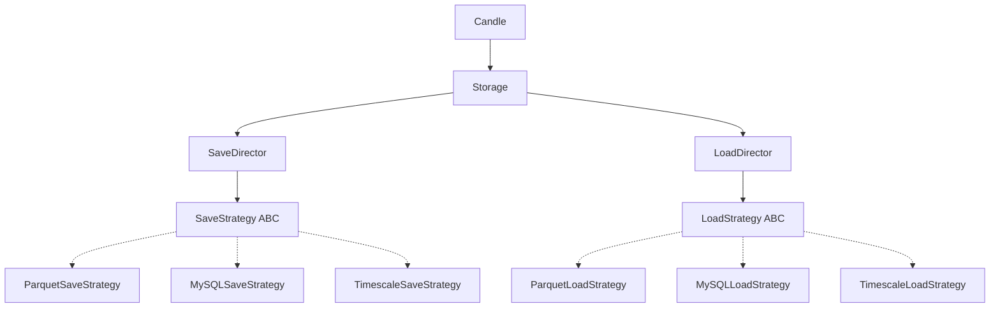

# Candle Storage Strategy 설계

## 개요

Candle 데이터의 저장/로드를 다양한 백엔드(Parquet, MySQL, TimescaleDB 등)에서 지원하기 위한 Strategy 패턴 기반 설계.

**핵심 원칙:**
- Save와 Load의 **책임 완전 분리**
- 각 Strategy가 독립적으로 전처리/후처리 수행
- Director가 Strategy를 조합하여 전체 흐름 관장

## 컴포넌트 다이어그램



## 책임 분리

### SaveDirector
- 저장 전체 흐름 관장
- SaveStrategy 선택 및 실행
- 공통 전처리 로직 (필요 시)

### LoadDirector
- 로드 전체 흐름 관장
- LoadStrategy 선택 및 실행
- Candle 객체 조립 (address + DataFrame)

### SaveStrategy (각 구현체)
**책임:**
- 백엔드별 데이터 전처리 (round, 타입 변환 등)
- 백엔드 특화 최적화 (tick 변환, 압축 등)
- 실제 저장 수행

**예시:**
- `ParquetSaveStrategy`: round(4) → tick 변환 → parquet 저장
- `MySQLSaveStrategy`: round(4) → DECIMAL 변환 → INSERT
- `TimescaleSaveStrategy`: round(4) → 압축 정책 설정 → INSERT

### LoadStrategy (각 구현체)
**책임:**
- 백엔드에서 데이터 조회
- 백엔드 특화 역변환 (tick→timestamp 등)
- DataFrame 반환

**예시:**
- `ParquetLoadStrategy`: parquet 읽기 → tick→timestamp 역변환
- `MySQLLoadStrategy`: SELECT 쿼리 → DataFrame 변환
- `TimescaleLoadStrategy`: SELECT 쿼리 → DataFrame 변환

## 인터페이스 설계

### SaveStrategy (ABC)
```python
class SaveStrategy(ABC):
    @abstractmethod
    def save(self, address: StockAddress, df: pd.DataFrame, basepath: str) -> None:
        """
        DataFrame을 저장

        Args:
            address: 자산 주소
            df: 저장할 DataFrame (원본, 전처리 필요)
            basepath: 저장 경로 (파일 기반 전략에서 사용)
        """
        pass
```

### LoadStrategy (ABC)
```python
class LoadStrategy(ABC):
    @abstractmethod
    def load(self, address: StockAddress, basepath: str) -> pd.DataFrame:
        """
        DataFrame 로드

        Args:
            address: 자산 주소
            basepath: 로드 경로 (파일 기반 전략에서 사용)

        Returns:
            로드된 DataFrame (timestamp 복원 완료)
        """
        pass
```

## 사용 흐름

### 저장
```python
candle = Candle(address, candle_df=df)
candle.save(strategy="parquet")  # 또는 "mysql", "timescale"

# 내부 흐름:
# Candle → Storage → SaveDirector → ParquetSaveStrategy
#   1. df.copy()
#   2. round(4)
#   3. tick 변환
#   4. parquet 저장
```

### 로드
```python
candle = Candle.load(address, strategy="parquet")

# 내부 흐름:
# Candle.load() → Storage → LoadDirector → ParquetLoadStrategy
#   1. parquet 읽기
#   2. tick → timestamp 역변환
#   3. DataFrame 반환
# → Candle 객체 조립 (address + df)
```

## Save/Load 분리의 장점

1. **책임 명확화**
   - Save: 전처리 + 저장 최적화
   - Load: 조회 + 역변환 + 객체 조립

2. **독립적 확장**
   - Save만 수정/추가 가능 (Load 영향 없음)
   - 각 전략의 테스트 독립성 확보

3. **안정성**
   - 저장 로직 변경이 로드에 영향 없음
   - 백엔드별 최적화 자유도 높음

## 트레이드오프

**장점:**
- 책임 명확, 안정성 높음
- 백엔드별 독립적 최적화 가능

**단점:**
- 구현 복잡도 증가 (Save/Load 각각 구현)
- 전략 추가 시 2개 클래스 작성 필요

→ **안정성과 확장성을 위해 복잡도 trade-off 수용**

## 의존성

### 현재 (Parquet 전략)
```toml
[project]
dependencies = [
    "pandas>=2.0.0",
    "pyarrow>=21.0.0"
]
```

**사용:**
- `pandas`: DataFrame 처리, timestamp/tick 변환
- `pyarrow`: Parquet 파일 읽기/쓰기, 메타데이터 관리

### 미래 확장 (DB 전략)

#### MySQL 전략
```toml
[project.optional-dependencies]
mysql = [
    "pymysql>=1.1.0",
    "sqlalchemy>=2.0.0"
]
```

#### TimescaleDB/PostgreSQL 전략
```toml
[project.optional-dependencies]
timescale = [
    "psycopg2-binary>=2.9.0",
    "sqlalchemy>=2.0.0"
]
```

#### 설치 예시
```bash
# Parquet만 (기본)
pip install financial-assets

# MySQL 지원
pip install financial-assets[mysql]

# TimescaleDB 지원
pip install financial-assets[timescale]

# 전체
pip install financial-assets[mysql,timescale]
```

### 의존성 격리 원칙

- **코어**: Parquet 전략만 기본 포함
- **옵셔널**: DB 전략은 사용자 선택 설치
- **전략 로딩**: 런타임에 import 실패 시 해당 전략 비활성화

**예시:**
```python
try:
    import pymysql
    HAS_MYSQL = True
except ImportError:
    HAS_MYSQL = False

# Candle.save(strategy="mysql") 호출 시
# HAS_MYSQL=False면 에러 메시지 + 설치 안내
```
