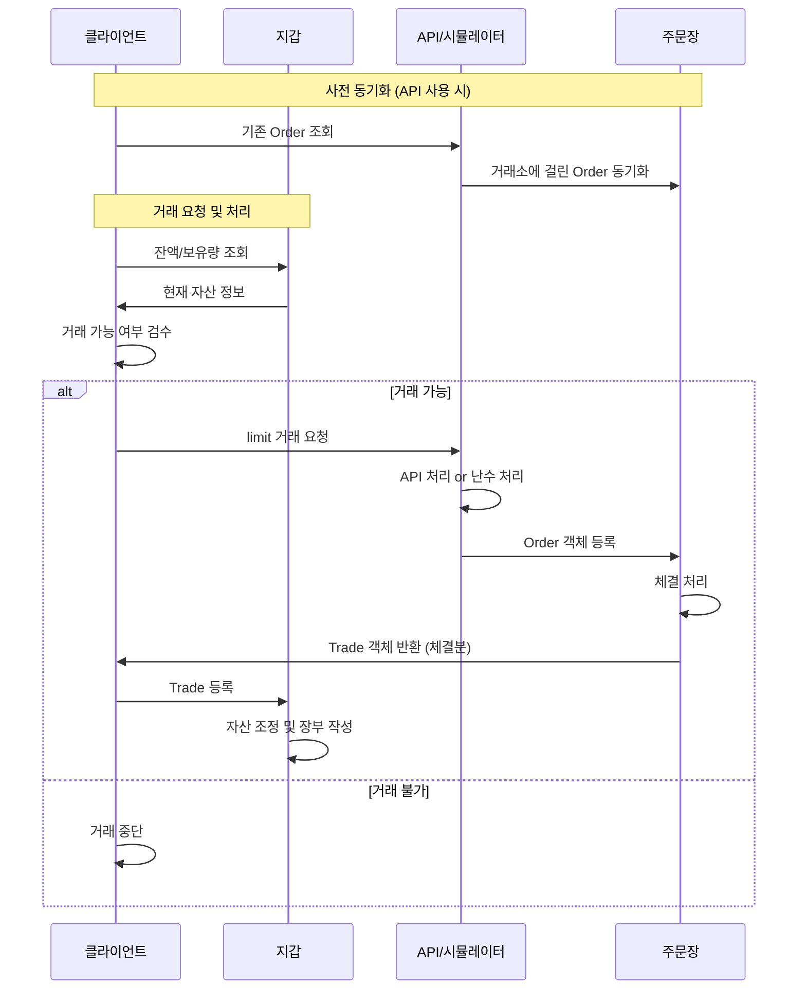
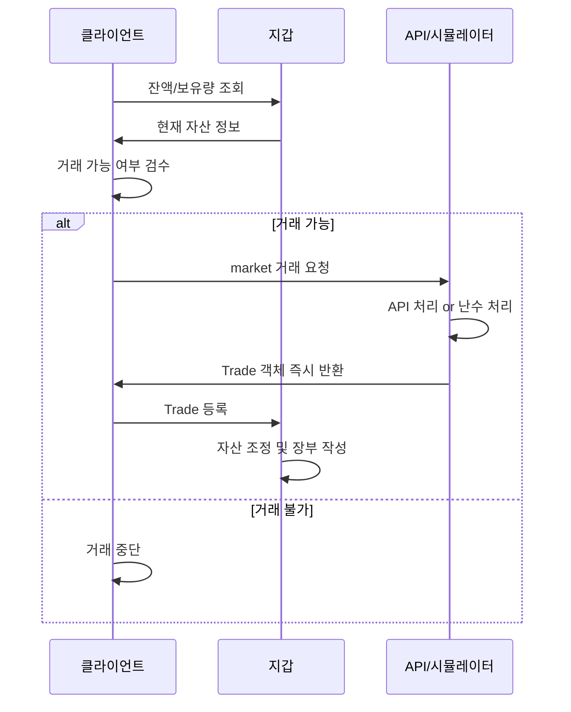

# Architecture - Trading Sim

financial-assets 패키지의 거시적 방향성을 정하는 문서.

## 단일 마켓 시뮬레이션

전체 마켓 시뮬레이션을 위한 단위 시뮬레이션 인터페이스. 하나의 마켓에서 발생하는 거래를 시뮬레이션하는 기본 빌딩블록 역할을 한다.

### 지정가 거래 처리 흐름

### 시장가 거래 처리 흐름

