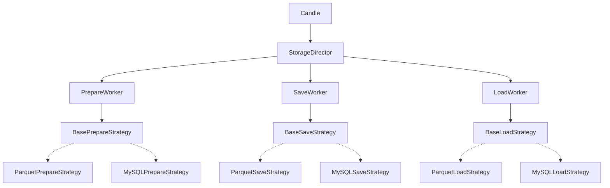
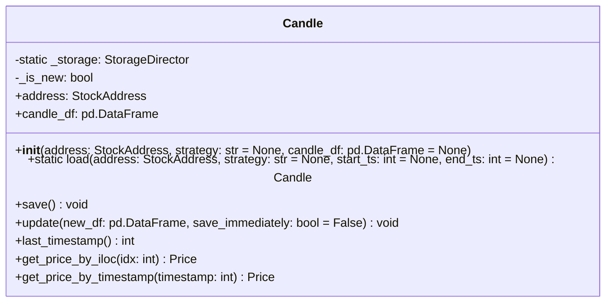

# Architecture - Candle

## 개요

금융 시계열 데이터(캔들스틱)를 효과적으로 저장/로드/업데이트하는 빌딩블록 모듈.

**자산 주소 규칙**: `archetype-exchange-tradetype-base-quote-timeframe`
- 예: `stock-nyse-spot-tsla-usd-1d`

### 목적

캔들 데이터를 쉽게 저장/로드/업데이트할 수 있는 **목적성 있는 인터페이스** 제공.

**핵심 기능:**
- `save()`: 데이터 저장 (저장소 준비 + 마지막 row 교체 + 신규 추가)
- `load(start_ts, end_ts)`: 범위 조회
- `update(new_df, save_immediately)`: 온메모리 병합 (선택적 즉시 저장)

**데이터 특성:**
- 캔들 데이터는 마지막 row를 제외하면 불변
- 대용량 데이터의 경우 부분 로드 필요
- 사용자가 on-memory vs 부분 로드 선택

### 설계 전략

**Strategy 패턴**
- 저장소 백엔드(Parquet, MySQL 등)를 전략으로 분리
- 각 전략이 데이터 크기/특성에 맞게 최적화
- 전략 선택: `.env` 환경변수 또는 명시적 지정

**데이터 최적화**
- HLOCV 값: 소수점 4자리 round
- 타임스탬프: 백엔드별 최적화 (Parquet은 tick 변환)
- 성능 우선순위: **속도 > 저장용량**

### 의존성

```toml
dependencies = [
    "pandas>=2.0.0",
    "pyarrow>=21.0.0",
    "python-dotenv>=1.0.0"
]
```

## 구조



**레이어 구조:**
1. **Candle**: 사용자 인터페이스
2. **StorageDirector**: 전략 선택 및 Worker 관리
3. **Worker**: 각 작업(prepare/save/load) 흐름 관장
4. **Strategy**: 백엔드별 구현 (현재 Parquet만, 미래 MySQL 등)

## 데이터

(작성 예정)

## API

### Candle



캔들 데이터의 저장/로드/업데이트 인터페이스.

**초기화**
- `address`: StockAddress 객체 (필수)
- `strategy`: 저장소 전략 ("parquet", "mysql" 등)
  - `None`이면 환경변수 `FA_CANDLE_STORAGE_STRTG` 사용 (기본값: "parquet")
- `candle_df`: 캔들 데이터 DataFrame
- `_is_new`: 내부 플래그 (True: 저장소 준비 필요, False: 기존 저장소 사용)

**메서드**
- `load(address, strategy, start_ts, end_ts)` (static): 캔들 데이터 로드
  - `start_ts`, `end_ts`: 선택적 범위 조회 (백엔드 지원 시)
  - 로드 후 `_is_new=False` 설정
- `save()`: 현재 candle_df 저장
  - `_is_new=True`면 PrepareStrategy 먼저 실행
  - SaveStrategy로 데이터 저장 (마지막 row 교체 + 신규 추가)
  - 저장 후 `_is_new=False` 설정
- `update(new_df, save_immediately)`: 온메모리 병합
  - candle_df에 new_df 병합 (마지막 row 교체 + 신규 추가)
  - `save_immediately=True`면 자동으로 `save()` 호출
- `last_timestamp()`: 마지막 타임스탬프 반환
- `get_price_by_iloc(idx)`: 인덱스로 Price 조회
- `get_price_by_timestamp(timestamp)`: 타임스탬프로 Price 조회

### StorageDirector

전략 선택 및 Worker 관리.

**책임:**
- 환경변수/파라미터에서 전략 결정
- 전략별 Worker 인스턴스 생성 및 캐싱
- Candle 요청을 적절한 Worker로 라우팅

### PrepareWorker / SaveWorker / LoadWorker

각 작업의 흐름 관장.

**책임:**
- Strategy 실행
- 공통 전처리/후처리 (필요 시)
- 오류 처리

### BasePrepareStrategy

```python
class BasePrepareStrategy(ABC):
    @abstractmethod
    def prepare(self, address: StockAddress) -> None:
        """저장소 준비 (생성, 스키마 확인 등)"""
        pass
```

**ParquetPrepareStrategy:**
- 디렉토리 생성 (`basepath` 확인 및 생성)

**MySQLPrepareStrategy:**
- 테이블 생성 (`CREATE TABLE IF NOT EXISTS candles`)

### BaseSaveStrategy

```python
class BaseSaveStrategy(ABC):
    @abstractmethod
    def save(self, address: StockAddress, df: pd.DataFrame) -> None:
        """데이터 저장 (마지막 row 교체 + 신규 추가)"""
        pass
```

**ParquetSaveStrategy:**
- 기존 파일 로드 (있으면)
- 마지막 row 제거
- round(4) 전처리
- new_df 병합
- tick 변환
- parquet 전체 재저장

**MySQLSaveStrategy:**
- 마지막 timestamp 조회
- 해당 row DELETE
- round(4) 전처리
- new_df INSERT

### BaseLoadStrategy

```python
class BaseLoadStrategy(ABC):
    @abstractmethod
    def load(self, address: StockAddress, start_ts: int = None, end_ts: int = None) -> pd.DataFrame:
        """데이터 로드 (범위 조회 선택적)"""
        pass
```

**ParquetLoadStrategy:**
- parquet 파일 로드
- tick → timestamp 역변환
- start_ts/end_ts 무시 (전체 로드, 경고 출력)

**MySQLLoadStrategy:**
- DB SELECT 쿼리 (WHERE timestamp BETWEEN start_ts AND end_ts)
- DataFrame 변환


## 환경변수

### FA_CANDLE_STORAGE_STRTG

저장소 전략 선택. 기본값: `"parquet"`

**설정:**
```bash
# .env 파일
FA_CANDLE_STORAGE_STRTG=parquet
```

**동작:**
- `.env` 파일이 없거나 키가 없으면 자동 생성 및 추가
- Candle 초기화 시 `strategy=None`이면 이 값 사용

**사용 예시:**
```python
# 환경변수 사용
candle = Candle(address)  # FA_CANDLE_STORAGE_STRTG 값 사용

# 명시적 지정
candle = Candle(address, strategy="mysql")  # 환경변수 무시
```
