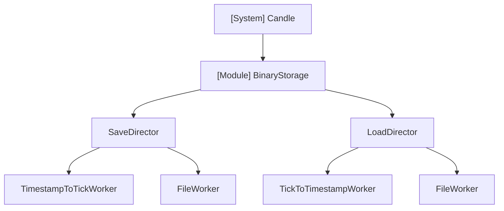
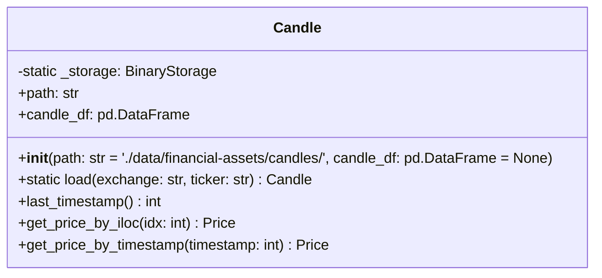
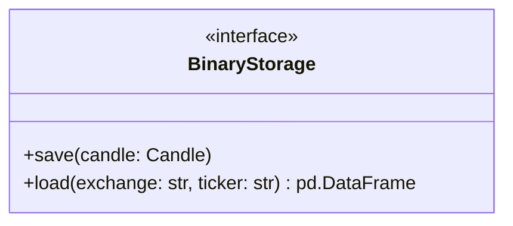

# Architecture - Candle

## 개요

금융 시계열 데이터(캔들스틱)를 효과적으로 저장하고 로드하는 빌딩블록 모듈.

### 목적

캔들 데이터의 효율적인 저장 및 로딩에 초점을 둔다. 성능 우선순위는 **속도 > 저장용량**이다.

### 설계 전략

**데이터 최적화**
- HLOCV 값: 소수점 4자리로 round 처리하여 저장
  - 정밀도 손실 최소화
  - 속도와 저장용량 모두 개선

**타임스탬프 처리**
- 단위화(예: tick 변환)를 통해 저장용량 절감
- 벡터 연산으로 단위 변환의 추가 시간 소모 최소화
- 속도와 저장용량 성능 모두 추구

**저장 형식**
- parquet 형식 사용 (압축 및 칼럼형 저장)

### 의존성

- pandas

## 구조

## 데이터

(작성 예정)

## API

### Candle

엔트리포인트이자 인터페이스 역할.

**초기화**
- 작업 폴더 위치 지정 가능
- 기본값: `'./data/financial-assets/candles/'` (프로젝트 루트 기준)
- 첫 인스턴스 생성 시 클래스 변수 `_storage` 자동 생성 (모든 인스턴스가 공유)

**메서드**
- `load(exchange: str, ticker: str)` (static): 캔들 데이터 로드
- `last_timestamp()`: 마지막 타임스탬프 반환
- `get_price_by_iloc(idx: int)`: 인덱스로 Price 객체 조회
- `get_price_by_timestamp(timestamp: int)`: 타임스탬프로 Price 객체 조회

### BinaryStorage

저장 및 로드 로직을 담당하는 인터페이스. 의존성 역전을 통해 구현체를 주입받아 사용.

#### SaveDirector

(작성 예정)

##### TimestampToTickWorker

(작성 예정)

##### FileWorker

(작성 예정)

#### LoadDirector

(작성 예정)

##### TickToTimestampWorker

(작성 예정)

##### FileWorker

(작성 예정)
