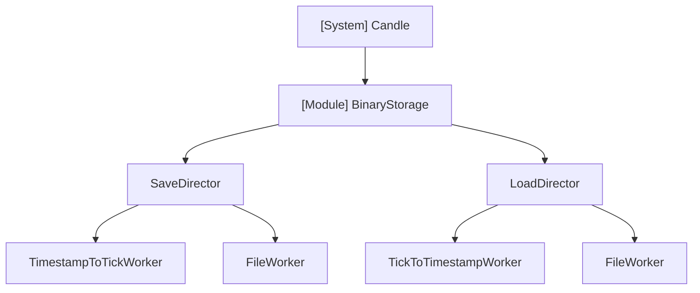
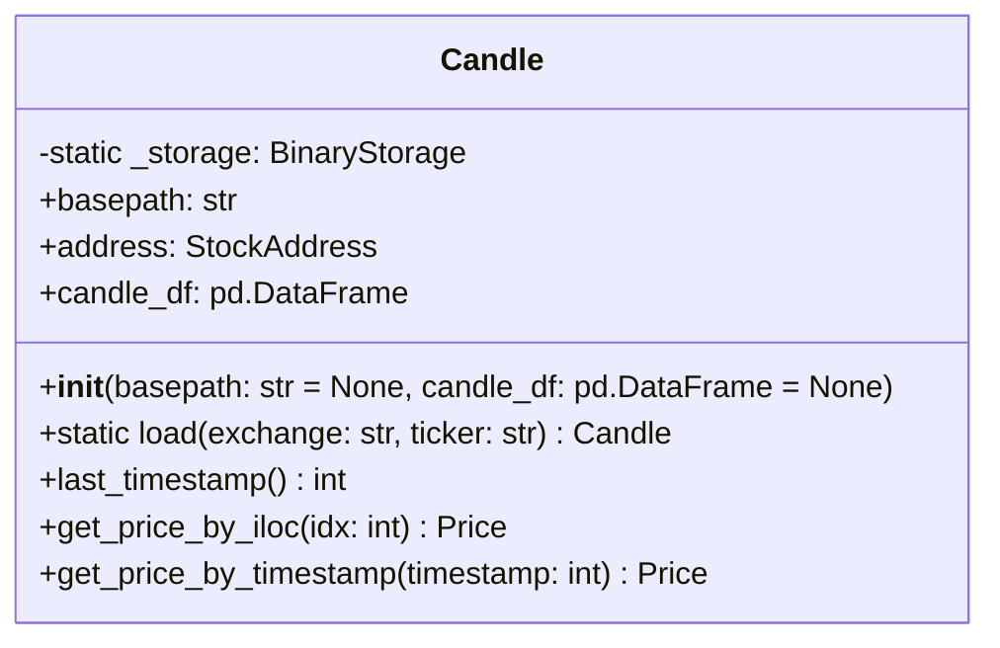
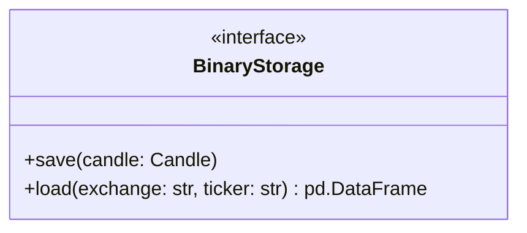
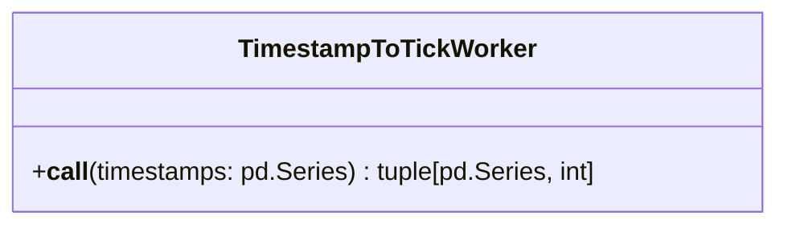
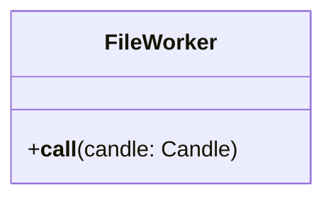
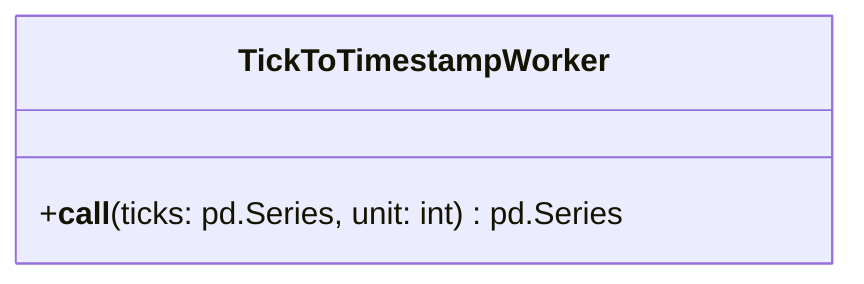
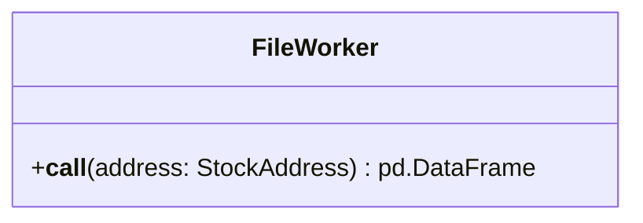

# Architecture - Candle

## 개요

금융 시계열 데이터(캔들스틱)를 효과적으로 저장하고 로드하는 빌딩블록 모듈.

**파일 네이밍 규칙**: `archetype-exchange-tradetype-base-quote-timeframe`
- 예: `stock-nyse-spot-tsla-usd-1d`

### 목적

캔들 데이터의 효율적인 저장 및 로딩에 초점을 둔다. 성능 우선순위는 **속도 > 저장용량**이다.

### 설계 전략

**데이터 최적화**
- HLOCV 값: 소수점 4자리로 round 처리하여 저장
  - 정밀도 손실 최소화
  - 속도와 저장용량 모두 개선

**타임스탬프 처리**
- 단위화(예: tick 변환)를 통해 저장용량 절감
- 벡터 연산으로 단위 변환의 추가 시간 소모 최소화
- 속도와 저장용량 성능 모두 추구

**저장 형식**
- parquet 형식 사용 (압축 및 칼럼형 저장)

### 의존성

- pandas

## 구조

## 데이터

(작성 예정)

## API

### Candle

엔트리포인트이자 인터페이스 역할.

**초기화**
- `basepath`: 작업 폴더 위치 지정 가능
  - 기본값 `None`일 경우 내부에서 `'./data/financial-assets/candles/'`로 설정 (프로젝트 루트 기준)
- 첫 인스턴스 생성 시 클래스 변수 `_storage` 자동 생성 (모든 인스턴스가 공유)

**메서드**
- `load(exchange: str, ticker: str)` (static): 캔들 데이터 로드
- `last_timestamp()`: 마지막 타임스탬프 반환
- `get_price_by_iloc(idx: int)`: 인덱스로 Price 객체 조회
- `get_price_by_timestamp(timestamp: int)`: 타임스탬프로 Price 객체 조회

### BinaryStorage

저장 및 로드 로직을 담당하는 인터페이스. 의존성 역전을 통해 구현체를 주입받아 사용.

#### SaveDirector

(작성 예정)

##### TimestampToTickWorker

타임스탬프를 틱 단위로 변환하여 저장용량 절감.

**변환 로직**
1. timestamp의 diff 계산
2. unique 값만 추출
3. 최대공약수를 계산하여 unit으로 사용
4. timestamp 전체를 unit으로 나눈 몫을 tick으로 변환

**메서드**
- `__call__(timestamps: pd.Series)`: 타임스탬프 Series를 틱 Series와 unit으로 변환
  - 반환: `(ticks: pd.Series, unit: int)`

##### FileWorker

전달받은 Candle 객체를 parquet 형식으로 저장.

**메서드**
- `__call__(candle: Candle)`: Candle 객체의 DataFrame을 파일로 저장
  - 파일명: `candle.address.to_filename() + ".parquet"`
  - 저장 경로: `candle.basepath`

#### LoadDirector

(작성 예정)

##### TickToTimestampWorker

틱 단위를 타임스탬프로 역변환.

**메서드**
- `__call__(ticks: pd.Series, unit: int)`: 틱 Series를 타임스탬프 Series로 변환
  - `ticks`: 틱 단위로 저장된 시간 데이터
  - `unit`: 틱 변환 단위 (예: 밀리초 단위)

##### FileWorker

StockAddress를 기반으로 parquet 파일을 읽어 DataFrame 반환.

**메서드**
- `__call__(address: StockAddress)`: 파일에서 DataFrame 로드
  - 파일명: `address.to_filename() + ".parquet"`
  - 로드 경로: `basepath` (LoadDirector에서 주입)
