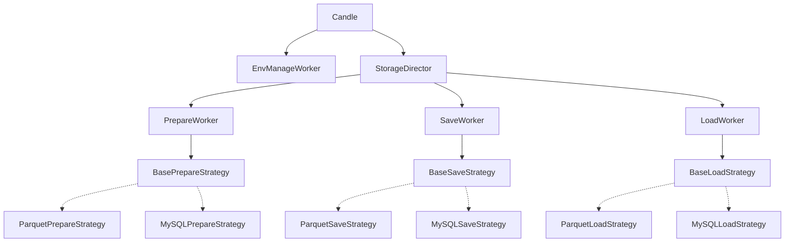
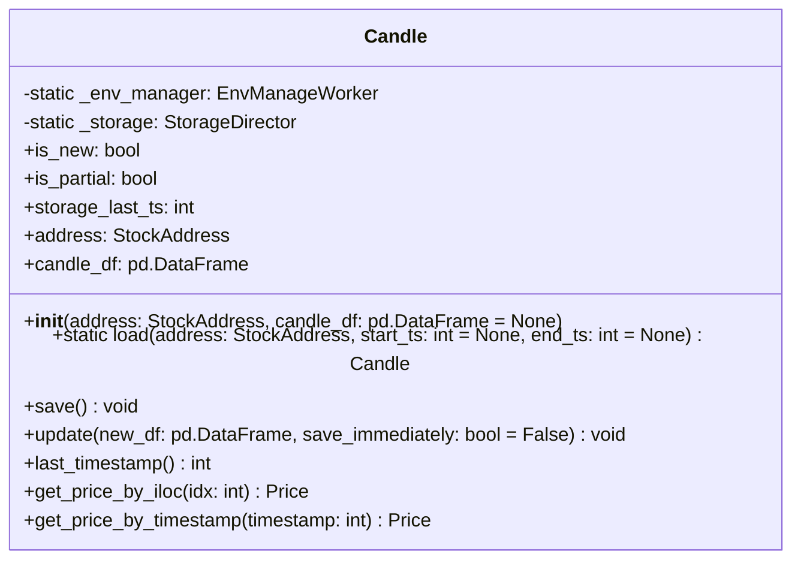
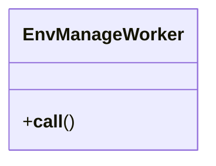
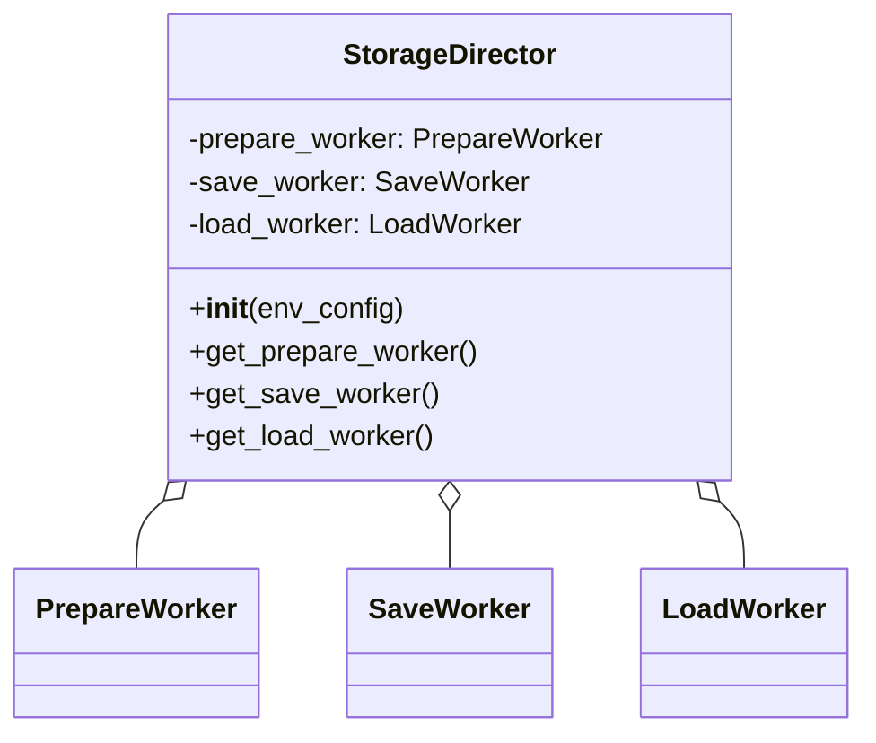
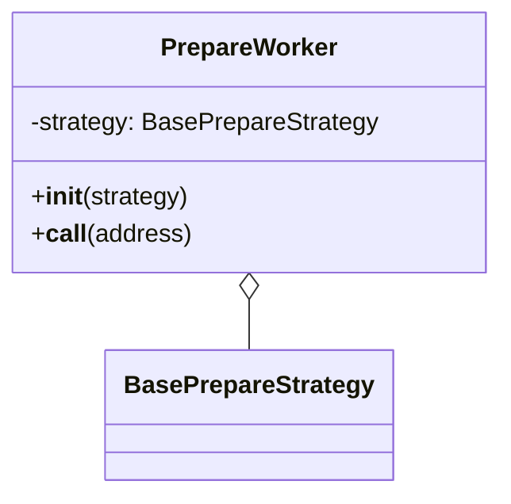
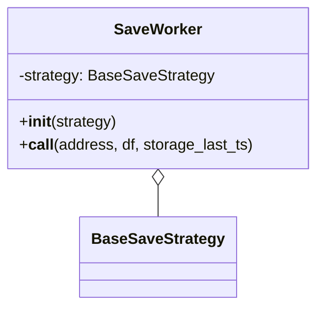
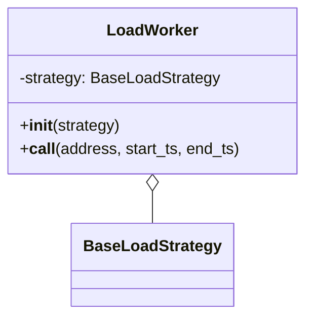
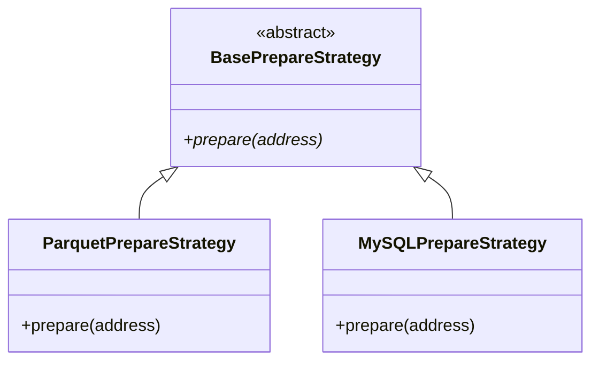
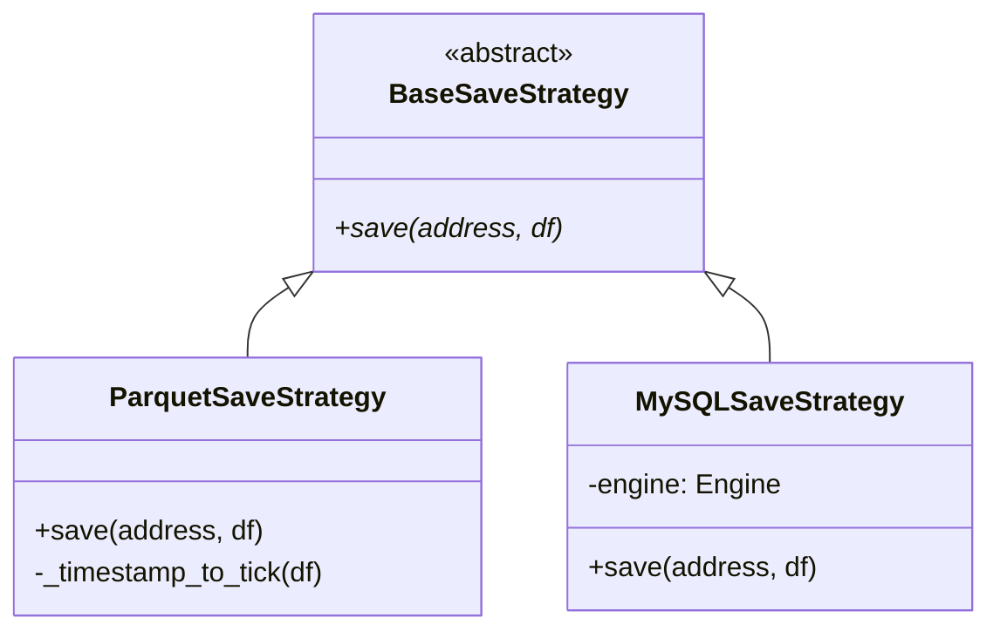
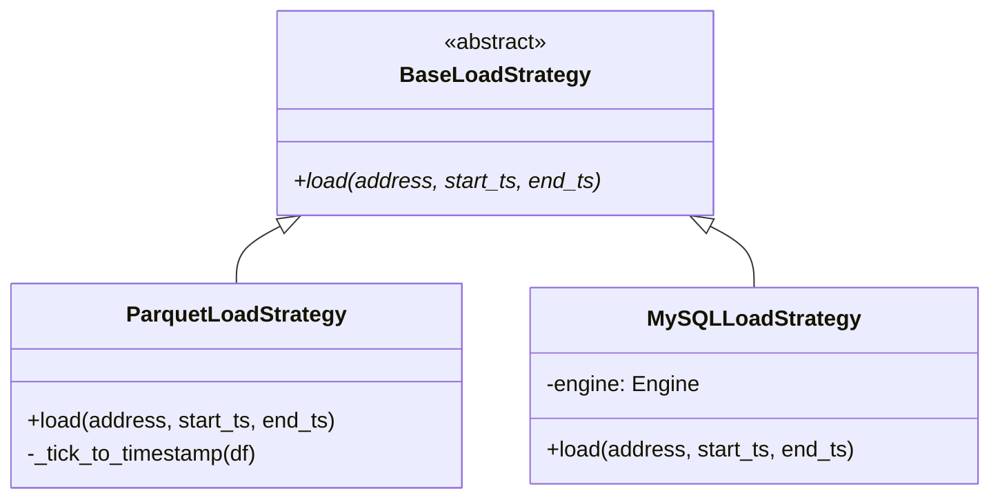

# Architecture - Candle

## 개요

금융 시계열 데이터(캔들스틱)를 효과적으로 저장/로드/업데이트하는 빌딩블록 모듈.

**자산 주소 규칙**: `archetype-exchange-tradetype-base-quote-timeframe`
- 예: `stock-nyse-spot-tsla-usd-1d`

### 목적

캔들 데이터를 쉽게 저장/로드/업데이트할 수 있는 **목적성 있는 인터페이스** 제공.

**핵심 기능:**
- `save()`: 데이터 저장 (저장소 준비 + 마지막 row 교체 + 신규 추가)
- `load(start_ts, end_ts)`: 범위 조회
- `update(new_df, save_immediately)`: 온메모리 병합 (선택적 즉시 저장)

**데이터 특성:**
- 캔들 데이터는 마지막 row를 제외하면 불변
- 대용량 데이터의 경우 부분 로드 필요
- 사용자가 on-memory vs 부분 로드 선택

### 설계 전략

**Strategy 패턴**
- 저장소 백엔드(Parquet, MySQL 등)를 전략으로 분리
- 각 전략이 데이터 크기/특성에 맞게 최적화
- 전략 선택: `.env` 환경변수 또는 명시적 지정

**데이터 최적화**
- HLOCV 값: 소수점 4자리 round
- 타임스탬프: 백엔드별 최적화 (Parquet은 tick 변환)
- 성능 우선순위: **속도 > 저장용량**

### 의존성

```toml
dependencies = [
    "pandas>=2.0.0",
    "pyarrow>=21.0.0",
    "python-dotenv>=1.0.0",
    "sqlalchemy>=2.0.0",
    "pymysql>=1.0.0"
]
```

**참고:**
- `sqlalchemy`: DB connection pool, transaction 관리
- `pymysql`: SQLAlchemy의 MySQL driver (순수 Python, 가볍고 안정적)

## 구조



**레이어 구조:**
1. **Candle**: 사용자 인터페이스
2. **EnvManageWorker**: 환경변수 관리 (전처리, 자동 생성)
3. **StorageDirector**: 전략 선택 및 Worker 관리
4. **Worker**: 각 작업(prepare/save/load) 흐름 관장
5. **Strategy**: 백엔드별 구현 (현재 Parquet만, 미래 MySQL 등)

**작업별 책임:**
- **prepare**: 저장소(파일, db+table) 존재 확인 및 없으면 생성
- **save**: 마지막 타임스탬프 캔들은 새 값으로 업데이트, 이후 값은 저장
- **load**: address를 받아서 start, end까지 데이터 로드해 반환

## 데이터

### DataFrame 스키마

캔들 데이터는 pandas DataFrame으로 표현되며, 다음 컬럼을 순서대로 가진다:

| 컬럼명 | 타입 | 설명 |
|--------|------|------|
| timestamp | int | 캔들의 타임스탬프 (millisecond 기준) |
| high | float | 고가 (소수점 4자리까지) |
| low | float | 저가 (소수점 4자리까지) |
| open | float | 시가 (소수점 4자리까지) |
| close | float | 종가 (소수점 4자리까지) |
| volume | float | 거래량 |

**데이터 최적화:**
- HLOCV 값: `round(4)` 적용하여 소수점 4자리까지만 저장
- timestamp: int 타입 (Parquet 저장 시 tick으로 변환하여 저장 용량 최적화)

### Timestamp ↔ Tick 변환 (Parquet 전용)

Parquet 저장 시 저장 용량을 극단적으로 줄이기 위해 timestamp를 tick으로 변환한다.

**변환 로직 (timestamp → tick):**
1. timestamp의 diff(차이값) 계산
2. unique diff 값들의 최대공약수(GCD)를 계산하여 `unit`으로 저장
3. 모든 timestamp를 `unit`으로 나눈 몫을 `tick`으로 변환
4. `tick` 컬럼과 `unit` 메타데이터를 함께 저장

**역변환 로직 (tick → timestamp):**
- `timestamp = tick * unit`

**효과:**
- 예: timestamp [1704067200000, 1704153600000, ...] (13자리)
- → tick [1, 2, 3, ...] (1-3자리) + unit=86400000
- 저장 용량 대폭 감소 (특히 일정한 간격의 시계열 데이터)

**저장 방식:**
- `unit` 값은 Parquet 파일의 metadata에 저장
- 로드 시 metadata에서 unit을 읽어 역변환

## API

### Candle



캔들 데이터의 저장/로드/업데이트 인터페이스.

**클래스 변수:**
- `_env_manager`: EnvManageWorker 인스턴스 (클래스 변수로 모든 Candle 인스턴스가 하나의 EnvManageWorker 객체를 공유)
- `_storage`: StorageDirector 인스턴스 (클래스 변수로 모든 Candle 인스턴스가 하나의 StorageDirector 객체를 공유)
  - 최초 사용 시 `_env_manager()`를 통해 환경변수에서 저장소 전략 읽어서 초기화
  - 이후 모든 Candle 인스턴스가 동일한 StorageDirector 사용

**초기화**
- `address`: StockAddress 객체 (필수)
- `candle_df`: 캔들 데이터 DataFrame
- `is_new`: 저장소 준비 여부 플래그 (True: 저장소 준비 필요, False: 기존 저장소 사용, save() 후 False로 변경)
- `is_partial`: 부분 로드 여부 플래그 (True: start_ts로 일부 로드, False: 최초 시작부터 전체 로드)
- `storage_last_ts`: 저장소에 기록된 마지막 타임스탬프 (None: 저장소 비어있음, int: 마지막 타임스탬프 값)

**메서드**
- `load(address, start_ts, end_ts)` (static): 캔들 데이터 로드
  - `start_ts`, `end_ts`: 선택적 범위 조회 (백엔드 지원 시)
  - 저장소 전략은 EnvManageWorker가 환경변수에서 자동으로 결정
  - 로드 후 `is_new=False`, `is_partial=(start_ts is not None)`, `storage_last_ts=로드된 마지막 타임스탬프` 설정
- `save()`: 현재 candle_df 저장
  - `is_new=True`면 PrepareStrategy 먼저 실행
  - SaveStrategy로 데이터 저장 (storage_last_ts와 candle_df를 비교해 중복 제거 후 저장)
  - 저장 후 `is_new=False`, `storage_last_ts=candle_df 마지막 타임스탬프` 설정
- `update(new_df, save_immediately)`: 온메모리 병합
  - new_df의 timestamp와 기존 candle_df의 timestamp 비교
  - 기존 timestamp와 일치하는 row는 new_df 값으로 업데이트
  - 신규 timestamp는 row 추가
  - 구현: timestamp 기준으로 정렬 및 중복 제거
  - `save_immediately=True`면 자동으로 `save()` 호출
- `last_timestamp()`: 마지막 타임스탬프 반환
- `get_price_by_iloc(idx)`: 인덱스로 Price 조회
- `get_price_by_timestamp(timestamp)`: 타임스탬프로 Price 조회

### EnvManageWorker

환경변수 관리 전담. Candle 초기화 과정에서 필요한 환경변수 준비, 로드하여 반환한다.



**환경변수:**
- `FA_CANDLE_STORAGE_STRTG`: 저장소 전략 (기본값: `"parquet"`)

**조건부 환경변수 (Parquet 전략 사용 시):**
- `FA_CANDLE_STORAGE_PARQUET_BASEPATH`: Parquet 파일 저장 경로 (기본값: `"./data/fa_candles/"`)

**조건부 환경변수 (MySQL 전략 사용 시):**
- `FA_CANDLE_STORAGE_MYSQL_HOST`: MySQL 호스트 (기본값: `"localhost"`)
- `FA_CANDLE_STORAGE_MYSQL_PORT`: MySQL 포트 (기본값: `3306`)
- `FA_CANDLE_STORAGE_MYSQL_DBNAME`: MySQL DB명 (기본값: `"fa$candles"`)
- `FA_CANDLE_STORAGE_MYSQL_USERNAME`: MySQL 사용자명 (기본값: `"root"`)
- `FA_CANDLE_STORAGE_MYSQL_PASSWORD`: MySQL 비밀번호 (기본값: `""`)

**메서드:**
- `__call__() -> dict`: 환경변수를 준비, 로드하여 dict로 반환

### StorageDirector

전략 선택 및 Worker 관리. 환경변수 기반으로 적절한 전략의 Worker를 생성하고 캐싱한다.



**Worker 관리 방식:**
- `__init__`에서 env_config의 strategy 값에 따라 적절한 Strategy 인스턴스 생성
- 생성된 Strategy를 각 Worker 생성자에 주입(Constructor Injection)
- Worker 인스턴스를 멤버 변수로 캐싱

**메서드:**
- `__init__(env_config: dict) -> None`: 환경변수 설정으로 초기화
- `get_prepare_worker() -> PrepareWorker`: PrepareWorker 인스턴스 반환 (캐싱)
- `get_save_worker() -> SaveWorker`: SaveWorker 인스턴스 반환 (캐싱)
- `get_load_worker() -> LoadWorker`: LoadWorker 인스턴스 반환 (캐싱)

### PrepareWorker

저장소 준비 작업 흐름 관장. Strategy를 실행하여 저장소를 준비한다.



**메서드:**
- `__init__(strategy: BasePrepareStrategy) -> None`: Strategy 주입받아 초기화
- `__call__(address: StockAddress) -> None`: 저장소 준비 실행 (내부에서 strategy.prepare 호출)

### SaveWorker

데이터 저장 작업 흐름 관장. Strategy를 실행하여 데이터를 저장한다.



**메서드:**
- `__init__(strategy: BaseSaveStrategy) -> None`: Strategy 주입받아 초기화
- `__call__(address: StockAddress, df: pd.DataFrame, storage_last_ts: int = None) -> None`: 데이터 저장 실행 (내부에서 strategy.save 호출)

### LoadWorker

데이터 로드 작업 흐름 관장. Strategy를 실행하여 데이터를 로드한다.



**메서드:**
- `__init__(strategy: BaseLoadStrategy) -> None`: Strategy 주입받아 초기화
- `__call__(address: StockAddress, start_ts: int = None, end_ts: int = None) -> pd.DataFrame`: 데이터 로드 및 반환 (내부에서 strategy.load 호출)

### BasePrepareStrategy

저장소 준비 전략의 추상 클래스. 전략별로 저장소를 준비한다.



**메서드:**
- `prepare(address: StockAddress) -> None`: 저장소 준비

**구현체:**
- **ParquetPrepareStrategy**: 디렉토리 생성 (`basepath` 확인 및 생성)
- **MySQLPrepareStrategy**: 테이블 생성

**MySQL 테이블 스키마:**
```sql
CREATE TABLE IF NOT EXISTS {table_name} (
    timestamp BIGINT NOT NULL,
    high DECIMAL(13, 4) NOT NULL,
    low DECIMAL(13, 4) NOT NULL,
    open DECIMAL(13, 4) NOT NULL,
    close DECIMAL(13, 4) NOT NULL,
    volume DOUBLE NOT NULL,
    PRIMARY KEY (timestamp)
);
```
- `table_name`: `StockAddress.to_tablename()`로 생성
- PRIMARY KEY로 timestamp 중복 방지

### BaseSaveStrategy

데이터 저장 전략의 추상 클래스. 마지막 row 교체 및 신규 데이터를 추가한다.



**메서드:**
- `save(address: StockAddress, df: pd.DataFrame, storage_last_ts: int = None) -> None`: 데이터 저장

**구현체:**
- **ParquetSaveStrategy**:
  - `storage_last_ts=None` (초기 저장): 파일 존재 시 예외 발생, 없으면 round(4) 전처리 → tick 변환 (metadata에 unit 저장) → parquet 저장
  - `storage_last_ts` 있음: 기존 파일 로드 → storage_last_ts 이상 데이터 제거 → round(4) 전처리 → df에서 storage_last_ts 이상만 필터링 → 병합 → tick 변환 → parquet 재저장
- **MySQLSaveStrategy**:
  - `storage_last_ts=None` (초기 저장): round(4) 전처리 → 전체 df INSERT (SQLAlchemy transaction)
  - `storage_last_ts` 있음: storage_last_ts 이상 데이터 DELETE → round(4) 전처리 → df에서 storage_last_ts 이상만 필터링 → INSERT (SQLAlchemy transaction)

### BaseLoadStrategy

데이터 로드 전략의 추상 클래스. 저장소에서 데이터를 로드하여 반환한다.



**메서드:**
- `load(address: StockAddress, start_ts: int = None, end_ts: int = None) -> pd.DataFrame`: 데이터 로드 및 반환 (start_ts 이상, end_ts 미만)

**구현체:**
- **ParquetLoadStrategy**: parquet 파일 로드 → metadata에서 unit 읽기 → tick → timestamp 역변환 (start_ts/end_ts 무시, 전체 로드) → 데이터 없으면 빈 DataFrame 반환 (storage_last_ts=0)
- **MySQLLoadStrategy**: SELECT 쿼리 실행 (`WHERE timestamp >= start_ts AND timestamp < end_ts`) → DataFrame 변환 → 데이터 없으면 빈 DataFrame 반환 (storage_last_ts=0)

## 디렉토리 구조

```
packages/financial-assets/financial_assets/candle/
├── __init__.py
├── Architecture.md
├── candle.py                              # Candle 클래스
│
├── env/
│   ├── __init__.py
│   └── env_manage_worker.py               # EnvManageWorker
│
└── storage/
    ├── __init__.py
    ├── storage_director.py                # StorageDirector
    │
    ├── prepare/
    │   ├── __init__.py
    │   ├── prepare_worker.py              # PrepareWorker
    │   └── strategy/
    │       ├── __init__.py
    │       ├── base.py                    # BasePrepareStrategy
    │       ├── parquet.py                 # ParquetPrepareStrategy
    │       └── mysql.py                   # MySQLPrepareStrategy
    │
    ├── save/
    │   ├── __init__.py
    │   ├── save_worker.py                 # SaveWorker
    │   └── strategy/
    │       ├── __init__.py
    │       ├── base.py                    # BaseSaveStrategy
    │       ├── parquet.py                 # ParquetSaveStrategy
    │       └── mysql.py                   # MySQLSaveStrategy
    │
    └── load/
        ├── __init__.py
        ├── load_worker.py                 # LoadWorker
        └── strategy/
            ├── __init__.py
            ├── base.py                    # BaseLoadStrategy
            ├── parquet.py                 # ParquetLoadStrategy
            └── mysql.py                   # MySQLLoadStrategy
```

**구조 원칙:**
- `env/`: 환경변수 관리 도메인
- `storage/`: 저장소 관련 모든 컴포넌트
- 각 작업(prepare/save/load)별로 폴더 분리
- Worker와 Strategy를 같은 폴더 아래 배치하여 응집도 향상
