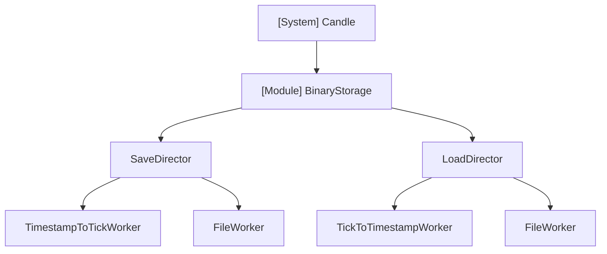
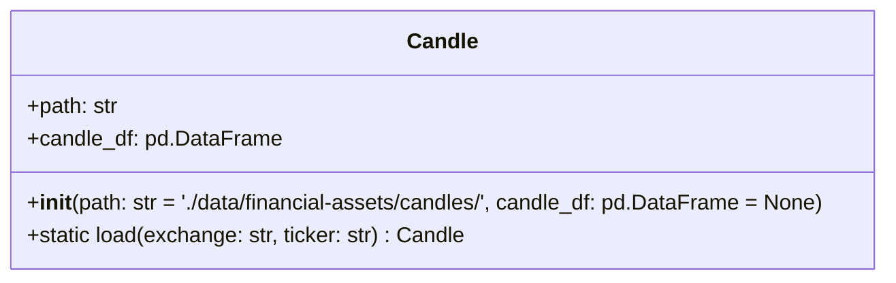

# Architecture - Candle

## 개요

금융 시계열 데이터(캔들스틱)를 처리하는 빌딩블록 모듈. parquet 형식으로 저장.

### 의존성

- pandas

## 구조

## 데이터

(작성 예정)

## API

### Candle

엔트리포인트이자 인터페이스 역할.

**초기화**
- 작업 폴더 위치 지정 가능
- 기본값: `'./data/financial-assets/candles/'` (프로젝트 루트 기준)

**메서드**
- `load(exchange: str, ticker: str)` (static): 캔들 데이터 로드

### BinaryStorage

(작성 예정)

#### SaveDirector

(작성 예정)

##### TimestampToTickWorker

(작성 예정)

##### FileWorker

(작성 예정)

#### LoadDirector

(작성 예정)

##### TickToTimestampWorker

(작성 예정)

##### FileWorker

(작성 예정)
