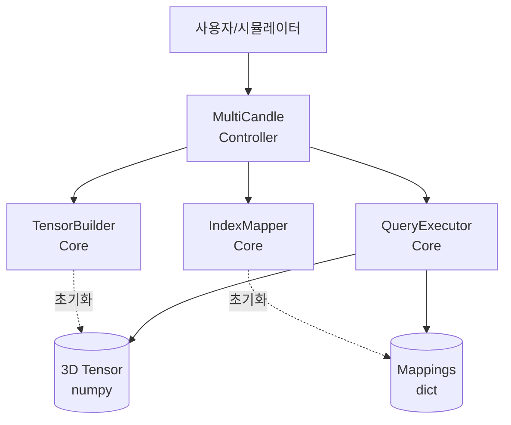

# Architecture - MultiCandle

## 개요

MultiCandle은 여러 종목의 캔들 데이터를 통합 관리하고 효율적으로 조회하는 모듈입니다.
시뮬레이션의 빌딩블록으로 설계되었으며, 고성능 시점 기반 조회를 지원합니다.

## 목적

- 여러 Candle 객체를 3D numpy 텐서로 통합
- 시점 기반 조회 최적화 (시뮬레이션 메인 루프용)
- 종목 기반 조회 지원 (분석용)
- stateless 조회 인터페이스 (커서 관리는 외부에서)

## 핵심 개념

### 데이터 구조

```
3D numpy 텐서: (n_symbols, n_timestamps, 5)
  - axis 0: 종목 (시작 시점 빠른 순 정렬)
  - axis 1: 타임스탬프 (시간 순 정렬)
  - axis 2: [open, high, low, close, volume]
  - dtype: float64
  - 누락 데이터: NaN
```

### 조회 패턴

1. **시점 기반 조회** (최우선 최적화)
   - 특정 시점의 모든 종목 스냅샷
   - 시뮬레이션 메인 루프에서 빈번히 호출

2. **종목 기반 조회**
   - 특정 종목의 시간 범위 데이터
   - 분석 및 백테스팅용

3. **범위 기반 조회**
   - 시간 범위 내 모든 종목 데이터

4. **반복자**
   - 시간 순회 반복자

## 아키텍처 패턴

**CPSCP 간소화 버전:**
- Controller (API): MultiCandle
- Core: TensorBuilder, IndexMapper, QueryExecutor
- Service/Plugin 생략 (전략 선택 없음)

## 컴포넌트 다이어그램



## 의존성 관계

```
Candle (financial_assets.candle)
    ↓
TensorBuilder (Core)
    ↓
IndexMapper (Core)
    ↓
QueryExecutor (Core)
    ↓
MultiCandle (API)
    ↓
사용자 (시뮬레이터 등)
```

## 계층 책임

### API 계층 (Controller)
- **MultiCandle**: 공개 인터페이스, 초기화, 조회 라우팅

### Core 계층
- **TensorBuilder**: List[Candle] → 3D 텐서 변환
- **IndexMapper**: symbol/timestamp 양방향 매핑
- **QueryExecutor**: 텐서 슬라이싱 및 조회 로직

## 사용 시나리오

### 시뮬레이션 메인 루프

```python
# 초기화
candles = [Candle.load(addr1), Candle.load(addr2), ...]
mc = MultiCandle(candles)

# 시뮬레이터가 시간을 진행하며
for timestamp in time_range:
    # 현재 시점의 모든 종목 데이터 조회 (빠른 조회)
    snapshot = mc.get_snapshot(timestamp)

    # 시뮬레이션 로직 수행
    for symbol, ohlcv in snapshot.items():
        # 거래 로직...
```

### 종목별 분석

```python
# 특정 종목의 시간 범위 데이터
btc_data = mc.get_symbol_range("BTC/USDT", start_ts, end_ts)

# 분석 수행
analyze_volatility(btc_data)
```

### 시간 순회

```python
# 시간 반복자로 순차 처리
for timestamp, snapshot in mc.iter_time(start_ts, end_ts):
    process(timestamp, snapshot)
```

## 성능 특성

### 메모리
- GB 단위 데이터 온메모리 보유
- numpy 연속 메모리 배치로 캐시 효율성 극대화

### 조회 성능
- **시점 기반 조회**: O(1) 인덱싱 + O(n_symbols) 복사
- **종목 기반 조회**: O(1) 인덱싱 + O(n_times) 복사
- **범위 조회**: O(n_symbols × n_times) 슬라이싱

### 초기화
- 전체 데이터 로드 및 텐서 구축
- 시간 복잡도: O(n_symbols × n_timestamps)
- 초기화 후 불변 (immutable)

## 제약사항

1. **온메모리 전제**: 모든 데이터가 메모리에 적재됨
2. **불변성**: 초기화 후 데이터 수정 불가 (read-only)
3. **동일 timeframe**: 모든 Candle이 같은 timeframe 가정
4. **동일 exchange**: 한 거래소의 데이터만 포함
5. **타임스탬프 정렬**: Candle 데이터가 이미 시간순 정렬됨

## 관련 모듈

- **financial_assets.candle**: 단일 종목 캔들 데이터
- **financial_assets.price**: OHLCV Price 객체
- **financial_assets.stock_address**: 종목 식별자
- **simple_logger**: 로깅 데코레이터 (@init_logging, @func_logging)

## 문서 구조

```
multicandle/
├── Architecture - MultiCandle.md          (본 문서)
├── API/
│   ├── for-agent-moduleinfo.md            (API 계층 개요)
│   └── MultiCandle/
│       └── for-agent-moduleinfo.md        (MultiCandle 상세)
└── Core/
    ├── for-agent-moduleinfo.md            (Core 계층 개요)
    ├── TensorBuilder/
    │   └── for-agent-moduleinfo.md
    ├── IndexMapper/
    │   └── for-agent-moduleinfo.md
    └── QueryExecutor/
        └── for-agent-moduleinfo.md
```
