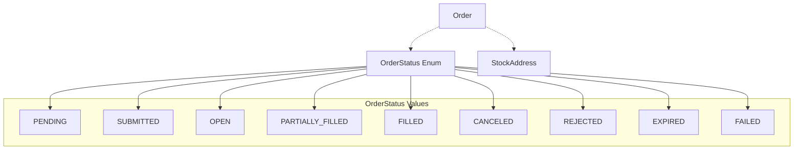

# Architecture - Order

## 개요

거래소 주문 정보를 표준화된 객체로 표현하는 구조체 모듈.

**목적**: 실제/가상 거래소의 다양한 주문 응답 형식을 통일된 Order 객체로 구조화.

### 핵심 기능

- 표준화된 Order 구조체 제공
- 주문 상태 통일 (OrderStatus Enum)
- Active 주문 판별 메서드

### 도메인 제약사항

- 메모리 전용 (저장/로드 기능 없음)
- 외부 어댑터가 거래소 응답을 파싱하여 Order 생성
- 거래소별 특화 필드는 `extra` dict에 저장

### 설계 전략

**단순 구조체 패턴**
- Director/Worker 패턴 불필요
- 데이터 클래스로 구현
- 상태 관리를 위한 Enum 사용

**확장성**
- `extra` dict로 거래소별 특수 필드 지원
- OrderStatus로 상태 표준화 (거래소별 매핑은 외부 책임)

## 구조



**레이어 설명:**
1. **Order**: 주문 정보 구조체
2. **OrderStatus**: 표준화된 주문 상태 Enum
3. **StockAddress**: 거래 대상 자산 주소 (기존 모듈)

## 컴포넌트

### Order

거래소 주문 정보를 표준화된 형식으로 보관하는 데이터 구조체.

**핵심 책임:**
- 거래소 주문의 필수 정보 보관 (자산, 수량, 가격, 상태 등)
- 주문 상태 기반 판별 로직 제공
- 거래소별 특수 필드를 확장 가능한 형태로 저장

**특징:**
- 불변성 지향 (dataclass frozen 권장, 상태 변경은 새 인스턴스 생성)
- 외부 어댑터가 생성 책임 (Order는 수동적 구조체)
- 메모리 전용 (영속성 기능 없음)

**제공 메서드:**
- `is_active()`: Active 상태 판별 (OPEN, PARTIALLY_FILLED)
- `is_completed()`: 완료/종료 상태 판별
- `remaining_quantity()`: 미체결 수량 계산

**통합:**
- `StockAddress` 모듈 사용 (거래 대상 자산 식별)

### OrderStatus

주문 상태를 표준화하는 Enum.

**핵심 책임:**
- 거래소별로 다른 상태 문자열을 통일된 상수로 관리
- 주문 생명주기의 모든 단계 표현

**상태 분류:**
- 대기: PENDING, SUBMITTED
- Active: OPEN, PARTIALLY_FILLED
- 완료: FILLED, CANCELED, REJECTED, EXPIRED
- 오류: FAILED

**주의사항:**
- 거래소별 상태 매핑은 외부 어댑터 책임
- Enum 값 추가 시 `is_active()`, `is_completed()` 메서드 동기화 필요

## 데이터

### Order 필드

```python
@dataclass
class Order:
    stock_address: StockAddress  # 거래 대상 자산
    order_id: str                # 거래소 부여 주문 ID
    side: Literal["buy", "sell"] # 매수/매도
    order_type: str              # limit, market, stop_limit 등
    price: float | None          # 주문 가격 (시장가는 None)
    quantity: float              # 주문 수량
    filled_quantity: float       # 체결된 수량
    status: OrderStatus          # 주문 상태
    timestamp: datetime          # 주문 생성 시각
    extra: dict                  # 거래소 특화 필드
```

### OrderStatus Enum

```python
class OrderStatus(Enum):
    # 대기 상태
    PENDING = "pending"                # 주문 생성됨, 거래소 미전송
    SUBMITTED = "submitted"            # 거래소에 전송됨

    # Active 상태
    OPEN = "open"                      # 거래소 활성화, 매칭 대기
    PARTIALLY_FILLED = "partially_filled"  # 부분 체결

    # 완료 상태
    FILLED = "filled"                  # 전량 체결
    CANCELED = "canceled"              # 취소됨
    REJECTED = "rejected"              # 거래소 거부
    EXPIRED = "expired"                # 시간 만료

    # 오류
    FAILED = "failed"                  # 처리 실패
```

**Active 주문**: `OPEN`, `PARTIALLY_FILLED`

### 거래소별 Status 매핑 예시

외부 어댑터가 수행:

```python
# Binance
"NEW" -> OrderStatus.OPEN
"PARTIALLY_FILLED" -> OrderStatus.PARTIALLY_FILLED
"FILLED" -> OrderStatus.FILLED
"CANCELED" -> OrderStatus.CANCELED
"REJECTED" -> OrderStatus.REJECTED
"EXPIRED" -> OrderStatus.EXPIRED

# Upbit
"wait" -> OrderStatus.OPEN
"done" -> OrderStatus.FILLED
"cancel" -> OrderStatus.CANCELED
```

## API

### Order

```python
@dataclass
class Order:
    stock_address: StockAddress
    order_id: str
    side: Literal["buy", "sell"]
    order_type: str
    price: float | None
    quantity: float
    filled_quantity: float
    status: OrderStatus
    timestamp: datetime
    extra: dict = field(default_factory=dict)

    def is_active(self) -> bool:
        """Active 상태 여부 (OPEN, PARTIALLY_FILLED)"""
        return self.status in {OrderStatus.OPEN, OrderStatus.PARTIALLY_FILLED}

    def is_completed(self) -> bool:
        """완료 상태 여부 (FILLED, CANCELED, REJECTED, EXPIRED, FAILED)"""
        return self.status in {
            OrderStatus.FILLED,
            OrderStatus.CANCELED,
            OrderStatus.REJECTED,
            OrderStatus.EXPIRED,
            OrderStatus.FAILED
        }

    def remaining_quantity(self) -> float:
        """미체결 수량"""
        return self.quantity - self.filled_quantity
```

### 사용 예시

```python
from financial_assets.order import Order, OrderStatus
from financial_assets.stock_address import StockAddress

# 외부 어댑터가 거래소 응답을 Order로 변환
binance_response = {
    "orderId": "12345",
    "symbol": "BTCUSDT",
    "side": "BUY",
    "type": "LIMIT",
    "price": "50000.0",
    "origQty": "0.1",
    "executedQty": "0.05",
    "status": "PARTIALLY_FILLED",
    "time": 1234567890000,
}

# 어댑터 변환 로직
stock_addr = StockAddress(
    archetype="crypto",
    exchange="binance",
    tradetype="spot",
    base="BTC",
    quote="USDT",
    timeframe="1m"
)

order = Order(
    stock_address=stock_addr,
    order_id=binance_response["orderId"],
    side="buy",
    order_type="limit",
    price=float(binance_response["price"]),
    quantity=float(binance_response["origQty"]),
    filled_quantity=float(binance_response["executedQty"]),
    status=OrderStatus.PARTIALLY_FILLED,
    timestamp=datetime.fromtimestamp(binance_response["time"] / 1000),
    extra={"binance_raw": binance_response}
)

# Active 주문 필터링
if order.is_active():
    print(f"Active order: {order.remaining_quantity()} remaining")
```

## 의존성

```toml
[project]
dependencies = [
    "python>=3.10"
]
```

StockAddress는 동일 패키지 내부 모듈이므로 외부 의존성 없음.
