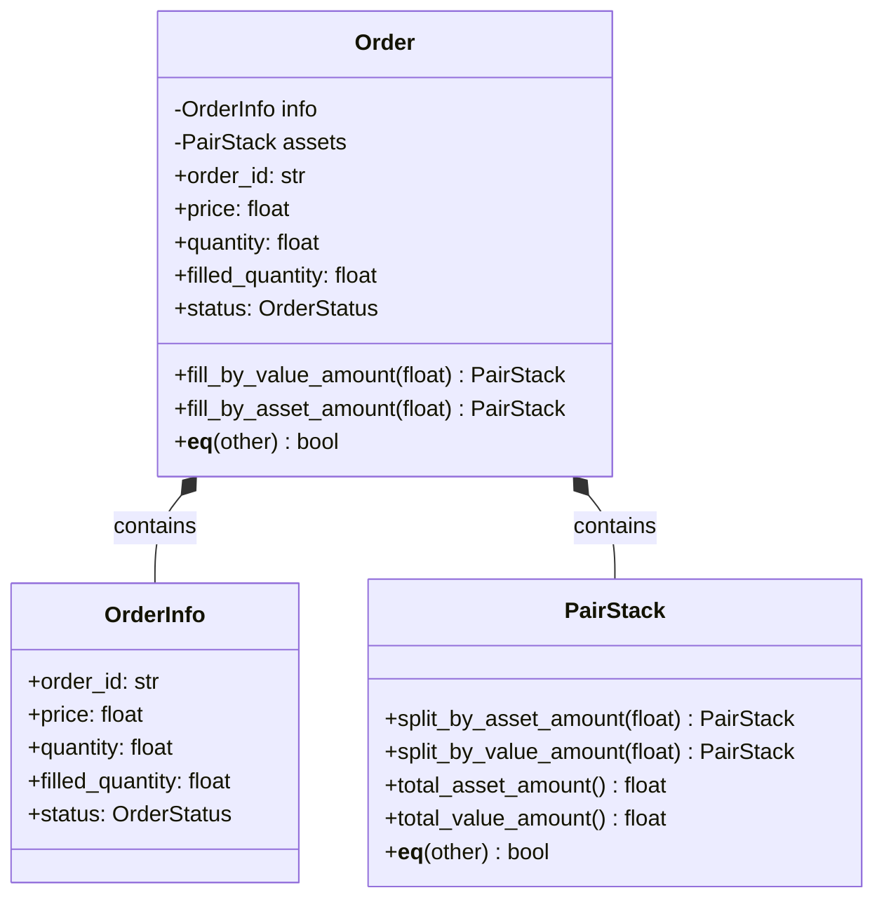

# Order Module Architecture

## 개요

`order` 모듈은 **실제 자산을 보유한 주문 객체**를 제공합니다. `OrderInfo`가 주문 정보(메타데이터)만 관리한다면, `Order` 클래스는 주문과 연결된 실제 자산(PairStack)을 함께 관리합니다.

### 책임 범위

실제 거래 트래킹 또는 거래 시뮬레이션에서 거래소에 요청하여 생성한 **limit 주문**의 동작을 따라합니다.

- 거래소에 올라간 limit 주문의 상태 및 자산 관리
- PairStack을 활용하여 가격별 주문 자산 관리
- 체결 시 자산 분리 및 반환 (FIFO)
- 취소 시 자산 반환

**참고**: market 주문은 즉시 체결되므로 주문 객체를 만들 필요가 없습니다. Order는 거래소에서 대기 중인 limit 주문을 위한 것입니다.

### 구현 전략

주문 체결은 해당 가격으로 여러번 나눠서 이뤄질 수 있습니다:
- **PairStack**: 체결 수량 또는 체결 가치만큼 `split`하여 반환
- **Order**: fill_by_* 메서드로 체결 처리, PairStack에서 자산 분리
- 매우 단순하게 실제 거래소 동작을 따라할 수 있음

## 클래스 다이어그램

**관계 설명:**
- `Order`는 `OrderInfo`(메타데이터)와 `PairStack`(실제 자산)을 포함
- `Order`는 OrderInfo의 모든 속성을 프로퍼티로 노출 (위임 패턴)
- 체결 시 `Order.fill_by_value_amount()` 또는 `fill_by_asset_amount()` 호출
- 내부적으로 `PairStack.split`을 호출하여 자산 분리 및 반환

**책임:**
- `Order`: 체결 처리 (fill_by_*), OrderInfo 속성 위임, 동등성 비교 (`__eq__`)

**동등성 비교:**
- `Order.__eq__()`: 각자의 PairStack 비교 (PairStack.__eq__는 asset_symbol, value_symbol 기반)
