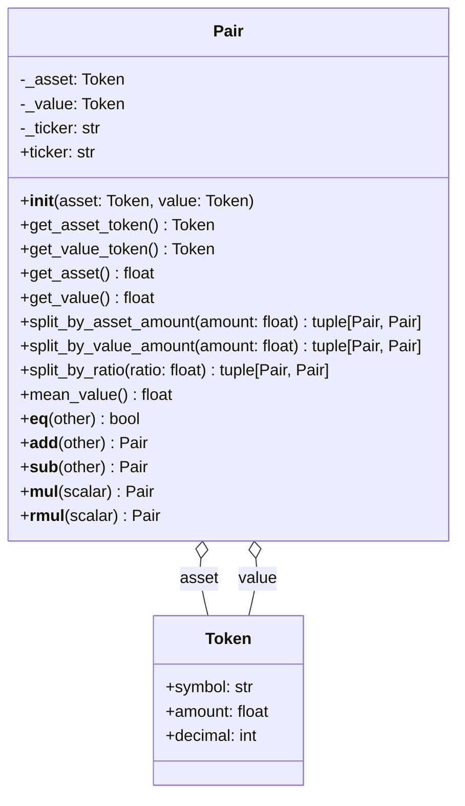

# Architecture - Pair

## 개요

자산(asset)과 그 가치(value)를 하나의 쌍으로 표현하는 단위.

**목적**: 거래 대상 자산과 그 교환 가치를 함께 관리하여 일관된 비율 유지.

### 핵심 기능

- 자산-가치 쌍 관리 (asset token, value token)
- 같은 쌍끼리 수량 연산 (덧셈, 뺄셈, 스칼라 곱)
- 다양한 기준으로 분할 (asset 기준, value 기준, 비율)
- 단위당 평균 가격 계산 (mean_value)

### 설계 원칙

**자산-가치 쌍 관리**
- asset: 거래 대상 토큰 (예: BTC)
- value: 해당 자산의 교환 가치 토큰 (예: USD)
- 두 토큰의 비율이 가격을 의미함

**Token 의존성**
- Pair는 두 개의 Token 객체로 구성됨
- decimal 처리는 Token이 담당하므로 Pair는 관여하지 않음
- Token의 불변성을 그대로 계승

**타입 안전성**
- 같은 symbol 쌍끼리만 연산 가능
- "BTC-USD" 쌍과 "ETH-USD" 쌍은 연산 불가

## 구조



**단일 클래스 구조**
- Director/Worker 패턴 불필요
- 두 개의 Token을 조합한 값 객체(Value Object)
- 연산자 오버로딩으로 직관적인 API 제공

## 데이터

### Pair 필드

```python
class Pair:
    _asset: Token    # 거래 대상 자산 (내부 전용)
    _value: Token    # 자산의 교환 가치 (내부 전용)
    _ticker: str     # 티커 문자열 (예: "BTC-USD")
```

**프로퍼티:**
- `ticker`: 티커 문자열 반환 (예: "BTC-USD")

**메서드:**
- `get_asset_token()`: 거래 대상 자산 Token 반환
- `get_value_token()`: 교환 가치 Token 반환
- `get_asset()`: 거래 대상 자산의 수량 반환
- `get_value()`: 교환 가치 수량 반환

**제약사항:**
- 내부 필드는 초기화 후 변경 불가
- 모든 연산은 새 Pair 인스턴스 생성
- decimal 처리는 Token 객체가 담당

### 예시

**거래 예시:**
```python
# BTC 1.5개를 $50,000에 거래
pair = Pair(
    asset=Token(symbol="BTC", amount=1.5),
    value=Token(symbol="USD", amount=75000.0)
)
# 암묵적 가격: 75000 / 1.5 = $50,000 per BTC
```

**포트폴리오 예시:**
```python
# ETH 10개 보유, 현재 가치 $20,000
portfolio = Pair(
    asset=Token(symbol="ETH", amount=10.0),
    value=Token(symbol="USD", amount=20000.0)
)
```

## API

### 초기화

```python
Pair(asset: Token, value: Token)
```

**파라미터:**
- `asset`: 거래 대상 자산 Token
- `value`: 자산의 교환 가치 Token

**예시:**
```python
from financial_assets.token import Token
from financial_assets.pair import Pair

btc_token = Token(symbol="BTC", amount=1.5)
usd_token = Token(symbol="USD", amount=75000.0)
pair = Pair(asset=btc_token, value=usd_token)
```

### 메서드

**split_by_asset_amount(amount: float) -> tuple[Pair, Pair]**

asset 수량 기준으로 Pair를 분할.

```python
pair = Pair(
    asset=Token(symbol="BTC", amount=1.0),
    value=Token(symbol="USD", amount=50000.0)
)

reduced, splitted = pair.split_by_asset_amount(0.3)
# reduced: Pair(asset=0.7 BTC, value=35000.0 USD)
# splitted: Pair(asset=0.3 BTC, value=15000.0 USD)
# 비율 유지: 50000 / 1.0 = 35000 / 0.7 = 15000 / 0.3
```

**split_by_value_amount(amount: float) -> tuple[Pair, Pair]**

value 수량 기준으로 Pair를 분할.

```python
pair = Pair(
    asset=Token(symbol="BTC", amount=1.0),
    value=Token(symbol="USD", amount=50000.0)
)

reduced, splitted = pair.split_by_value_amount(15000.0)
# reduced: Pair(asset=0.7 BTC, value=35000.0 USD)
# splitted: Pair(asset=0.3 BTC, value=15000.0 USD)
# 비율 유지
```

**split_by_ratio(ratio: float) -> tuple[Pair, Pair]**

비율로 Pair를 분할.

```python
pair = Pair(
    asset=Token(symbol="BTC", amount=1.0),
    value=Token(symbol="USD", amount=50000.0)
)

reduced, splitted = pair.split_by_ratio(0.3)
# reduced: Pair(asset=0.7 BTC, value=35000.0 USD)
# splitted: Pair(asset=0.3 BTC, value=15000.0 USD)
```

**mean_value() -> float**

단위 asset당 평균 value를 반환 (단위당 가격).

```python
pair = Pair(
    asset=Token(symbol="BTC", amount=1.5),
    value=Token(symbol="USD", amount=75000.0)
)

price = pair.mean_value()
# price: 50000.0 ($50,000 per BTC)
```

**예외:**
- `ValueError`: asset.amount가 0일 때

### 연산자

**비교 연산**

```python
pair1 = Pair(
    asset=Token(symbol="BTC", amount=1.0),
    value=Token(symbol="USD", amount=50000.0)
)
pair2 = Pair(
    asset=Token(symbol="BTC", amount=1.0),
    value=Token(symbol="USD", amount=50000.0)
)

pair1 == pair2  # True (asset와 value 모두 같음)
```

**산술 연산 (같은 symbol 쌍끼리만)**

```python
# 덧셈
pair1 = Pair(
    asset=Token(symbol="BTC", amount=1.0),
    value=Token(symbol="USD", amount=50000.0)
)
pair2 = Pair(
    asset=Token(symbol="BTC", amount=0.5),
    value=Token(symbol="USD", amount=25000.0)
)
total = pair1 + pair2
# Pair(asset=1.5 BTC, value=75000.0 USD)

# 뺄셈
remaining = pair1 - pair2
# Pair(asset=0.5 BTC, value=25000.0 USD)

# 스칼라 곱
double = pair1 * 2
# Pair(asset=2.0 BTC, value=100000.0 USD)
```

**에러 케이스**

```python
btc_usd = Pair(
    asset=Token(symbol="BTC", amount=1.0),
    value=Token(symbol="USD", amount=50000.0)
)
eth_usd = Pair(
    asset=Token(symbol="ETH", amount=10.0),
    value=Token(symbol="USD", amount=20000.0)
)

# ValueError: Cannot add pairs with different asset symbols
btc_usd + eth_usd

# ValueError: Cannot add pairs with different value symbols
pair1 = Pair(asset=Token("BTC", 1.0), value=Token("USD", 50000.0))
pair2 = Pair(asset=Token("BTC", 0.5), value=Token("KRW", 60000000.0))
pair1 + pair2
```

### 사용 예시

```python
from financial_assets.token import Token
from financial_assets.pair import Pair

# 거래 기록
trade1 = Pair(
    asset=Token(symbol="BTC", amount=0.5),
    value=Token(symbol="USD", amount=25000.0)
)
trade2 = Pair(
    asset=Token(symbol="BTC", amount=0.3),
    value=Token(symbol="USD", amount=15000.0)
)

# 총 거래량
total_trade = trade1 + trade2
# Pair(asset=0.8 BTC, value=40000.0 USD)

# 포지션 분할 (asset 기준)
position = Pair(
    asset=Token(symbol="ETH", amount=10.0),
    value=Token(symbol="USD", amount=20000.0)
)
remaining_position, sold_position = position.split_by_asset_amount(3.0)
# remaining: 7 ETH worth $14,000
# sold: 3 ETH worth $6,000

# 포지션 분할 (value 기준)
remaining_position, sold_position = position.split_by_value_amount(8000.0)
# remaining: 6 ETH worth $12,000
# sold: 4 ETH worth $8,000

# 수수료 계산 (스칼라 곱)
fee_rate = 0.001
fee = total_trade * fee_rate
# Pair(asset=0.0008 BTC, value=40.0 USD)
```

## 의존성

```toml
[project]
dependencies = [
    "python>=3.10"
]
```

**내부 의존성:**
- Token 모듈 (같은 패키지)

## 통합

Pair는 다른 모듈들에서 사용됩니다:

- **Order**: 주문 시 자산과 가치 쌍으로 표현
- **Trade**: 체결된 거래의 자산-가치 쌍
- **Position**: 보유 포지션의 현재 가치 표현
