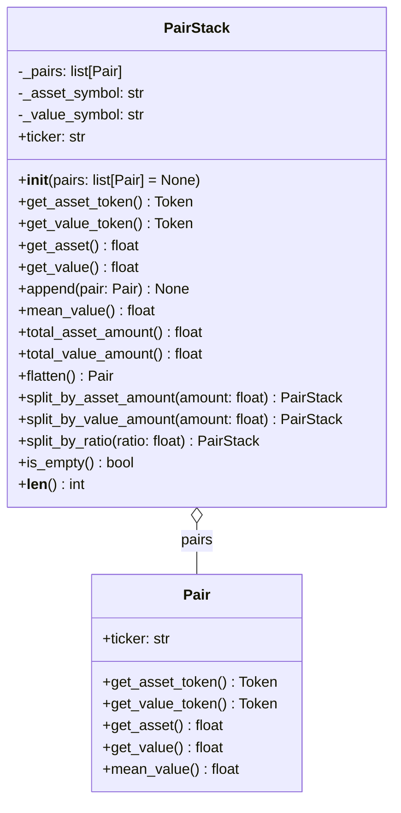

# Architecture - PairStack

## 개요

같은 ticker(symbol pair)의 Pair들을 스택으로 관리하며, 평단가가 유사한 Pair는 자동으로 병합.

**목적**: 여러 거래를 평단가 기준으로 그룹화하여 관리하면서도 하나의 Pair처럼 동작.

### 핵심 기능

- 같은 ticker의 Pair 스택 관리
- 평단가 차이 0.01% 이내 Pair 자동 병합
- 스택 전체를 하나의 Pair처럼 분할 (원본 수정, 분리된 것만 반환)
- 전체 평단가 계산 (mean_value)
- 전체를 하나의 Pair로 병합 (flatten)

### 설계 원칙

**가변 객체 (Mutable)**
- Pair와 달리 PairStack은 가변 객체
- split 연산 시 원본이 수정됨
- 분리된 PairStack만 반환

**평단가 기반 자동 병합**
- Pair 추가 시 스택 최상단 Pair와 평단가 비교
- 차이가 0.01% 이내면 자동 병합
- 0.01% 초과 시 새로운 레이어로 추가

**스택 순서 유지**
- 분할 시 스택 순서대로 분리
- 예: [Pair1, Pair2, Pair3] 에서 분리 → 원본: [Pair1], 반환: PairStack([Pair2, Pair3])

**타입 안전성**
- 같은 asset symbol, 같은 value symbol끼리만 관리 가능

## 구조



**가변 스택 구조**
- Pair와 달리 내부 리스트 수정 가능
- append()로 Pair 추가 (자동 병합 로직)
- split 메서드는 원본 수정 후 분리된 부분만 반환

## 데이터

### PairStack 필드

```python
class PairStack:
    _pairs: list[Pair]           # Pair들의 스택
    _asset_symbol: str | None    # 관리하는 asset symbol (None이면 빈 스택)
    _value_symbol: str | None    # 관리하는 value symbol (None이면 빈 스택)
```

**제약사항:**
- 모든 Pair는 같은 asset_symbol, value_symbol을 가져야 함
- 빈 PairStack은 symbol이 None
- 첫 번째 Pair 추가 시 symbol 결정

### 자동 병합 로직

**평단가 차이 계산:**
```python
existing_mean = existing_pair.mean_value()
new_mean = new_pair.mean_value()
diff_ratio = abs(new_mean - existing_mean) / existing_mean

if diff_ratio <= 0.0001:  # 0.01%
    # 병합
else:
    # 분리
```

**예시:**
```python
# 기존: 1 BTC = $50,000 (평단가: $50,000)
# 추가: 0.5 BTC = $25,000 (평단가: $50,000)
# 차이: 0% → 병합됨 → 1.5 BTC = $75,000

# 기존: 1 BTC = $50,000 (평단가: $50,000)
# 추가: 0.5 BTC = $25,500 (평단가: $51,000)
# 차이: 2% → 분리 유지
```

## API

### 초기화

```python
PairStack(pairs: list[Pair] | None = None)
```

**파라미터:**
- `pairs`: 초기 Pair 리스트 (선택, 자동 병합 적용됨)

**예시:**
```python
from financial_assets.token import Token
from financial_assets.pair import Pair, PairStack

# 빈 스택
stack = PairStack()

# 초기 Pair들과 함께 생성
stack = PairStack([
    Pair(Token("BTC", 1.0), Token("USD", 50000.0)),
    Pair(Token("BTC", 0.5), Token("USD", 25000.0))
])
```

### 프로퍼티

**ticker -> str**

티커 문자열을 반환 (예: "BTC-USD").

```python
stack = PairStack([
    Pair(Token("BTC", 1.0), Token("USD", 50000.0)),
    Pair(Token("BTC", 0.5), Token("USD", 26000.0)),
])
ticker = stack.ticker  # "BTC-USD"
```

**get_asset_token() -> Token**

전체 asset을 하나의 Token으로 반환.

```python
asset_token = stack.get_asset_token()  # Token("BTC", 1.5)
```

**get_value_token() -> Token**

전체 value를 하나의 Token으로 반환.

```python
value_token = stack.get_value_token()  # Token("USD", 76000.0)
```

**get_asset() -> float**

전체 asset 수량 반환.

```python
asset_amount = stack.get_asset()  # 1.5
```

**get_value() -> float**

전체 value 수량 반환.

```python
value_amount = stack.get_value()  # 76000.0
```

### 메서드

**append(pair: Pair) -> None**

Pair를 스택에 추가. 최상단 Pair와 평단가 차이가 0.01% 이내면 자동 병합.

```python
stack = PairStack()
stack.append(Pair(Token("BTC", 1.0), Token("USD", 50000.0)))
stack.append(Pair(Token("BTC", 0.5), Token("USD", 25000.0)))
# 평단가 같음 → 병합됨 → [Pair(1.5 BTC, 75000 USD)]

stack.append(Pair(Token("BTC", 0.3), Token("USD", 15600.0)))
# 평단가 4% 차이 → 분리 유지 → [Pair(1.5 BTC, 75000 USD), Pair(0.3 BTC, 15600 USD)]
```

**mean_value() -> float**

전체 스택의 평단가 반환.

```python
stack = PairStack([
    Pair(Token("BTC", 1.0), Token("USD", 50000.0)),
    Pair(Token("BTC", 0.5), Token("USD", 26000.0))
])
# 총: 1.5 BTC = 76000 USD
mean = stack.mean_value()  # 76000 / 1.5 = 50666.67
```

**total_asset_amount() -> float**

전체 asset 수량 합계 반환.

```python
total_asset = stack.total_asset_amount()  # 1.5
```

**total_value_amount() -> float**

전체 value 수량 합계 반환.

```python
total_value = stack.total_value_amount()  # 76000.0
```

**flatten() -> Pair**

모든 Pair를 하나로 합산하여 단일 Pair 반환.

```python
stack = PairStack([
    Pair(Token("BTC", 1.0), Token("USD", 50000.0)),
    Pair(Token("BTC", 0.5), Token("USD", 26000.0))
])
merged = stack.flatten()
# Pair(Token("BTC", 1.5), Token("USD", 76000.0))
```

**split_by_asset_amount(amount: float) -> PairStack**

asset 수량 기준으로 분할. 원본 수정, 분리된 PairStack 반환.

```python
stack = PairStack([
    Pair(Token("BTC", 1.0), Token("USD", 50000.0)),  # Layer 1
    Pair(Token("BTC", 0.8), Token("USD", 42000.0)),  # Layer 2
    Pair(Token("BTC", 0.5), Token("USD", 27000.0))   # Layer 3
])
# 총: 2.3 BTC

# 1.5 BTC 분리
splitted = stack.split_by_asset_amount(1.5)

# 원본 (수정됨): 0.8 BTC
# [Pair(0.8 BTC, 40000 USD)]

# 반환 (분리됨): 1.5 BTC
# PairStack([
#     Pair(0.2 BTC, 10000 USD),   # Layer 1 일부
#     Pair(0.8 BTC, 42000 USD),   # Layer 2 전체
#     Pair(0.5 BTC, 27000 USD)    # Layer 3 전체
# ])
```

**split_by_value_amount(amount: float) -> PairStack**

value 수량 기준으로 분할. 원본 수정, 분리된 PairStack 반환.

```python
splitted = stack.split_by_value_amount(50000.0)
# 원본과 반환 값은 split_by_asset_amount와 동일한 방식
```

**split_by_ratio(ratio: float) -> PairStack**

비율 기준으로 분할. 원본 수정, 분리된 PairStack 반환.

```python
splitted = stack.split_by_ratio(0.6)  # 60% 분리
# 원본: 40% 남음
# 반환: 60% 분리됨 (스택 순서대로)
```

**is_empty() -> bool**

스택이 비어있는지 확인.

```python
stack = PairStack()
stack.is_empty()  # True
```

**len(stack) -> int**

스택에 있는 Pair 레이어 개수 반환.

```python
len(stack)  # 3 (3개의 Pair 레이어)
```

### 사용 예시

```python
from financial_assets.token import Token
from financial_assets.pair import Pair, PairStack

# 거래 누적
stack = PairStack()

# 첫 거래
stack.append(Pair(Token("BTC", 1.0), Token("USD", 50000.0)))

# 두 번째 거래 (같은 평단가) → 자동 병합
stack.append(Pair(Token("BTC", 0.5), Token("USD", 25000.0)))
# 내부: [Pair(1.5 BTC, 75000 USD)]
print(len(stack))  # 1

# 세 번째 거래 (다른 평단가) → 분리 유지
stack.append(Pair(Token("BTC", 0.5), Token("USD", 26000.0)))
# 내부: [Pair(1.5 BTC, 75000 USD), Pair(0.5 BTC, 26000 USD)]
print(len(stack))  # 2

# 전체 평단가
mean = stack.mean_value()  # (75000 + 26000) / (1.5 + 0.5) = 50500

# 일부 매도 (0.8 BTC)
sold = stack.split_by_asset_amount(0.8)
# stack: [Pair(0.7 BTC, 35000 USD), Pair(0.5 BTC, 26000 USD)]
# sold: PairStack([Pair(0.8 BTC, 40000 USD)])

# 전체 병합
merged = stack.flatten()
# Pair(1.2 BTC, 61000 USD)
```

## 의존성

```toml
[project]
dependencies = [
    "python>=3.10"
]
```

**내부 의존성:**
- Pair 모듈 (같은 패키지)
- Token 모듈 (간접 의존)

## 통합

PairStack은 다른 모듈들에서 사용될 수 있습니다:

- **Position**: 여러 번의 거래로 쌓인 포지션 관리
- **Portfolio**: 같은 자산의 여러 평단가 레이어 추적
