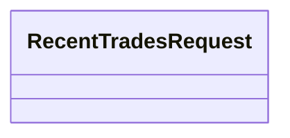
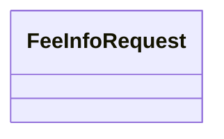
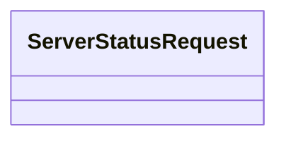

# Request Architecture

## 개요

Request 모듈은 거래 전략 실행자가 Gateway에게 작업을 요청할 때 사용하는 요청 객체를 정의한다. Gateway의 모든 메서드는 Request 객체를 입력으로 받으며, 이를 통해 타입 안정성과 명확한 인터페이스를 제공한다.

Request는 Gateway와의 상호작용에서 사용자 의도를 표현하는 진입점이다. 주문 생성, 주문 조회, 체결 확인, 잔고 조회, 시장 데이터 조회 등 모든 Gateway 동작은 해당하는 Request 객체를 통해 시작된다. Request 타입을 주문 유형별, 조회 유형별로 세분화하여 분리함으로써 각 요청에 필요한 파라미터를 명확히 정의하고, 런타임 오류를 컴파일 타임에 방지할 수 있다.

## 설계 원칙

### 1:1 Request-Response 매핑

모든 Gateway 메서드는 고유한 형식의 Request 객체를 입력으로 받고, 고유한 형식의 Response를 반환한다. 예를 들어 `request_open_limit_order` 메서드는 `OpenLimitOrderRequest`를 받아 `OpenLimitOrderResponse`를 반환하며, `request_current_balance` 메서드는 `CurrentBalanceRequest`를 받아 `CurrentBalanceResponse`를 반환한다. 이러한 1:1 매핑을 통해 각 요청의 입력과 출력 타입이 명확해지고, IDE의 타입 힌트와 정적 분석 도구가 효과적으로 동작할 수 있다.

### 통일된 상호작용 인터페이스

Gateway의 모든 메서드는 `request_*` 형태의 이름을 가지며, Request 객체를 받아 Response를 반환하는 동일한 패턴을 따른다. 주문 생성, 주문 조회, 시장 데이터 조회 등 모든 종류의 작업이 이 패턴으로 통일되어 있어, 사용자는 Gateway와 상호작용하는 일관된 방법을 학습하면 된다. 이는 시뮬레이션 환경과 실제 거래소 환경 간 전환을 용이하게 하며, Gateway 구현체가 달라져도 사용자 코드의 변경을 최소화한다.

### 타입별 파라미터 명확화

Request 타입을 세분화하여 각 요청에 필요한 파라미터를 명확히 정의한다. `OpenLimitOrderRequest`는 symbol, side, quantity, price를 필수 파라미터로 가지며, `MarketOrderRequest`는 price 파라미터가 없는 대신 symbol, side, quantity만 필요하다. 조회 요청인 `OrderCurrentStateRequest`는 order_id를 파라미터로 가진다. 이처럼 각 요청 타입이 자신에게 필요한 파라미터만 정의함으로써, 불필요한 optional 파라미터나 런타임 검증 로직을 제거하고, 컴파일 타임에 오류를 발견할 수 있다.

### Gateway 구현체 독립성

Request와 Response는 financial-assets 패키지에 정의되며, Gateway 구현체(BinanceSpotGateway, SimulationSpotGateway 등)는 이를 의존한다. 이를 통해 Request/Response 타입은 특정 Gateway 구현에 종속되지 않으며, 새로운 Gateway 구현체를 추가할 때 기존 Request/Response 타입을 그대로 재사용할 수 있다. Gateway는 Request를 받아 내부적으로 거래소 API 호출 또는 시뮬레이션 실행으로 변환하고, 그 결과를 표준 Response 형식으로 반환하는 어댑터 역할을 수행한다.

## 공통 구조

### BaseRequest

모든 Request 클래스가 상속받는 기본 클래스다.

**책임:**
- 모든 요청에 고유한 추적 ID 자동 부여
- Request 생성 시점 기록
- 요청 추적 및 디버깅 지원

**Properties:**

- `client_request_id: str` - 요청 고유 식별자 (형식: yymmddhhmmss-uuid)

**Methods:**

- `_generate_client_request_id() -> str` - 고유한 요청 ID를 생성한다 (yymmddhhmmss-uuid 형식)

**ID 생성 규칙:**
- 형식: `{timestamp}-{uuid4}`
- timestamp: yymmddhhmmss (예: 250127153045)
- uuid4: 표준 UUID4 (예: a7b3c4d5-e6f7-8901-2345-6789abcdef01)
- 완성 예시: `250127153045-a7b3c4d5-e6f7-8901-2345-6789abcdef01`
- 생성 시점에 자동으로 할당되며, 문자열 정렬만으로 시간순 정렬 보장

## Request 명세

### LimitBuyOrderRequest

지정가 매수 주문 생성을 요청한다.

**Properties:**

- `address: StockAddress` - 거래할 자산의 주소
- `price: float` - 지정가 매수 가격
- `volume: float` - 매수할 수량
- `order_type: Optional = None` - 주문 유효 기간 및 체결 조건 (장전~정규장, 정규장, 정규장~장후, 장외, GTC 등)
- `post_only: bool = False` - Maker 전용 주문 여부 (즉시 체결되어 Taker가 되는 경우 주문 거부)

### LimitSellOrderRequest

지정가 매도 주문 생성을 요청한다.

**Properties:**

- `address: StockAddress` - 거래할 자산의 주소
- `price: float` - 지정가 매도 가격
- `volume: float` - 매도할 수량
- `order_type: Optional = None` - 주문 유효 기간 및 체결 조건 (장전~정규장, 정규장, 정규장~장후, 장외, GTC 등)
- `post_only: bool = False` - Maker 전용 주문 여부 (즉시 체결되어 Taker가 되는 경우 주문 거부)

### MarketBuyOrderRequest

시장가 매수 주문 생성을 요청한다.

**Properties:**

- `address: StockAddress` - 거래할 자산의 주소
- `volume: float` - 매수할 자산 수량
- `order_type: Optional = None` - 주문 체결 조건 (FOK, IOC 등)

### MarketSellOrderRequest

시장가 매도 주문 생성을 요청한다.

**Properties:**

- `address: StockAddress` - 거래할 자산의 주소
- `volume: float` - 매도할 자산 수량
- `order_type: Optional = None` - 주문 체결 조건 (FOK, IOC 등)

### CloseOrderRequest

주문 취소를 요청한다.

**Properties:**

- `order_id: str` - 취소할 주문의 고유 ID

### ModifyOrderRequest

기존 주문 수정을 요청한다.

**Properties:**

- `order_id: str` - 수정할 주문의 고유 ID
- `new_price: Optional[float] = None` - 변경할 가격 (지정가 주문에만 적용)
- `new_volume: Optional[float] = None` - 변경할 수량

**제약사항:**
- `new_price`와 `new_volume` 중 최소 하나는 None이 아니어야 함
- 거래소에 따라 주문 수정을 지원하지 않을 수 있음 (예: 바이낸스는 취소 후 재생성 필요)

### OrderCurrentStateRequest

특정 주문의 현재 상태 조회를 요청한다.

**Properties:**

- `order_id: str` - 조회할 주문의 고유 ID

### OrderListRequest

현재 active/live 상태인 미체결 주문 목록 조회를 요청한다.

**Properties:**

- 파라미터 없음 (계정의 모든 활성 주문 조회)

### TradeInfoRequest

특정 주문의 체결 내역 조회를 요청한다.

**Properties:**

- `order_id: str` - 체결 내역을 조회할 주문의 고유 ID

### RecentTradesRequest

계정의 최근 체결 내역 조회를 요청한다.

**Properties:**

- 파라미터 없음 (계정의 최근 체결 내역 조회, 범위는 구현체에 따라 다름)

### CurrentBalanceRequest

현재 계정 잔고 조회를 요청한다.

**Properties:**

### PriceDataRequest

캔들 데이터(OHLCV) 조회를 요청한다. 거래 전략 실행 중 필요한 제한적/즉시적 캔들 조회에 사용되며, 대량 히스토리 데이터 수집이나 백테스팅용 데이터 준비는 별도 캔들 스토리지 시스템(financial-assets/candle)을 사용해야 한다.

**Properties:**

- `address: StockAddress` - 조회할 자산의 주소
- `interval: str` - 캔들 간격 (예: "1m", "5m", "15m", "1h", "4h", "1d")
- `start: Optional[int] = None` - 조회 시작 시점 (unix timestamp 초단위, 없으면 서버의 최초 데이터부터)
- `end: Optional[int] = None` - 조회 종료 시점 (unix timestamp 초단위, 없으면 현재까지)

**참고:**
- 거래소 API 제한(rate limit, 페이지네이션 등)은 Gateway 구현체가 내부적으로 처리

### OrderbookRequest

현재 호가창 스냅샷 조회를 요청한다.

**Properties:**

- `address: StockAddress` - 조회할 자산의 주소

### TickerRequest

현재 시세 정보 조회를 요청한다.

**Properties:**

- `address: Optional[StockAddress] = None` - 조회할 자산의 주소 (None이면 전체 또는 주요 자산 ticker 조회)

### AvailableMarketsRequest

거래 가능한 마켓 목록 조회를 요청한다.

**Properties:**

### FeeInfoRequest

현재 거래 수수료율 정보 조회를 요청한다.

**Properties:**

### ServerStatusRequest

거래소 서버 상태 및 점검 여부 조회를 요청한다.

**Properties:**

## 구현 계획
