# Response Architecture

## 개요

Response 모듈은 Gateway가 Request 처리 결과를 전달할 때 사용하는 응답 객체를 정의한다. 모든 Gateway 메서드는 대응하는 Response 객체를 반환하며, 이를 통해 성공/실패 상태, 결과 데이터, 오류 정보 등을 일관된 형식으로 제공한다.

Response는 Gateway와 전략 실행자 간의 상호작용 결과를 표현하는 출구점이다. 주문 생성 결과, 조회 결과, 오류 정보 등 모든 Gateway 동작의 결과는 해당하는 Response 객체를 통해 전달된다. Response 타입을 작업 유형별로 세분화하여 분리함으로써 각 응답에 포함되는 데이터를 명확히 정의하고, 성공/실패 시나리오를 체계적으로 처리할 수 있다.

## 설계 원칙

### 1:1 Request-Response 매핑

모든 Request에 대응하는 고유한 Response 타입이 존재한다. OpenLimitOrderRequest는 OpenLimitOrderResponse를, OrderCurrentStateRequest는 OrderCurrentStateResponse를 반환한다. 이러한 1:1 매핑을 통해 각 작업의 결과 타입이 명확해지고, IDE의 타입 힌트와 정적 분석 도구가 효과적으로 동작할 수 있다.

### 성공/실패 명확한 구분

모든 Response는 작업의 성공/실패를 명확히 구분할 수 있는 정보를 포함한다. 성공 시에는 결과 데이터(Order, Trade, Balance 등)를 포함하며, 실패 시에는 오류 코드, 오류 메시지, 원인 등을 포함한다. 부분 성공(예: 부분 체결)과 같은 중간 상태도 명확히 표현할 수 있어야 한다.

### Gateway 구현체 독립성

Response는 financial-assets 패키지에 정의되며, 특정 Gateway 구현에 종속되지 않는다. Binance API 응답, Upbit API 응답, 시뮬레이션 결과 등 다양한 출처의 데이터가 동일한 Response 형식으로 변환되어 전달된다. Gateway는 내부적으로 각 거래소 API의 응답을 표준 Response 형식으로 변환하는 어댑터 역할을 수행한다.

### 메타데이터 포함

모든 Response는 응답 생성 시점, 소스(거래소 식별자), 응답 처리에 필요한 메타데이터를 포함한다. 이를 통해 응답 추적, 디버깅, 로깅, 감사 등을 지원한다.

## 공통 구조

### BaseResponse

모든 Response 클래스가 상속받는 기본 클래스다.

**책임:**
- 원본 요청 추적
- 응답 생성 시점 및 Gateway 기록
- 모든 응답에 공통된 상태 플래그 제공

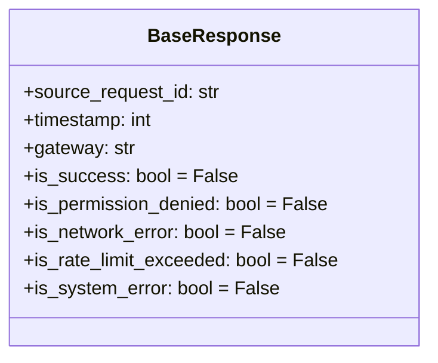

**Properties:**

**요청 추적:**
- `source_request_id: str` - 원본 Request의 client_request_id

**메타데이터:**
- `timestamp: int` - 응답 생성 시각 (unix timestamp 초단위)
- `gateway: str` - Gateway 식별자 (예: "binance", "upbit", "simulation")

**공통 상태 플래그:**
- `is_success: bool = False` - 작업 성공 여부
- `is_permission_denied: bool = False` - API 권한 부족, IP 차단, 지역 제한 등
- `is_network_error: bool = False` - 네트워크 오류
- `is_rate_limit_exceeded: bool = False` - API 호출 제한 초과
- `is_system_error: bool = False` - 거래소 내부 시스템 오류

## Response 명세

### OpenLimitOrderResponse

지정가 주문 생성 요청에 대한 응답.

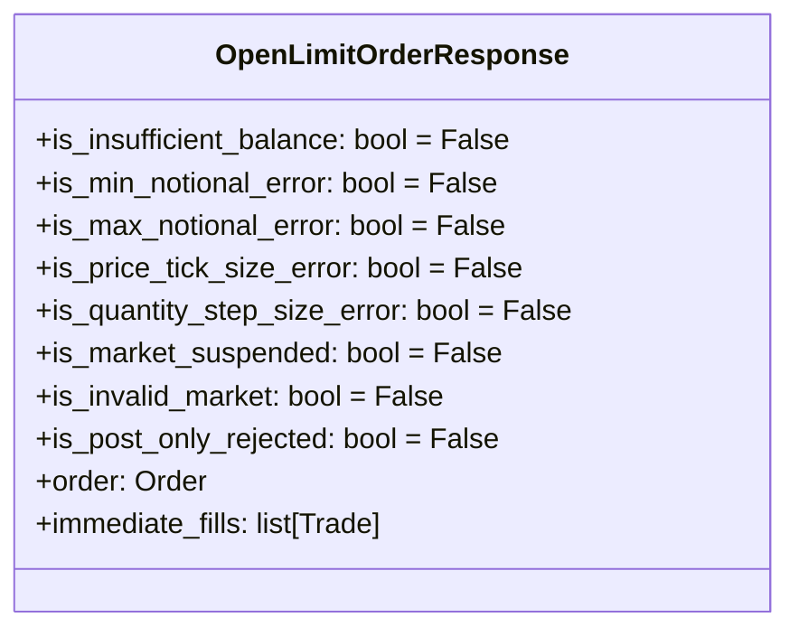

**Properties:**

**고유 상태 플래그:**
- `is_insufficient_balance: bool = False` - 잔고 부족 오류
- `is_min_notional_error: bool = False` - 최소 주문 금액/수량 미달
- `is_max_notional_error: bool = False` - 최대 주문 금액/수량 초과
- `is_price_tick_size_error: bool = False` - 가격 틱 사이즈 위반
- `is_quantity_step_size_error: bool = False` - 수량 단위 위반
- `is_market_suspended: bool = False` - 마켓 거래 정지 중
- `is_invalid_market: bool = False` - 존재하지 않는 마켓
- `is_post_only_rejected: bool = False` - post_only 옵션 위반으로 주문 거부

**결과 데이터:**

성공 시 (`is_success=True`):
- `order: Order` - 생성된 주문 객체 (order_id, status, filled_quantity 등 포함)
- `immediate_fills: list[Trade]` - 주문 생성과 동시에 체결된 내역 (없으면 빈 리스트)

**동작:**
- 주문이 즉시 체결되면 `order.status`는 `FILLED` 또는 `PARTIALLY_FILLED`
- Gateway는 거래소 특성에 따라 체결 내역 제공:
  - Binance: 응답의 `fills` 배열 사용
  - Upbit 등: 추가 조회 API 호출하여 체결 내역 획득
- 사용자는 `order.status`로 즉시 체결 여부를 판단하고, 상세 내역은 `immediate_fills`에서 확인
- TIF(Time In Force) 옵션은 `order.time_in_force`로 확인:
  - `None`: Gateway가 거래소/주문타입별 기본값 적용
  - `GTC`: 취소할 때까지 유효
  - `IOC`: 즉시 체결 가능한 부분만 체결, 나머지 취소
  - `FOK`: 전량 즉시 체결 또는 전체 거부

### CloseLimitOrderResponse

지정가 주문 취소 요청에 대한 응답.

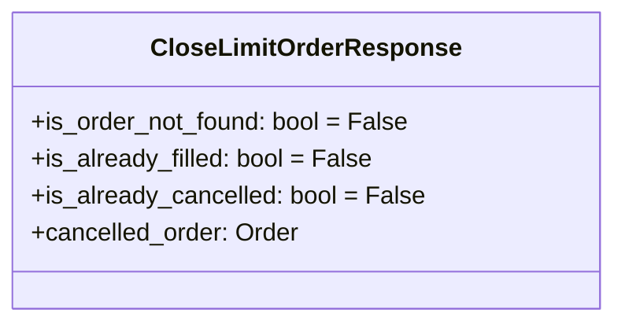

**Properties:**

**고유 상태 플래그:**
- `is_order_not_found: bool = False` - 주문 ID가 존재하지 않음
- `is_already_filled: bool = False` - 이미 전체 체결된 주문
- `is_already_cancelled: bool = False` - 이미 취소된 주문

**결과 데이터:**

성공 시 (`is_success=True`):
- `cancelled_order: Order` - 취소된 주문의 최종 상태 (부분 체결 정보 포함)

### MarketOrderResponse

시장가 주문 생성 요청에 대한 응답.

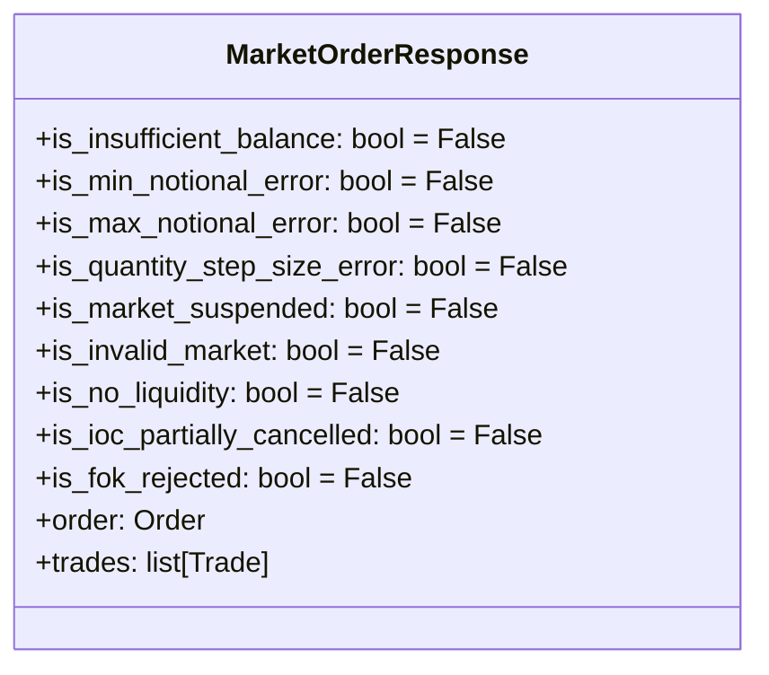

**Properties:**

**고유 상태 플래그:**
- `is_insufficient_balance: bool = False` - 잔고 부족 오류
- `is_min_notional_error: bool = False` - 최소 주문 금액/수량 미달
- `is_max_notional_error: bool = False` - 최대 주문 금액/수량 초과
- `is_quantity_step_size_error: bool = False` - 수량 단위 위반
- `is_market_suspended: bool = False` - 마켓 거래 정지 중
- `is_invalid_market: bool = False` - 존재하지 않는 마켓
- `is_no_liquidity: bool = False` - 유동성 부족 (시장가 특유)
- `is_ioc_partially_cancelled: bool = False` - IOC 설정으로 미체결 부분 취소됨
- `is_fok_rejected: bool = False` - FOK 설정으로 전량 체결 실패하여 전체 거부됨

**결과 데이터:**

성공 시 (`is_success=True`):
- `order: Order` - 생성된 시장가 주문 객체 (최종 상태 포함)
- `trades: list[Trade]` - 체결 내역 목록

**동작:**
- 시장가 주문은 즉시 체결 시도
- TIF(Time In Force) 옵션별 동작:
  - `None` 또는 `IOC`: 즉시 체결 가능한 부분만 체결, 미체결 부분 취소
  - `FOK`: 전량 즉시 체결되지 않으면 전체 거부 → `is_fok_rejected=True`, `is_success=False`
- IOC로 부분 체결 후 나머지 취소: `is_ioc_partially_cancelled=True`
- 체결 내역은 `trades`에서 확인
- TIF 설정은 `order.time_in_force`로 확인
- Gateway는 거래소별 기본값 적용 (시장가는 보통 IOC가 기본)

### StopLimitOrderResponse (미구현)

스톱 리밋 주문 생성 요청(`StopLimitBuyOrderRequest`, `StopLimitSellOrderRequest`)에 대한 응답.

**재사용 방안:**
- ✅ `OpenLimitOrderResponse` 재사용 가능
- Stop 주문도 트리거되면 지정가 주문으로 전환되므로 동일한 Response 사용

**추가 필요 플래그 (검토 필요):**
- `is_stop_trigger_invalid: bool` - 트리거 가격이 현재가와 역방향 (예: 매수 stop_price < 현재가)
- `is_stop_price_too_close: bool` - 트리거 가격이 현재가에 너무 근접 (거래소별 최소 거리 제한)

**동작:**
- Stop 주문은 트리거 전까지 대기 상태
- 트리거되면 지정가 주문으로 전환 → OpenLimitOrderResponse와 동일
- `order.order_type = OrderType.STOP_LIMIT`, `order.stop_price` 포함

### StopMarketOrderResponse (미구현)

스톱 마켓 주문 생성 요청(`StopMarketBuyOrderRequest`, `StopMarketSellOrderRequest`)에 대한 응답.

**재사용 방안:**
- ✅ `MarketOrderResponse` 재사용 가능
- Stop 주문도 트리거되면 시장가 주문으로 전환되므로 동일한 Response 사용

**추가 필요 플래그 (검토 필요):**
- `is_stop_trigger_invalid: bool` - 트리거 가격이 현재가와 역방향
- `is_stop_price_too_close: bool` - 트리거 가격이 현재가에 너무 근접

**동작:**
- Stop 주문은 트리거 전까지 대기 상태
- 트리거되면 시장가 주문으로 전환 → MarketOrderResponse와 동일
- `order.order_type = OrderType.STOP_MARKET`, `order.stop_price` 포함

**Gateway 구현 시 고려사항:**
1. **거래소별 지원 여부:**
   - Binance: STOP_LOSS, STOP_LOSS_LIMIT, TAKE_PROFIT, TAKE_PROFIT_LIMIT 지원
   - Upbit: Stop 주문 미지원 → is_system_error 반환 또는 미구현 오류

2. **시뮬레이션 구현:**
   - 가격 모니터링 필요
   - 트리거 조건 검증 (매수: stop_price ≥ 현재가, 매도: stop_price ≤ 현재가)
   - 트리거 시 해당 타입 주문으로 자동 전환

3. **트리거 검증:**
   - 매수 Stop: stop_price > 현재가 (상승 시 진입)
   - 매도 Stop: stop_price < 현재가 (하락 시 청산)
   - 역방향 설정 시 is_stop_trigger_invalid 반환

### ModifyOrderResponse

주문 수정 요청에 대한 응답.

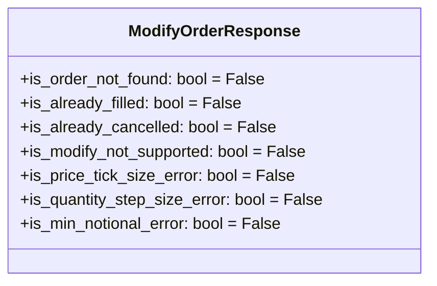

**Properties:**

**고유 상태 플래그:**
- `is_order_not_found: bool = False` - 주문 ID가 존재하지 않음
- `is_already_filled: bool = False` - 이미 전체 체결된 주문
- `is_already_cancelled: bool = False` - 이미 취소된 주문
- `is_modify_not_supported: bool = False` - 거래소가 주문 수정을 지원하지 않음
- `is_price_tick_size_error: bool = False` - 가격 틱 사이즈 위반
- `is_quantity_step_size_error: bool = False` - 수량 단위 위반
- `is_min_notional_error: bool = False` - 최소 주문 금액/수량 미달

**결과 데이터:** (나중에 작성)

### OrderCurrentStateResponse

주문 상태 조회 요청에 대한 응답.

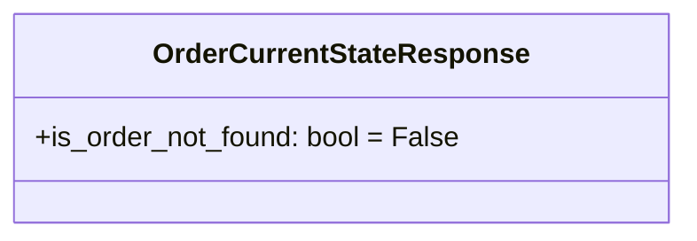

**Properties:**

**고유 상태 플래그:**
- `is_order_not_found: bool = False` - 주문 ID가 존재하지 않음

**결과 데이터:** (나중에 작성)

### OrderListResponse

미체결 주문 목록 조회 요청에 대한 응답.

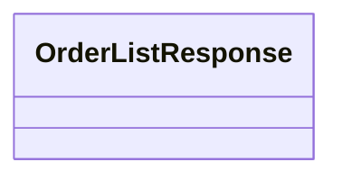

**Properties:**

고유 상태 플래그 없음 (BaseResponse의 공통 플래그만 사용)

**결과 데이터:** (나중에 작성)

### TradeInfoResponse

주문 체결 내역 조회 요청에 대한 응답.

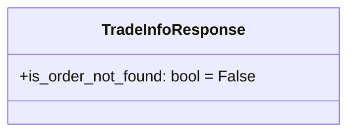

**Properties:**

**고유 상태 플래그:**
- `is_order_not_found: bool = False` - 주문 ID가 존재하지 않음

**결과 데이터:** (나중에 작성)

### RecentTradesResponse

최근 체결 내역 조회 요청에 대한 응답.

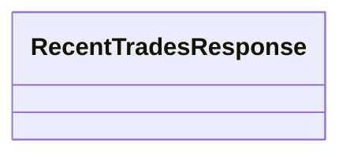

**Properties:**

고유 상태 플래그 없음 (BaseResponse의 공통 플래그만 사용)

**결과 데이터:** (나중에 작성)

### CurrentBalanceResponse

계정 잔고 조회 요청에 대한 응답.

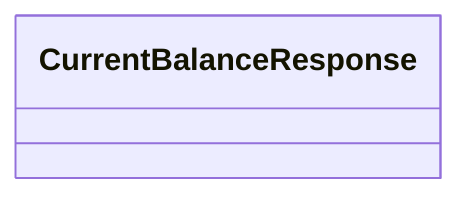

**Properties:**

고유 상태 플래그 없음 (BaseResponse의 공통 플래그만 사용)

**결과 데이터:** (나중에 작성)

### PriceDataResponse

캔들 데이터 조회 요청에 대한 응답.

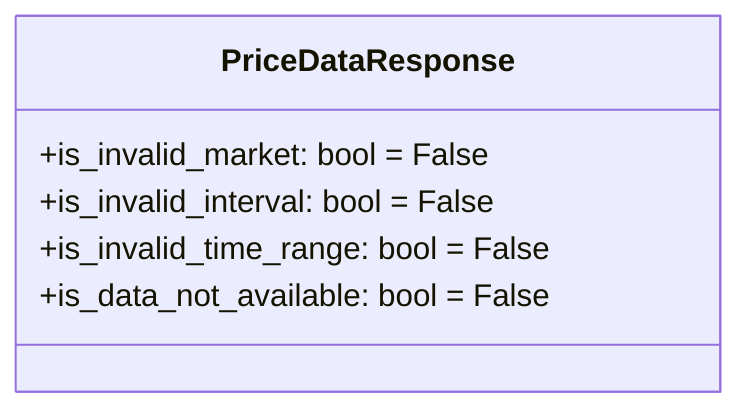

**Properties:**

**고유 상태 플래그:**
- `is_invalid_market: bool = False` - 존재하지 않는 마켓
- `is_invalid_interval: bool = False` - 잘못된 캔들 간격 (예: 지원하지 않는 interval)
- `is_invalid_time_range: bool = False` - 잘못된 시간 범위 (start > end, 미래 시각 등)
- `is_data_not_available: bool = False` - 요청한 기간의 데이터 없음

**결과 데이터:** (나중에 작성)

### OrderbookResponse

호가창 조회 요청에 대한 응답.

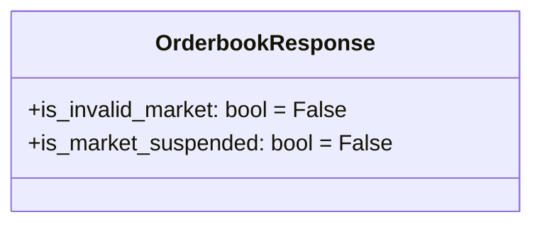

**Properties:**

**고유 상태 플래그:**
- `is_invalid_market: bool = False` - 존재하지 않는 마켓
- `is_market_suspended: bool = False` - 마켓 거래 정지 중

**결과 데이터:** (나중에 작성)

### TickerResponse

시세 정보 조회 요청에 대한 응답.

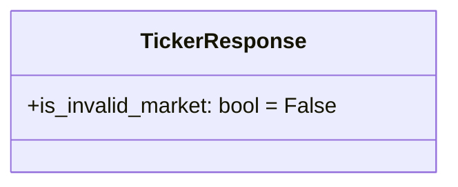

**Properties:**

**고유 상태 플래그:**
- `is_invalid_market: bool = False` - 존재하지 않는 마켓

**결과 데이터:** (나중에 작성)

### AvailableMarketsResponse

거래 가능 마켓 조회 요청에 대한 응답.

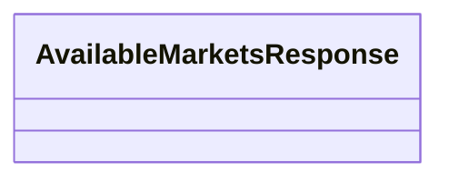

**Properties:**

고유 상태 플래그 없음 (BaseResponse의 공통 플래그만 사용)

**결과 데이터:** (나중에 작성)

### FeeInfoResponse

거래 수수료 정보 조회 요청에 대한 응답.

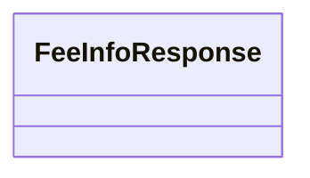

**Properties:**

고유 상태 플래그 없음 (BaseResponse의 공통 플래그만 사용)

**결과 데이터:** (나중에 작성)

### ServerStatusResponse

서버 상태 조회 요청에 대한 응답.

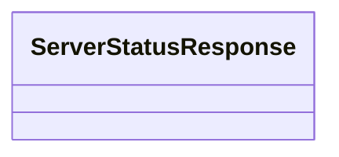

**Properties:**

고유 상태 플래그 없음 (BaseResponse의 공통 플래그만 사용)

**결과 데이터:** (나중에 작성)

## 구현 계획

(작성 중)
