# Response Architecture

## 개요

Response 모듈은 Gateway가 Request 처리 결과를 전달할 때 사용하는 응답 객체를 정의한다. 모든 Gateway 메서드는 대응하는 Response 객체를 반환하며, 이를 통해 성공/실패 상태, 결과 데이터, 오류 정보 등을 일관된 형식으로 제공한다.

Response는 Gateway와 전략 실행자 간의 상호작용 결과를 표현하는 출구점이다. 주문 생성 결과, 조회 결과, 오류 정보 등 모든 Gateway 동작의 결과는 해당하는 Response 객체를 통해 전달된다. Response 타입을 작업 유형별로 세분화하여 분리함으로써 각 응답에 포함되는 데이터를 명확히 정의하고, 성공/실패 시나리오를 체계적으로 처리할 수 있다.

## 설계 원칙

### 1:1 Request-Response 매핑

모든 Request에 대응하는 고유한 Response 타입이 존재한다. OpenLimitOrderRequest는 OpenLimitOrderResponse를, OrderCurrentStateRequest는 OrderCurrentStateResponse를 반환한다. 이러한 1:1 매핑을 통해 각 작업의 결과 타입이 명확해지고, IDE의 타입 힌트와 정적 분석 도구가 효과적으로 동작할 수 있다.

### 성공/실패 명확한 구분

모든 Response는 작업의 성공/실패를 명확히 구분할 수 있는 정보를 포함한다. 성공 시에는 결과 데이터(Order, Trade, Balance 등)를 포함하며, 실패 시에는 오류 코드, 오류 메시지, 원인 등을 포함한다. 부분 성공(예: 부분 체결)과 같은 중간 상태도 명확히 표현할 수 있어야 한다.

### Gateway 구현체 독립성

Response는 financial-assets 패키지에 정의되며, 특정 Gateway 구현에 종속되지 않는다. Binance API 응답, Upbit API 응답, 시뮬레이션 결과 등 다양한 출처의 데이터가 동일한 Response 형식으로 변환되어 전달된다. Gateway는 내부적으로 각 거래소 API의 응답을 표준 Response 형식으로 변환하는 어댑터 역할을 수행한다.

### 메타데이터 포함

모든 Response는 응답 생성 시점, 소스(거래소 식별자), 응답 처리에 필요한 메타데이터를 포함한다. 이를 통해 응답 추적, 디버깅, 로깅, 감사 등을 지원한다.

## 공통 구조

### BaseResponse

모든 Response 클래스가 상속받는 기본 클래스다.

**책임:**
- 원본 요청 추적
- 응답 생성 시점 및 Gateway 기록
- 모든 응답에 공통된 상태 플래그 제공

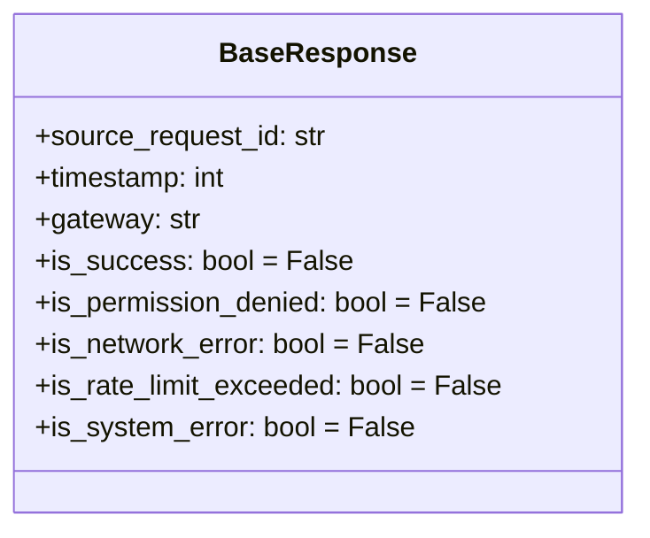

**Properties:**

**요청 추적:**
- `source_request_id: str` - 원본 Request의 client_request_id

**메타데이터:**
- `timestamp: int` - 응답 생성 시각 (unix timestamp 초단위)
- `gateway: str` - Gateway 식별자 (예: "binance", "upbit", "simulation")

**공통 상태 플래그:**
- `is_success: bool = False` - 작업 성공 여부
- `is_permission_denied: bool = False` - API 권한 부족, IP 차단, 지역 제한 등
- `is_network_error: bool = False` - 네트워크 오류
- `is_rate_limit_exceeded: bool = False` - API 호출 제한 초과
- `is_system_error: bool = False` - 거래소 내부 시스템 오류

## Response 명세

### OpenSpotOrderResponse

Spot 주문 생성 요청에 대한 통합 응답. 모든 Spot 주문 타입(Limit, Market, StopLimit, StopMarket)에 사용된다.

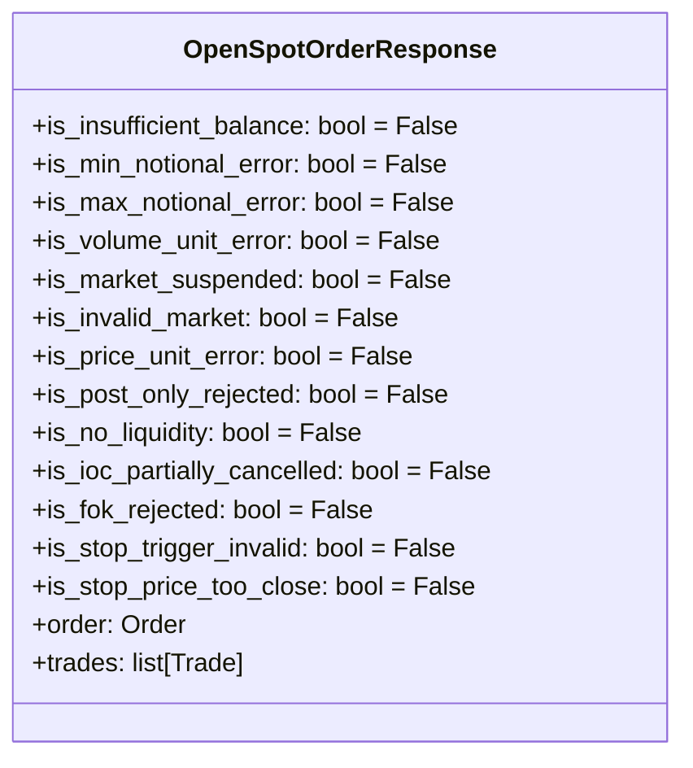

**Properties:**

**공통 검증 오류 플래그:**
- `is_insufficient_balance: bool = False` - 잔고 부족 오류
- `is_min_notional_error: bool = False` - 최소 주문 금액/수량 미달
- `is_max_notional_error: bool = False` - 최대 주문 금액/수량 초과
- `is_volume_unit_error: bool = False` - 수량 최소 단위 위반
- `is_market_suspended: bool = False` - 마켓 거래 정지 중
- `is_invalid_market: bool = False` - 존재하지 않는 마켓

**지정가 주문 관련 플래그:**
- `is_price_unit_error: bool = False` - 가격 최소 단위 위반 (Limit, StopLimit만)
- `is_post_only_rejected: bool = False` - post_only 옵션 위반으로 주문 거부 (Limit, StopLimit만)

**시장가 주문 관련 플래그:**
- `is_no_liquidity: bool = False` - 유동성 부족 (Market, StopMarket만)

**TIF 관련 플래그:**
- `is_ioc_partially_cancelled: bool = False` - IOC 설정으로 미체결 부분 취소됨 (모든 타입)
- `is_fok_rejected: bool = False` - FOK 설정으로 전량 체결 실패하여 전체 거부됨 (모든 타입)

**Stop 주문 관련 플래그:**
- `is_stop_trigger_invalid: bool = False` - 트리거 가격이 현재가와 역방향 (StopLimit, StopMarket만)
- `is_stop_price_too_close: bool = False` - 트리거 가격이 현재가에 너무 근접 (StopLimit, StopMarket만)

**결과 데이터:**

성공 시 (`is_success=True`):
- `order: Order` - 생성된 주문 객체 (order_id, status, order_type, stop_price 등 포함)
- `trades: list[Trade]` - 즉시 체결된 내역 (없으면 빈 리스트)

**동작:**
- 주문 타입은 `order.order_type`으로 확인 (LIMIT, MARKET, STOP_LIMIT, STOP_MARKET)
- 주문이 즉시 체결되면 `order.status`는 `FILLED` 또는 `PARTIALLY_FILLED`
- Gateway는 거래소 특성에 따라 체결 내역 제공:
  - Binance: 응답의 `fills` 배열 사용
  - Upbit 등: 추가 조회 API 호출하여 체결 내역 획득
- TIF(Time In Force) 옵션은 `order.time_in_force`로 확인:
  - `None`: Gateway가 거래소/주문타입별 기본값 적용
  - `GTC`: 취소할 때까지 유효
  - `IOC`: 즉시 체결 가능한 부분만 체결, 나머지 취소
  - `FOK`: 전량 즉시 체결 또는 전체 거부
- Stop 주문은 트리거 전까지 대기 상태, 트리거되면 해당 주문 타입으로 전환

**플래그 적용 매트릭스:**

| 주문 타입 | 적용 플래그 |
|-----------|-------------|
| Limit | 공통, 지정가, TIF |
| Market | 공통, 시장가, TIF |
| StopLimit | 공통, 지정가, TIF, Stop |
| StopMarket | 공통, 시장가, TIF, Stop |

### OpenFuturesOrderResponse (미구현)

Futures 주문 생성 요청에 대한 응답. 추후 구현 예정.

**Spot과의 차이점:**
- 포지션 개념 (Long/Short)
- 마진, 레버리지, 청산가
- 펀딩비, 미실현손익
- Open/Close 구분

**추후 추가 예정:**
- `is_insufficient_margin` - 마진 부족
- `is_leverage_too_high` - 레버리지 초과
- `is_liquidation_risk` - 청산 위험
- `position: Position` - 포지션 정보
- `liquidation_price: float` - 청산가

### CloseLimitOrderResponse

지정가 주문 취소 요청에 대한 응답.

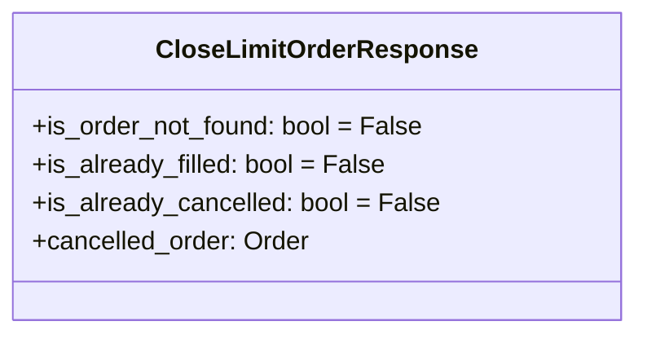

**Properties:**

**고유 상태 플래그:**
- `is_order_not_found: bool = False` - 주문 ID가 존재하지 않음
- `is_already_filled: bool = False` - 이미 전체 체결된 주문
- `is_already_cancelled: bool = False` - 이미 취소된 주문

**결과 데이터:**

성공 시 (`is_success=True`):
- `cancelled_order: Order` - 취소된 주문의 최종 상태 (부분 체결 정보 포함)

### ModifyOrderResponse

주문 수정 요청에 대한 응답.

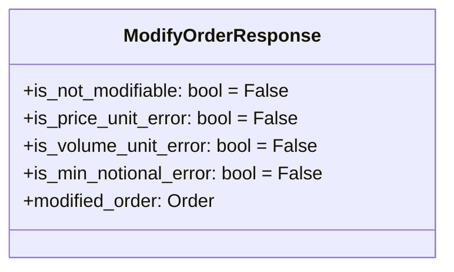

**Properties:**

**고유 상태 플래그:**
- `is_not_modifiable: bool = False` - 수정 불가능한 주문 상태 (주문 없음/이미 체결됨/이미 취소됨)
- `is_price_unit_error: bool = False` - 가격 최소 단위 위반
- `is_volume_unit_error: bool = False` - 수량 최소 단위 위반
- `is_min_notional_error: bool = False` - 최소 주문 금액/수량 미달

**결과 데이터:**

성공 시 (`is_success=True`):
- `modified_order: Order` - 수정된 주문 객체 (새로운 가격/수량 반영)

### OrderCurrentStateResponse

주문 상태 조회 요청에 대한 응답.

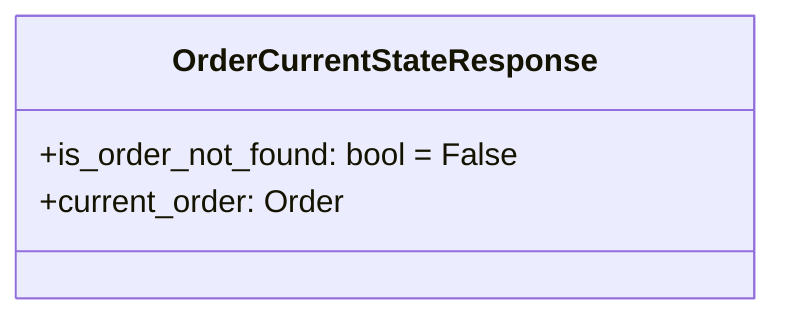

**Properties:**

**고유 상태 플래그:**
- `is_order_not_found: bool = False` - 주문 ID가 존재하지 않음

**결과 데이터:**

성공 시 (`is_success=True`):
- `current_order: Order` - 조회된 주문의 현재 상태

### OrderListResponse

미체결 주문 목록 조회 요청에 대한 응답.

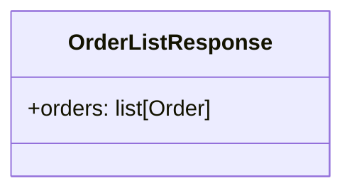

**Properties:**

고유 상태 플래그 없음 (BaseResponse의 공통 플래그만 사용)

**결과 데이터:**

성공 시 (`is_success=True`):
- `orders: list[Order]` - 조회된 주문 목록 (미체결/부분체결 주문)

### TradeInfoResponse

주문 체결 내역 조회 요청에 대한 응답.

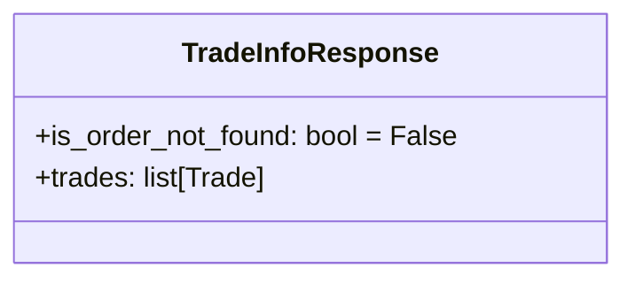

**Properties:**

**고유 상태 플래그:**
- `is_order_not_found: bool = False` - 주문 ID가 존재하지 않음

**결과 데이터:**

성공 시 (`is_success=True`):
- `trades: list[Trade]` - 해당 주문의 체결 내역 목록 (시간순 정렬)

**동작:**
- 특정 order_id에 바인드된 모든 체결(Fill) 목록을 반환
- 주문이 부분 체결된 경우 여러 개의 Trade가 포함될 수 있음
- 주문이 아직 체결되지 않은 경우 빈 리스트 반환
- Trade는 체결 시각(timestamp) 오름차순으로 정렬됨
- 각 Trade는 개별 체결의 가격, 수량, 수수료 정보를 포함
- Spot 주문은 SpotTrade, Futures 주문은 FuturesTrade 타입으로 반환

### RecentTradesResponse

최근 체결 내역 조회 요청에 대한 응답.

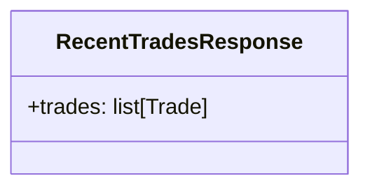

**Properties:**

고유 상태 플래그 없음 (BaseResponse의 공통 플래그만 사용)

**결과 데이터:**

성공 시 (`is_success=True`):
- `trades: list[Trade]` - 체결 내역 목록 (시간 순)

**동작:**
- 내 계정의 특정 심볼에 대한 체결 내역 반환 (private data, 인증 필요)
- TradeInfoResponse와의 차이: TradeInfoResponse는 특정 order_id의 체결 내역, RecentTradesResponse는 특정 심볼의 계정 체결 내역
- Gateway 증분 조회 전략:
  - 첫 조회: 24시간 이내 체결 내역 전체 반환
  - 이후 조회: 마지막 조회 이후 신규 체결만 반환 (캐싱된 타임스탬프 활용)
  - `start = last_timestamp`, `end = now`로 거래소 API 호출
- Trade는 체결 시각(timestamp) 오름차순으로 정렬됨
- 거래소별 구현:
  - Binance: `/api/v3/myTrades` (startTime, endTime 사용)
  - Bybit: `/v5/execution/list` (startTime, endTime 사용)
  - Upbit: 주문 조회 후 trades 필드 추출

### CurrentBalanceResponse

계정 잔고 조회 요청에 대한 응답.

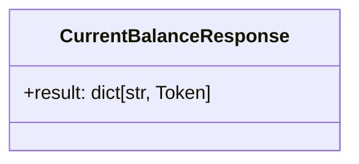

**Properties:**

고유 상태 플래그 없음 (BaseResponse의 공통 플래그만 사용)

**결과 데이터:**

성공 시 (`is_success=True`):
- `result: dict[str, Token]` - 토큰 심볼을 키로, 보유 수량을 값으로 하는 잔고 맵

**동작:**
- key: 토큰 심볼 (예: "BTC", "USDT", "ETH")
- value: Token 객체 (심볼과 수량 정보 포함)
- 잔고가 0인 토큰은 포함 여부가 거래소 정책에 따라 다를 수 있음
- Gateway는 거래소 API 응답을 dict[str, Token] 형식으로 변환

### PriceDataResponse

캔들 데이터 조회 요청에 대한 응답.

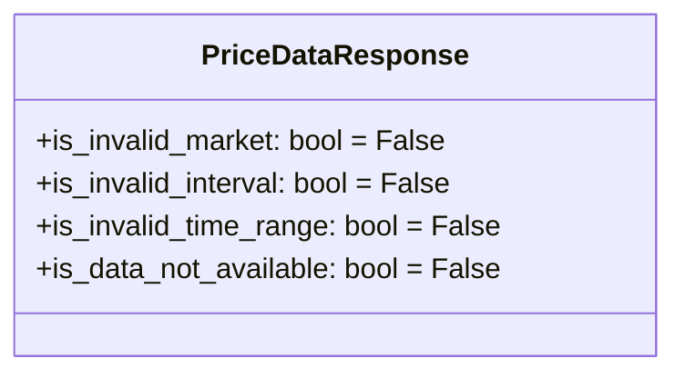

**Properties:**

**고유 상태 플래그:**
- `is_invalid_market: bool = False` - 존재하지 않는 마켓
- `is_invalid_interval: bool = False` - 잘못된 캔들 간격 (예: 지원하지 않는 interval)
- `is_invalid_time_range: bool = False` - 잘못된 시간 범위 (start > end, 미래 시각 등)
- `is_data_not_available: bool = False` - 요청한 기간의 데이터 없음

**결과 데이터:** (나중에 작성)

### OrderbookResponse

호가창 조회 요청에 대한 응답.

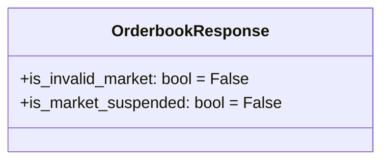

**Properties:**

**고유 상태 플래그:**
- `is_invalid_market: bool = False` - 존재하지 않는 마켓
- `is_market_suspended: bool = False` - 마켓 거래 정지 중

**결과 데이터:** (나중에 작성)

### TickerResponse

시세 정보 조회 요청에 대한 응답.

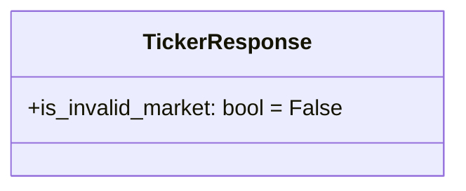

**Properties:**

**고유 상태 플래그:**
- `is_invalid_market: bool = False` - 존재하지 않는 마켓

**결과 데이터:** (나중에 작성)

### AvailableMarketsResponse

거래 가능 마켓 조회 요청에 대한 응답.

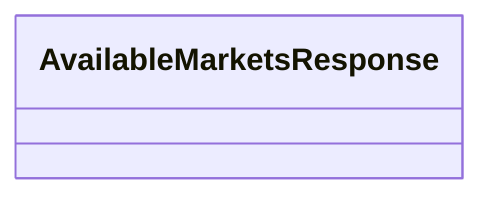

**Properties:**

고유 상태 플래그 없음 (BaseResponse의 공통 플래그만 사용)

**결과 데이터:** (나중에 작성)

### FeeInfoResponse

거래 수수료 정보 조회 요청에 대한 응답.

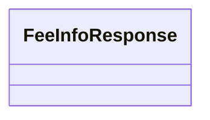

**Properties:**

고유 상태 플래그 없음 (BaseResponse의 공통 플래그만 사용)

**결과 데이터:** (나중에 작성)

### ServerStatusResponse

서버 상태 조회 요청에 대한 응답.

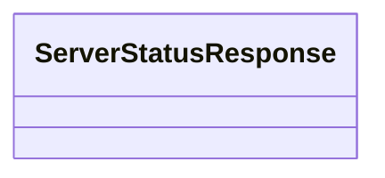

**Properties:**

고유 상태 플래그 없음 (BaseResponse의 공통 플래그만 사용)

**결과 데이터:** (나중에 작성)

## 구현 계획

(작성 중)
