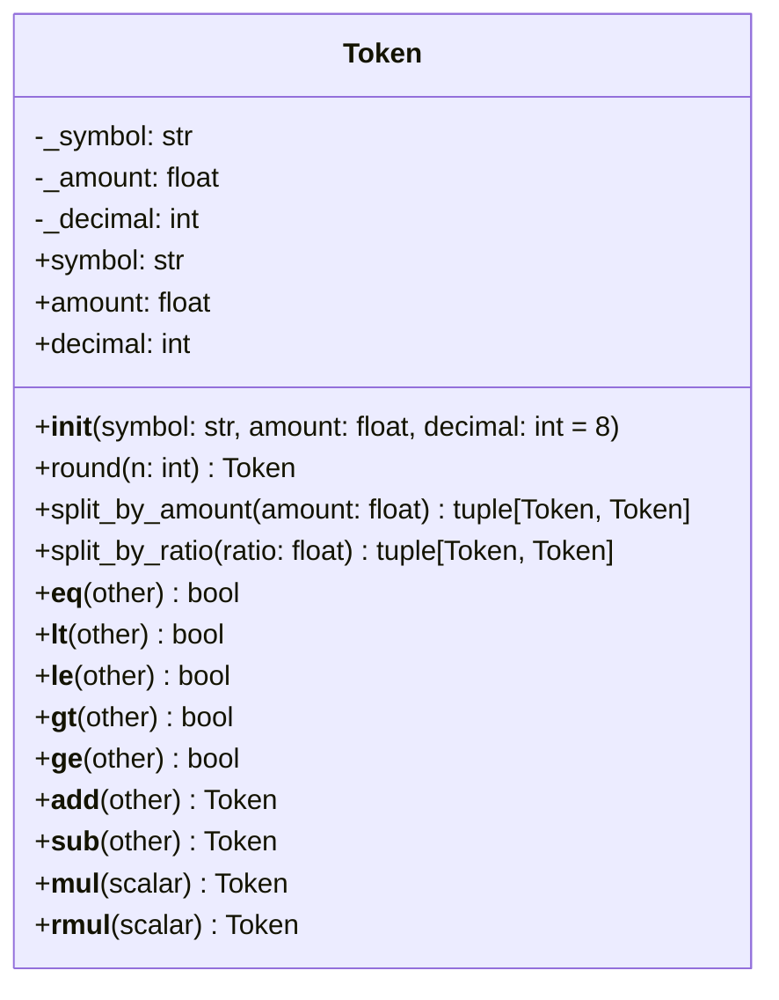

# Architecture - Token

## 개요

거래 가능한 자산을 표현하는 가장 기본적인 단위.

**목적**: 자산의 심볼(symbol)과 수량(amount)을 하나의 객체로 표현하여 타입 안정성 제공.

### 핵심 기능

- 자산 식별 (symbol)
- 수량 관리 (amount)
- 같은 자산끼리 수량 연산 (덧셈, 뺄셈, 스칼라 곱)
- 같은 자산끼리 수량 비교
- 정밀도 제어 (round)

### 설계 원칙

**역할 중립성**
- Token은 "currency"인지 "crypto"인지 구분하지 않음
- 역할은 Market에서의 위치(base/quote)로 결정됨
- BTC는 BTC/USD에서는 거래 대상, ETH/BTC에서는 거래 수단

**Symbol vs Ticker 용어 정의**
- **Symbol**: 단일 자산 식별자 (BTC, ETH, USD)
- **Ticker**: 거래 페어 식별자 (BTC-USD, ETH-BTC)
- 업계에서 혼용되지만 본 프로젝트에서는 명확히 구분

**불변성 (Immutability)**
- 모든 연산은 새로운 Token 객체 반환
- 원본 객체는 변경되지 않음

**타입 안전성**
- 다른 symbol끼리 연산 시도 시 에러 발생
- "사과 + 오렌지" 방지

## 구조



**단일 클래스 구조**
- Director/Worker 패턴 불필요
- 단순한 값 객체(Value Object)
- 연산자 오버로딩으로 직관적인 API 제공

## 데이터

### Token 필드

```python
class Token:
    _symbol: str      # 자산 식별자 (읽기 전용)
    _amount: float    # 자산 수량 (읽기 전용)
    _decimal: int     # 소수점 정밀도 (읽기 전용, 기본값: 8)
```

**속성 (Properties):**
- `symbol`: 자산 식별자 반환 (읽기 전용)
- `amount`: 자산 수량 반환 (읽기 전용)
- `decimal`: 소수점 정밀도 반환 (읽기 전용)

**제약사항:**
- symbol, amount, decimal은 초기화 후 변경 불가
- 모든 연산은 새 Token 인스턴스 생성
- amount는 초기화 시 decimal 자리로 자동 반올림됨

### Symbol 예시

| 자산 유형 | Symbol 예시 |
|---------|-----------|
| 암호화폐 | BTC, ETH, USDT |
| 법정화폐 | USD, KRW, JPY |
| 주식 | AAPL, TSLA, GOOGL |

## API

### 초기화

```python
Token(symbol: str, amount: float, decimal: int = 8)
```

**파라미터:**
- `symbol`: 자산 식별자
- `amount`: 자산 수량 (decimal 자리로 자동 반올림됨)
- `decimal`: 소수점 정밀도 (기본값: 8)

**예시:**
```python
btc = Token(symbol="BTC", amount=1.5)  # decimal=8 (기본값)
usd = Token(symbol="USD", amount=50000.0, decimal=4)
```

### 메서드

**round(n: int) -> Token**

수량을 반올림한 새로운 Token 반환. decimal 정밀도도 n으로 변경됨.

```python
btc = Token(symbol="BTC", amount=1.23456789, decimal=8)
rounded = btc.round(4)
# Token(symbol='BTC', amount=1.2346, decimal=4)
```

**split_by_amount(amount: float) -> tuple[Token, Token]**

특정 금액으로 토큰을 분할. decimal 정밀도는 원본 Token의 값을 승계.

```python
token = Token(symbol="BTC", amount=1.0, decimal=8)
reduced, splitted = token.split_by_amount(0.3)
# reduced: Token(symbol='BTC', amount=0.7, decimal=8)
# splitted: Token(symbol='BTC', amount=0.3, decimal=8)
# reduced.amount + splitted.amount == token.amount (보장됨)
```

**split_by_ratio(ratio: float) -> tuple[Token, Token]**

비율로 토큰을 분할. decimal 정밀도는 원본 Token의 값을 승계.

```python
token = Token(symbol="BTC", amount=1.0, decimal=8)
reduced, splitted = token.split_by_ratio(0.3)
# reduced: Token(symbol='BTC', amount≈0.7, decimal=8)
# splitted: Token(symbol='BTC', amount≈0.3, decimal=8)
# reduced.amount + splitted.amount == token.amount (보장됨)
```

### 연산자

**비교 연산 (같은 symbol끼리만)**

```python
btc1 = Token(symbol="BTC", amount=1.0)
btc2 = Token(symbol="BTC", amount=2.0)

btc1 == btc2  # False
btc1 < btc2   # True
btc1 <= btc2  # True
btc1 > btc2   # False
btc1 >= btc2  # False
```

**산술 연산 (같은 symbol끼리만)**

```python
# 덧셈 (더 높은 decimal 정밀도 사용)
btc1 = Token(symbol="BTC", amount=1.0, decimal=8)
btc2 = Token(symbol="BTC", amount=0.5, decimal=4)
total = btc1 + btc2
# Token(symbol='BTC', amount=1.5, decimal=8)

# 뺄셈 (더 높은 decimal 정밀도 사용)
remaining = btc1 - btc2
# Token(symbol='BTC', amount=0.5, decimal=8)

# 스칼라 곱 (원본 decimal 유지)
double = btc1 * 2
# Token(symbol='BTC', amount=2.0, decimal=8)

half = 0.5 * btc1
# Token(symbol='BTC', amount=0.5, decimal=8)
```

**에러 케이스**

```python
btc = Token(symbol="BTC", amount=1.0)
eth = Token(symbol="ETH", amount=10.0)

# ValueError: Cannot add tokens with different symbols
btc + eth

# ValueError: Cannot compare tokens with different symbols
btc < eth
```

### 사용 예시

```python
from financial_assets.token import Token

# 포트폴리오 수량 합산
holdings1 = Token(symbol="BTC", amount=1.0)
holdings2 = Token(symbol="BTC", amount=0.5)
total_holdings = holdings1 + holdings2
# Token(symbol='BTC', amount=1.5)

# 거래 수수료 계산
fee_rate = 0.001
trading_amount = Token(symbol="ETH", amount=10.0)
fee = trading_amount * fee_rate
# Token(symbol='ETH', amount=0.01)

# 잔액 확인
balance = Token(symbol="USDT", amount=1000.0)
order_amount = Token(symbol="USDT", amount=500.0)

if balance >= order_amount:
    remaining = balance - order_amount
    # Token(symbol='USDT', amount=500.0)
```

## 의존성

```toml
[project]
dependencies = [
    "python>=3.10"
]
```

외부 의존성 없음 (Python 표준 라이브러리만 사용).

## 통합

Token은 다른 모듈들의 기본 구성 요소로 사용됩니다:

- **Price**: 두 Token 간 교환 비율 (`base_token` / `quote_token`)
- **Order**: 주문 수량을 Token으로 표현
- **Trade**: 실제 거래된 수량을 Token으로 표현
