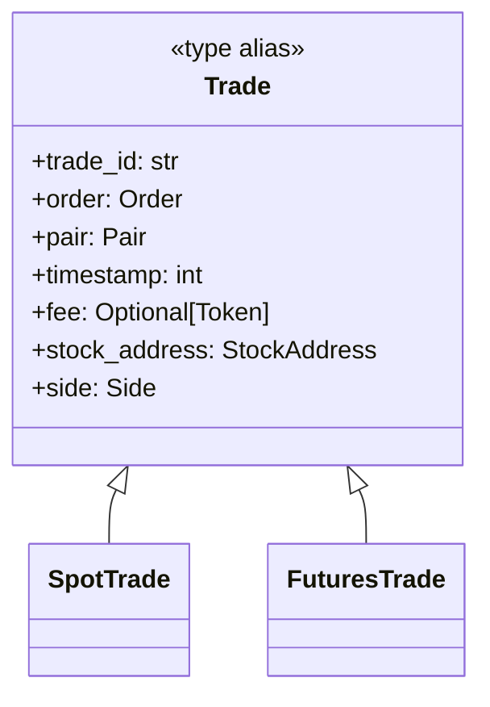
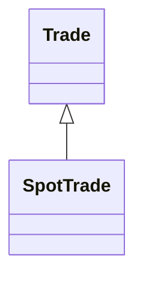
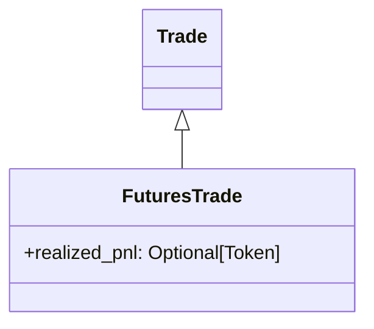

# Trade Architecture

## 개요

Trade 모듈은 거래소에서 실제로 체결 완료된 개별 체결(Fill) 정보를 표현하는 불변 데이터 구조를 정의한다. Trade는 Fill과 동일한 개념이며, 하나의 체결 이벤트를 나타낸다. 주문(Order)이 전체 또는 일부 체결될 때마다 하나 이상의 Trade가 생성되며, 이는 거래 시뮬레이션이나 실제 거래소 API의 체결 정보를 표준화하여 제공한다.

Trade는 주문 실행의 최종 결과물이다. 주문은 의도를 담은 요청이라면, Trade는 그 의도가 실제로 체결된 사실 기록이다. 하나의 주문이 여러 번에 걸쳐 체결될 수 있으므로 하나의 주문은 여러 Trade를 가질 수 있다. 각 Trade는 특정 가격과 수량으로 체결된 개별 체결 이벤트를 나타내며, 체결 시점, 수수료, 거래 방향 등의 정보를 포함한다.

## 설계 원칙

### 불변성(Immutable)

모든 Trade 객체는 불변(frozen=True)으로 설계된다. 체결된 거래는 과거의 사실이며 변경될 수 없다. 이를 통해 거래 기록의 무결성을 보장하고, 멀티스레드 환경에서도 안전하게 사용할 수 있다.

### 시장 유형별 분리

Spot과 Futures는 거래 메커니즘이 근본적으로 다르므로 Trade도 별도의 클래스로 분리한다. SpotTrade는 즉시 자산 교환을 나타내며, FuturesTrade는 포지션 개념과 미실현손익을 포함한다. 이러한 분리를 통해 각 시장 유형의 특성을 명확히 표현하고, 불필요한 속성 혼재를 방지한다.

### 타입 안전성

모든 Trade는 Trade 타입으로 통합하여 타입 힌트에 사용할 수 있다. Trade는 SpotTrade와 FuturesTrade의 Union 타입으로, 이를 통해 다양한 시장 유형의 거래를 단일 인터페이스로 처리하면서도 타입 안전성을 유지한다.

### Gateway 독립성

Trade 구조는 특정 거래소 API에 종속되지 않는다. Binance, Upbit, Bybit 등 다양한 거래소의 체결 데이터가 동일한 Trade 형식으로 변환되어 제공된다. Gateway는 각 거래소의 응답을 표준 Trade 형식으로 변환하는 어댑터 역할을 수행한다.

## 공통 구조

### Trade (Type Alias)

모든 Trade 클래스를 포괄하는 타입 별칭. 타입 힌트에서 사용된다.

**역할:**
- 다양한 Trade 타입을 단일 타입으로 표현
- 함수 시그니처와 반환 타입에 사용
- IDE 자동완성 및 정적 타입 검사 지원
- stock_address, side는 초기화 시 order에서 복사하여 저장

**공통 속성 (모든 Trade가 가져야 하는 속성):**
- `trade_id: str` - 체결 고유 ID (거래소가 부여한 개별 체결 이벤트 ID)
- `order: Order` - 원본 주문 객체 참조
- `pair: Pair` - 거래 쌍 (가격과 수량 정보 포함)
- `timestamp: int` - 체결 시각 (unix timestamp 초단위)
- `fee: Optional[Token]` - 거래 수수료 (수수료가 없으면 None)
- `stock_address: StockAddress` - 거래소 식별자 (초기화 시 order.stock_address에서 복사)
- `side: Side` - 거래 방향 (초기화 시 order.side에서 복사) (SpotTrade: BUY/SELL, FuturesTrade: LONG/SHORT)

## Trade 명세

### SpotTrade

현물 거래의 체결 정보를 나타낸다.

**Properties:**

공통 속성만 사용. 추가 속성 없음.
- `side`: BUY(매수), SELL(매도)만 사용

**특징:**
- 즉시 자산 교환 완료
- 잔고에 즉시 반영됨
- 포지션 개념 없음

### FuturesTrade

선물 거래의 체결 정보를 나타낸다.

**Properties:**

추가 속성:
- `realized_pnl: Optional[Token]` - 이 체결로 실현된 손익 (포지션 청산 시, 없으면 None)

공통 속성 중 특이사항:
- `side`: LONG(롱 포지션), SHORT(숏 포지션)만 사용

**특징:**
- 포지션 개념 존재 (Long/Short)
- 포지션 진입/청산 구분
- 실현손익 계산
- 레버리지 적용

**SpotTrade와의 차이점:**
- 포지션 방향 명시적 표현 (LONG/SHORT)
- 실현손익 추적 (realized_pnl)
- 포지션 청산 시 손익 확정

## 구현 계획

### 구현 완료

- [x] SpotTrade 구현
- [x] FuturesTrade 구현
- [x] Side enum에 LONG, SHORT 추가
- [x] Trade 타입 별칭 정의 (`Trade = SpotTrade | FuturesTrade`)
- [x] 불변 데이터 구조 (frozen=True)
- [x] 공통 속성 정의

### 추후 구현 예정

**테스트:**
- [ ] SpotTrade 생성 및 속성 접근 테스트
- [ ] 불변성 테스트 (frozen=True 검증)
- [ ] FuturesTrade 생성 및 고유 속성 테스트
- [ ] Side enum 값 검증 테스트 (Spot: BUY/SELL, Futures: LONG/SHORT)
- [ ] 다양한 거래소 데이터 변환 테스트

**Gateway 통합:**
- [ ] 거래소 API 응답을 Trade로 변환하는 어댑터 구현
- [ ] realized_pnl 계산 로직 Gateway에서 처리

**문서화:**
- [ ] Trade vs Order 개념 차이 문서화
- [ ] 각 거래소별 trade_id 매핑 규칙 문서화
- [ ] Side enum 값 사용 가이드 (Spot vs Futures)
