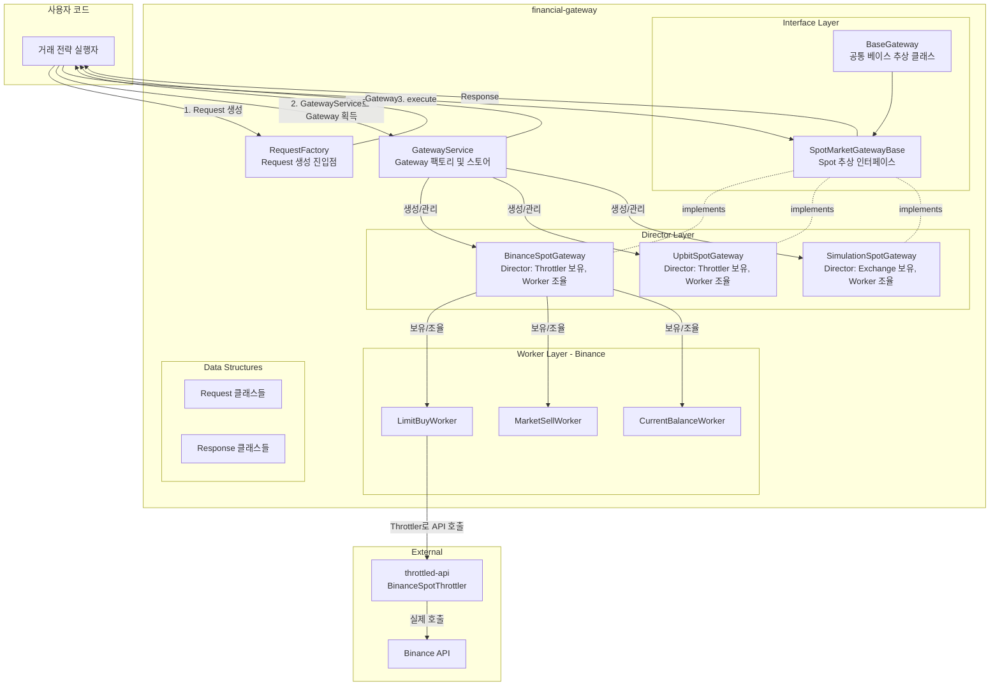

# Architecture - Financial Gateway

## Overview

Financial Gateway는 거래 전략 실행자와 거래소(실제 API 또는 시뮬레이션) 사이의 통일된 인터페이스를 제공한다. RequestFactory로 Request를 생성하고, Gateway에 전달하여 Response를 받는 단순하고 일관된 상호작용 모델을 제공한다.

Gateway는 내부적으로 throttled-api와 통합되어 거래소 API rate limit을 준수하며, Request 타입에 따라 적절한 Worker로 라우팅하여 처리한다. 동일한 Request/Response 인터페이스로 시뮬레이션과 실거래를 모두 처리하여, Gateway 교체만으로 Sim-to-Real 전환이 가능하다.

### Core Features

- **RequestFactory**: Request 객체 생성의 통일된 진입점
- **통합 Gateway 인터페이스**: 모든 Gateway가 동일한 execute() 메서드 제공
- **Sim-to-Real 전환**: Gateway 교체만으로 시뮬레이션 ↔ 실거래 전환
- **throttled-api 통합**: 거래소 API rate limit 자동 관리
- **Spot/Futures 분리**: 시장 타입별 독립적인 Gateway 인터페이스

### Design Philosophy

**RequestFactory와 Gateway의 역할 분리**

RequestFactory는 Request 객체 생성만 담당하며, Gateway는 Request 처리 및 Response 반환만 담당한다. 각 책임이 명확히 분리되어 Request 생성 방식과 Gateway 처리 로직이 독립적으로 변경 가능하다.

**Gateway 교체를 통한 Sim-to-Real 전환**

전략 코드는 추상 인터페이스(SpotMarketGatewayBase)에만 의존하며, 구체 Gateway(SimulationSpotGateway, BinanceSpotGateway)를 주입받아 사용한다. 이를 통해 전략 코드 변경 없이 Gateway 교체만으로 시뮬레이션과 실거래 간 전환이 가능하다.

**Spot과 Futures의 구조적 분리**

Spot 거래와 Futures 거래는 거래 메커니즘, 필요 파라미터, 관리 대상이 본질적으로 다르다. SpotMarketGatewayBase와 FuturesMarketGatewayBase로 분리하여 각 시장 타입의 특성을 명확히 반영한다.

**SDW 패턴 적용**

Gateway는 SDW(Service-Director-Worker) 패턴을 따른다. Service는 추상 인터페이스(SpotMarketGatewayBase), Director는 구체 Gateway(BinanceSpotGateway), Worker는 각 Request별 처리자다. Director가 Throttler를 공유 리소스로 보유하며, Worker에 전달하여 일관된 rate limiting을 보장한다.

### Dependencies

```toml
dependencies = [
    "throttled-api",
    "financial-assets",
    "binance-connector>=3.12.0",
    "python-upbit-api>=1.9.1",
    "python-dotenv>=1.0.0",
]
```

**Notes:**
- `throttled-api`: API rate limiting 관리 (BinanceSpotThrottler 등)
- `financial-assets`: 도메인 객체 (Order, Trade 등)
- `binance-connector`: Binance API 클라이언트
- `python-upbit-api`: Upbit API 클라이언트
- `python-dotenv`: 환경변수에서 API 키 로드

## Structure



**Component Responsibilities:**

**RequestFactory**
- 각 Request 타입별 생성 메서드 제공
- 파라미터 검증 및 Request 객체 생성

**GatewayService**
- 구체 Gateway 팩토리: 요청에 따라 적절한 Gateway 생성 (Binance, Upbit, Simulation)
- 구체 Gateway 스토어: 생성된 Gateway 인스턴스 관리 및 캐싱
- Gateway 생성 시 필요한 설정 및 의존성 주입

**BaseGateway**
- 모든 Gateway의 최상위 추상 클래스
- `gateway_name`, `is_realworld_gateway` 속성 제공
- API 키 검증 로직 포함

**SpotMarketGatewayBase (Service - 추상)**
- Spot 거래 Gateway의 통일된 인터페이스
- `execute(request: BaseRequest) -> BaseResponse` 추상 메서드

**BinanceSpotGateway (Director - 구체)**
- SpotMarketGatewayBase 구현
- Throttler를 공유 리소스로 보유
- Request 타입에 따라 적절한 Worker로 라우팅
- Worker 생성 및 관리

**Worker (각 Request별)**
- LimitBuyWorker, MarketSellWorker, CurrentBalanceWorker 등
- encode: Request → API 파라미터 변환
- call: Throttler를 통해 API 호출
- decode: API 응답 → Response 객체 변환

**Request/Response**
- Request: 거래 의도를 표현하는 데이터 구조
- Response: 처리 결과를 담는 데이터 구조 (성공/실패, 오류 플래그, 결과 데이터)

**Dependencies:**
- Strategy → RequestFactory (Request 생성)
- Strategy → SpotMarketGatewayBase (execute 호출)
- BinanceSpotGateway → Workers (Worker 관리)
- Workers → Throttler (API 호출)
- Throttler → Binance API (실제 호출)

**Notes:**
- 이 문서는 시스템 레벨 컴포넌트 구조와 책임을 정의합니다
- 구체적인 패턴, API 명세, 데이터 구조는 각 컴포넌트의 moduleinfo 문서에서 정의됩니다
- Gateway 구현체마다 SDW 패턴을 적용하여 일관된 구조 유지

**Development Order and Status:** [Concept Design | Designing | Developing | Testing | Done | Deprecated]
1. [Request/Response] Concept Design
2. [RequestFactory] Concept Design
3. [GatewayService] Concept Design
4. [BaseGateway] Concept Design
5. [SpotMarketGatewayBase] Concept Design
6. [BinanceSpotGateway + Workers] Concept Design
7. [UpbitSpotGateway + Workers] Concept Design
8. [SimulationSpotGateway + Workers] Concept Design
