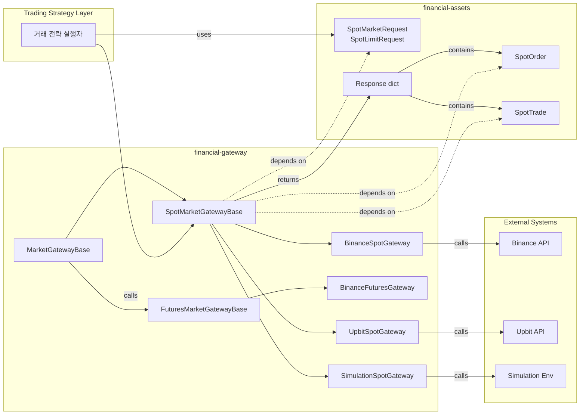

# Financial Gateway Architecture

## 개요

Financial Gateway는 거래 전략 실행자와 실제 거래 발생 지점(거래소 API 또는 시뮬레이션 환경) 사이를 매개하는 인터페이스 어댑터다. 이 게이트웨이가 없으면 모든 거래소나 시뮬레이션 환경 객체마다 각자의 API 시그니처 스타일대로 전략 실행자의 행동 부분을 분기 처리하거나 재구현해야 한다. Gateway를 통해 시뮬레이션에서 실제 거래소로 넘어갈 때 어댑터만 변경하여 바로 실제 적용으로 전환할 수 있으며, 전략 행동자는 실제 거래 수행 관련 로직과 완전히 분리된다.

Gateway의 핵심 역할은 거래 행위로의 진입점을 동일한 인터페이스로 접근할 수 있도록 하는 것이다. 사용자는 거래소별 API나 시뮬레이션의 구체적인 차이를 알 필요 없이, Gateway가 제공하는 통일된 인터페이스를 통해 모든 거래 동작과 조회 동작을 수행한다. Gateway는 단순한 거래 제출뿐만 아니라 주문 취소, 주문 조회, 체결 확인, 잔고 조회, 호가 조회 등 거래소 및 시뮬레이션과의 모든 상호작용을 포괄한다. 매번 여러 개의 어댑터를 구현하기 어렵기 때문에, 외부와의 소통 창구를 하나의 Gateway로 통합하는 것이 적절하다.

Spot 거래와 Futures 거래는 본질적으로 다르기 때문에 분리되어야 한다. 거래 메커니즘이 다르고(Spot은 즉시 자산 교환, Futures는 레버리지와 포지션 관리), 필요한 파라미터가 다르며(Futures는 레버리지, 마진 타입 등 추가 정보 필요), 관리 대상도 다르다(Spot은 보유 자산, Futures는 포지션과 마진). 따라서 SpotMarketGateway와 FuturesMarketGateway로 구분하며, 두 게이트웨이는 "사고 판다"는 추상적 행위 외에는 공통점이 거의 없다. 최상위에 MarketGatewayBase라는 공통 추상 부모는 존재하지만, 이는 근본적으로 약한 추상층이다. 잔고 조회 같은 소수의 공통 메서드는 가질 수 있으나, 대부분의 구체적인 거래 행위는 Spot과 Futures 각각의 베이스 클래스에서 정의된다.

거래 요청과 결과의 생명주기는 Request → Order → Response → Trade/Info 순서로 진행된다. Request는 사용자가 생성하는 거래 의도이며, Order는 거래소나 시뮬레이션이 생성하는 등록된 주문(order_id 포함)이다. Response는 dict 타입의 반응 정보로 response_type과 source 메타데이터를 포함하며, 내부에 Trade 객체나 Order 객체가 담긴다. Market 주문과 Limit 주문 모두 Response 구조를 통해 처리되며, 조회 동작도 Response로 통일된다. Request 타입은 SpotMarketRequest, SpotLimitRequest처럼 주문 유형별로 분리하여 더 안정적인 타입 안정성을 확보한다.

## 컴포넌트 구조

## SpotMarketGateway

SpotMarketGateway는 현물 거래 시장과의 모든 상호작용을 담당하는 인터페이스다. 주문 제출, 주문 관리, 주문 조회, 체결 내역 조회, 계정 정보 조회, 시장 데이터 조회 등 현물 거래에 필요한 모든 기능을 제공한다. 모든 메서드는 Request 객체를 입력으로 받으며, 일관된 Response dict 구조를 반환한다.

