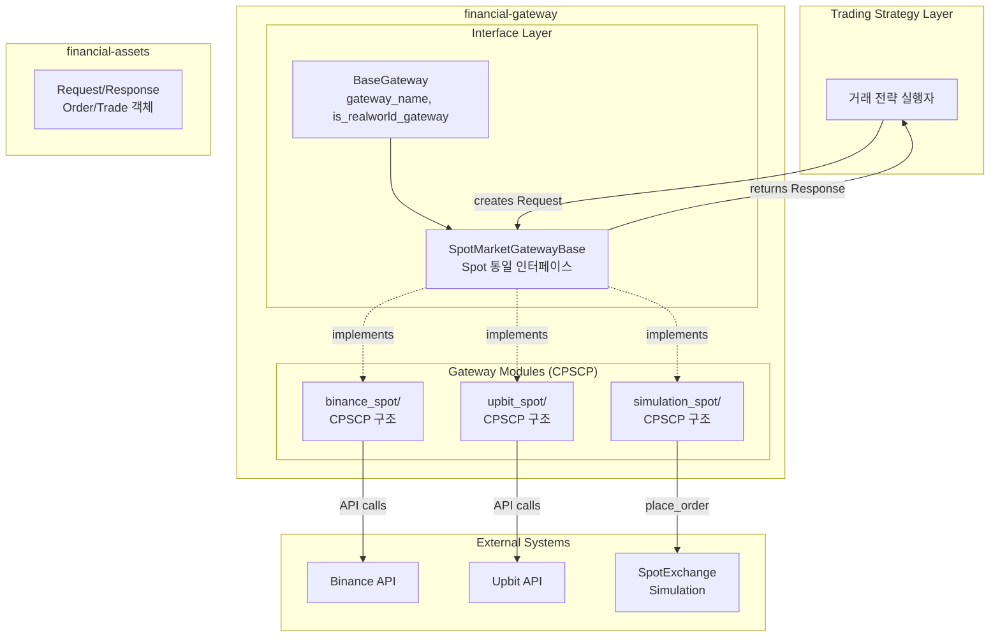
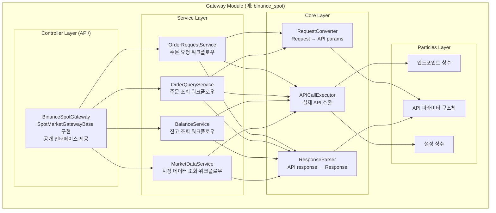

# Architecture - Financial Gateway

## Overview

Financial Gateway는 거래 전략 실행자와 실제 거래 발생 지점(거래소 API 또는 시뮬레이션 환경) 사이를 매개하는 인터페이스 어댑터다. Gateway를 통해 시뮬레이션에서 실제 거래소로 넘어갈 때 어댑터만 변경하여 바로 실제 적용으로 전환할 수 있으며, 전략 실행자는 실제 거래 수행 관련 로직과 완전히 분리된다.

사용자는 거래소별 API나 시뮬레이션의 구체적인 차이를 알 필요 없이, Gateway가 제공하는 통일된 인터페이스를 통해 모든 거래 동작과 조회 동작을 수행한다. Gateway는 단순한 거래 제출뿐만 아니라 주문 취소, 주문 조회, 체결 확인, 잔고 조회, 호가 조회 등 거래소 및 시뮬레이션과의 모든 상호작용을 포괄한다.

### Architectural Pattern

**CPSCP (Controller-Plugin-Service-Core-Particles) 패턴 적용**

각 Gateway 구현체(BinanceSpotGateway, UpbitSpotGateway, SimulationSpotGateway)는 독립적인 CPSCP 모듈로 구성된다. 이를 통해:

- **명확한 계층 분리**: API 호출, 변환 로직, 비즈니스 워크플로우가 계층별로 분리
- **독립적 확장**: 새 거래소 추가 시 기존 Gateway에 영향 없이 독립 모듈로 추가
- **유지보수성**: 거래소별 변경이 다른 Gateway와 격리됨
- **일관된 구조**: 모든 Gateway가 동일한 계층 구조 패턴 준수

**계층 구조:**
```
Particles (API 파라미터, 엔드포인트, 설정)
    ↑
Core (RequestConverter, ResponseParser, APICallExecutor)
    ↑
Service (OrderRequestService, BalanceService, MarketDataService)
    ↑
Controller (BinanceSpotGateway, UpbitSpotGateway 등)
```

### Core Features

- **Unified Interface**: Request/Response 기반 통일된 거래 인터페이스
- **Multi-Backend Support**: Binance, Upbit, Simulation 등 다양한 백엔드 지원
- **Market Type Separation**: Spot과 Futures를 별도 Gateway로 분리
- **Order Lifecycle Management**: 주문 생성, 수정, 취소, 조회 전체 라이프사이클
- **Market Data Access**: 캔들, 호가, 시세 등 시장 데이터 조회
- **Account Management**: 잔고, 포지션, 수수료 등 계정 정보 관리
- **Layered Architecture**: CPSCP 패턴 기반 계층 구조로 책임 명확화

### Design Philosophy

**Gateway 교체를 통한 Sim-to-Real 전환**

Gateway 패턴의 핵심 목적은 **코드 변경 없이 실행 환경을 전환**하는 것이다. 전략 실행자는 `SpotMarketGatewayBase` 인터페이스에만 의존하며, 구체적인 Gateway 구현체(SimulationSpotGateway, BinanceSpotGateway 등)를 주입받아 사용한다. 이를 통해 다음과 같은 워크플로우가 가능하다:

1. **시뮬레이션 단계**: SimulationSpotGateway를 사용하여 전략을 훈련하고 백테스팅
2. **실전 전환**: Gateway를 BinanceSpotGateway로 교체하여 동일한 전략 코드로 실제 거래 수행

전략 코드는 Gateway 타입을 알 필요가 없으며, Request 객체를 생성하여 Gateway 메서드를 호출하고 Response를 받는 것만으로 모든 작업을 수행한다. Gateway 내부에서 시뮬레이션 엔진을 호출하든 Binance API를 호출하든 전략 입장에서는 완전히 투명하다.

```python
# 전략 코드 (Gateway 독립적)
class TradingStrategy:
    def __init__(self, gateway: SpotMarketGatewayBase):
        self.gateway = gateway

    def execute_trade(self):
        request = LimitBuyOrderRequest(address=..., price=..., volume=...)
        response = self.gateway.request_limit_buy_order(request)
        if response.is_success:
            # 주문 성공 처리
            pass

# 시뮬레이션 단계
sim_gateway = SimulationSpotGateway(spot_exchange)
strategy = TradingStrategy(gateway=sim_gateway)
strategy.execute_trade()  # 시뮬레이션 실행

# 실전 단계 (전략 코드 변경 없음!)
# .env 파일에서 API 키 자동 로드
binance_gateway = BinanceSpotGateway()  # BINANCE_API_KEY, BINANCE_API_SECRET 읽음
strategy = TradingStrategy(gateway=binance_gateway)
strategy.execute_trade()  # 실제 거래 실행
```

**Spot과 Futures의 구조적 분리**

Spot 거래와 Futures 거래는 본질적으로 다르기 때문에 분리되어야 한다. 거래 메커니즘이 다르고(Spot은 즉시 자산 교환, Futures는 레버리지와 포지션 관리), 필요한 파라미터가 다르며(Futures는 레버리지, 마진 타입 등 추가 정보 필요), 관리 대상도 다르다(Spot은 보유 자산, Futures는 포지션과 마진). 따라서 SpotMarketGatewayBase와 FuturesMarketGatewayBase로 구분하며, 두 게이트웨이는 "사고 판다"는 추상적 행위 외에는 공통점이 거의 없다. 최상위에 BaseGateway라는 공통 추상 부모는 존재하지만, 이는 근본적으로 약한 추상층이다.

**Real World vs Simulation의 동작적 분리**

Real world gateway(실제 거래소 API)와 Simulation gateway는 구조는 동일하지만(같은 인터페이스) 동작이 다르다. Real world gateway는 API 인증이 필요하고, Simulation gateway는 불필요하다. 이는 구조적 차이가 아니므로 별도 클래스 계층을 만들지 않고, BaseGateway의 `is_realworld_gateway: bool` 플래그로 구분한다. Real world gateway는 초기화 시 환경변수에서 API 키를 검증하고, Simulation gateway는 검증을 생략한다.

**Request → Order → Response 생명주기**

거래 요청과 결과의 생명주기는 Request → Order → Response 순서로 진행된다. Request는 사용자가 생성하는 거래 의도이며, Order는 거래소나 시뮬레이션이 생성하는 등록된 주문(order_id 포함)이다. Response는 응답 정보로 is_success, 오류 플래그, 메타데이터를 포함하며, 내부에 Order 객체나 Trade 객체가 담긴다. Request 타입은 LimitBuyOrderRequest, MarketSellOrderRequest처럼 주문 유형별로 분리하여 타입 안정성을 확보한다.

**Order 객체 처리의 환경별 차이**

Order의 의미와 처리 방식은 Gateway 구현체의 환경에 따라 본질적으로 다르다. SimulationSpotGateway는 시뮬레이션 환경 내부에서 financial-assets/order 모듈의 Order 객체를 직접 생성하고 관리하며, 이 객체가 시뮬레이션의 상태로 존재한다. 반면 BinanceSpotGateway, UpbitSpotGateway 등 실제 거래소 API와 통신하는 Gateway는 거래소 서버가 주문을 관리하고 있으며, Gateway는 API를 통해 서버로부터 주문 상태를 조회하여 받아올 뿐이다. 이 차이는 Gateway 내부 구현에만 영향을 주며, 사용자 입장에서는 동일한 Request/Response 인터페이스로 추상화되어 보인다.

### Configuration

**API Key Naming Convention**

모든 Gateway는 .env 파일에서 API 인증 정보를 로드한다. API 키 환경변수 명명 규칙은 다음과 같다:

```
{PROVIDER}_{MARKET_TYPE}_API_KEY
{PROVIDER}_{MARKET_TYPE}_API_SECRET
```

- `PROVIDER`: 거래소 이름 (BINANCE, UPBIT, BYBIT 등)
- `MARKET_TYPE`: 시장 타입 (SPOT, FUTURES)

**예시:**
```bash
# .env
BINANCE_SPOT_API_KEY=your_binance_spot_key
BINANCE_SPOT_API_SECRET=your_binance_spot_secret

BINANCE_FUTURES_API_KEY=your_binance_futures_key
BINANCE_FUTURES_API_SECRET=your_binance_futures_secret

UPBIT_SPOT_API_KEY=your_upbit_key
UPBIT_SPOT_API_SECRET=your_upbit_secret
```

**Spot과 Futures 분리 이유:**

Spot과 Futures는 별도의 계정이나 API 키를 사용할 수 있다. 리스크 관리를 위해 Spot 계정과 Futures 계정을 물리적으로 분리하거나, 각각 다른 권한 수준의 API 키를 사용하는 것이 일반적이다. 따라서 환경변수도 `{PROVIDER}_SPOT_*`과 `{PROVIDER}_FUTURES_*`로 명확히 구분한다.

**Public API vs Private API:**

거래소 API는 크게 두 가지로 구분된다:

- **Public API** (인증 불필요): 시세 조회, 호가 조회, 캔들 데이터, 마켓 목록 등
  - `request_price_data()`, `request_orderbook()`, `request_ticker()`, `request_available_markets()` 등
  - API Key 없이 호출 가능 (일부 거래소는 rate limit 완화를 위해 선택적으로 API Key 사용)

- **Private API** (인증 필수): 주문, 취소, 잔고 조회, 체결 내역 등
  - `request_limit_buy_order()`, `request_current_balance()`, `request_trade_info()` 등
  - API Key + Secret 둘 다 필수

Gateway는 Public API도 제공하지만, Private API 사용을 위해 초기화 시 API 인증 정보를 필수로 요구한다. Public API만 사용하는 경우에도 일관된 인터페이스 유지를 위해 Gateway 인스턴스를 통해 호출한다.

**키 검증:**

`is_realworld_gateway=True`인 Gateway는 초기화 시 필수 환경변수가 설정되지 않았을 경우 명확한 에러 메시지와 함께 `EnvironmentError`를 발생시킨다. `is_realworld_gateway=False`인 Gateway는 API 키 검증을 수행하지 않는다.

```python
# Real world gateway - API 키 검증 수행
binance_gateway = BinanceSpotGateway()  # is_realworld_gateway=True
# 내부적으로 BINANCE_SPOT_API_KEY, BINANCE_SPOT_API_SECRET 검증
# 없으면: EnvironmentError("BINANCE_SPOT_API_KEY not found in environment")

# Simulation gateway - API 키 검증 생략
sim_gateway = SimulationSpotGateway(spot_exchange)  # is_realworld_gateway=False
# 환경변수 체크 없음

# Public API도 동일한 Gateway 인스턴스로 호출
response = binance_gateway.request_ticker(request)  # 인증 불필요하지만 동일 인터페이스
```

### Dependencies

```toml
dependencies = [
    "financial-assets",
    "financial-simulation",
    "binance-connector>=3.12.0",
    "python-upbit-api>=1.9.1",
    "python-dotenv>=1.0.0",
]
```

**Notes:**
- `financial-assets`: Request, Response, Order, Trade 등 도메인 객체 제공
- `financial-simulation`: SimulationSpotGateway가 SpotExchange와 연동
- `binance-connector`: Binance API 클라이언트
- `python-upbit-api`: Upbit API 클라이언트
- `python-dotenv`: .env 파일에서 API 키 로드

## Structure

### High-Level Architecture



### Gateway Module Internal Structure (CPSCP)

각 Gateway 모듈(binance_spot, upbit_spot, simulation_spot)은 동일한 CPSCP 계층 구조를 따른다:



### Component Responsibilities (CPSCP Layers)

**Interface Layer (base/):**

- **BaseGateway**: 모든 Gateway의 최상위 추상 클래스. `gateway_name` 속성과 `is_realworld_gateway` 플래그를 제공. Real world gateway는 API 키 검증을 수행하고, Simulation gateway는 검증을 생략.

- **SpotMarketGatewayBase**: Spot 거래의 통일된 인터페이스를 정의하는 추상 클래스. 주문 생성(limit/market/stop), 주문 관리(취소/수정/조회), 계정 정보(잔고/체결 내역), 시장 데이터(캔들/호가/시세), 시스템 정보(마켓 목록/수수료/서버 상태) 등 모든 Spot 거래 기능의 추상 메서드를 선언.

**Gateway Module Layers (각 Gateway 모듈 공통):**

**Controller Layer (API/):**
- SpotMarketGatewayBase 인터페이스 구현
- 전략 실행자를 위한 공개 API 제공
- Service 계층 생성 및 조율
- API 키 검증 (is_realworld_gateway=True인 경우)
- 거래소별 구현: BinanceSpotGateway, UpbitSpotGateway, SimulationSpotGateway

**Service Layer:**
- **OrderRequestService**: 주문 요청 워크플로우 (limit/market/stop 주문 생성)
  - RequestConverter로 Request → API params 변환
  - APICallExecutor로 API 호출 또는 시뮬레이션 실행
  - ResponseParser로 결과 → Response 변환
- **OrderQueryService**: 주문 조회 워크플로우 (주문 상태, 체결 내역 조회)
- **BalanceService**: 잔고 조회 워크플로우 (현재 잔고, 포지션 조회)
- **MarketDataService**: 시장 데이터 조회 워크플로우 (캔들, 호가, 시세 조회)

**Core Layer:**
- **RequestConverter**: Request 객체를 거래소별 API 파라미터로 변환 (Stateless)
  - LimitBuyOrderRequest → {"symbol": "BTCUSDT", "side": "BUY", ...}
- **ResponseParser**: 거래소 API 응답을 Response 객체로 파싱 (Stateless)
  - API response JSON → OpenSpotOrderResponse
- **APICallExecutor**: 실제 API 호출 또는 시뮬레이션 실행
  - BinanceSpotGateway: binance-connector 라이브러리 사용
  - UpbitSpotGateway: python-upbit-api 라이브러리 사용
  - SimulationSpotGateway: SpotExchange.place_order() 호출

**Particles Layer:**
- **Constants/**: API 엔드포인트, 설정 상수
  - {provider}_endpoints.py: API URL, 경로 상수
  - {provider}_config.py: 타임아웃, 재시도 설정 등
- **InternalStruct/**: API 파라미터 구조체
  - api_params.py: 중간 데이터 구조 (dataclass)

**Dependencies:**
```
Particles (엔드포인트, 설정, 파라미터 구조체)
    ↑
Core (RequestConverter, ResponseParser, APICallExecutor)
    ↑
Service (OrderRequestService, BalanceService, MarketDataService)
    ↑
Controller (BinanceSpotGateway, UpbitSpotGateway, SimulationSpotGateway)
    ↑
Interface (SpotMarketGatewayBase)
```

**Data Flow:**
1. 전략 실행자가 Request 객체 생성 (예: LimitBuyOrderRequest)
2. Controller 메서드 호출 (예: request_limit_buy_order(request))
3. Controller가 적절한 Service 선택 및 호출
4. Service가 Core 계층 조합:
   - RequestConverter로 Request → API params 변환
   - APICallExecutor로 API 호출
   - ResponseParser로 응답 → Response 변환
5. Controller가 Response 반환 (예: OpenSpotOrderResponse)

### Directory Structure

```
financial_gateway/
├── Architecture.md                        # 전체 시스템 설계 문서
├── base/
│   ├── BaseGateway.py
│   ├── SpotMarketGatewayBase.py           # Spot Gateway 인터페이스
│   ├── FuturesMarketGatewayBase.py        # Futures Gateway 인터페이스 (추후)
│   ├── __init__.py
│   └── for-agent-moduleinfo.md
│
├── binance_spot/                          # Binance Spot Gateway 모듈
│   ├── API/
│   │   ├── BinanceSpotGateway/
│   │   │   ├── BinanceSpotGateway.py
│   │   │   └── for-agent-moduleinfo.md
│   │   └── for-agent-moduleinfo.md
│   ├── Service/
│   │   ├── OrderRequestService/
│   │   │   ├── OrderRequestService.py
│   │   │   └── for-agent-moduleinfo.md
│   │   ├── OrderQueryService/
│   │   │   ├── OrderQueryService.py
│   │   │   └── for-agent-moduleinfo.md
│   │   ├── BalanceService/
│   │   │   ├── BalanceService.py
│   │   │   └── for-agent-moduleinfo.md
│   │   ├── MarketDataService/
│   │   │   ├── MarketDataService.py
│   │   │   └── for-agent-moduleinfo.md
│   │   └── for-agent-moduleinfo.md
│   ├── Core/
│   │   ├── RequestConverter/
│   │   │   ├── RequestConverter.py
│   │   │   └── for-agent-moduleinfo.md
│   │   ├── ResponseParser/
│   │   │   ├── ResponseParser.py
│   │   │   └── for-agent-moduleinfo.md
│   │   ├── APICallExecutor/
│   │   │   ├── APICallExecutor.py
│   │   │   └── for-agent-moduleinfo.md
│   │   └── for-agent-moduleinfo.md
│   ├── Constants/
│   │   ├── binance_endpoints.py
│   │   └── binance_config.py
│   ├── InternalStruct/
│   │   └── api_params.py
│   └── __init__.py
│
├── upbit_spot/                            # Upbit Spot Gateway 모듈
│   ├── API/
│   │   ├── UpbitSpotGateway/
│   │   │   ├── UpbitSpotGateway.py
│   │   │   └── for-agent-moduleinfo.md
│   │   └── for-agent-moduleinfo.md
│   ├── Service/
│   │   ├── OrderRequestService/
│   │   ├── OrderQueryService/
│   │   ├── BalanceService/
│   │   ├── MarketDataService/
│   │   └── for-agent-moduleinfo.md
│   ├── Core/
│   │   ├── RequestConverter/
│   │   ├── ResponseParser/
│   │   ├── APICallExecutor/
│   │   └── for-agent-moduleinfo.md
│   ├── Constants/
│   │   ├── upbit_endpoints.py
│   │   └── upbit_config.py
│   ├── InternalStruct/
│   │   └── api_params.py
│   └── __init__.py
│
└── simulation_spot/                       # Simulation Spot Gateway 모듈
    ├── API/
    │   ├── SimulationSpotGateway/
    │   │   ├── SimulationSpotGateway.py
    │   │   └── for-agent-moduleinfo.md
    │   └── for-agent-moduleinfo.md
    ├── Service/
    │   ├── OrderPlacementService/
    │   ├── OrderQueryService/
    │   ├── BalanceService/
    │   └── for-agent-moduleinfo.md
    ├── Core/
    │   ├── OrderFactory/
    │   ├── ResponseBuilder/
    │   └── for-agent-moduleinfo.md
    ├── InternalStruct/
    │   └── simulation_state.py
    └── __init__.py
```

**Notes:**
- 이 문서는 시스템 레벨 컴포넌트 구조와 책임을 정의합니다
- 구체적인 API 명세, 메서드 시그니처, 알고리즘, 데이터 구조는 각 컴포넌트의 moduleinfo 문서에서 정의됩니다
- CPSCP 패턴 기반 계층 구조를 모든 Gateway 모듈에 적용합니다

**Development Order and Status:** [Concept Design | Designing | Developing | Testing | Done | Deprecated]
1. [BaseGateway] Done
2. [SpotMarketGatewayBase] Designing (CPSCP 인터페이스 정의)
3. [SimulationSpotGateway] Designing (우선 구현 대상, is_realworld_gateway=False)
4. [BinanceSpotGateway] Designing (is_realworld_gateway=True)
5. [UpbitSpotGateway] Designing (is_realworld_gateway=True)
6. [FuturesMarketGatewayBase] Concept Design (추후)
7. [BinanceFuturesGateway] Concept Design (추후)
