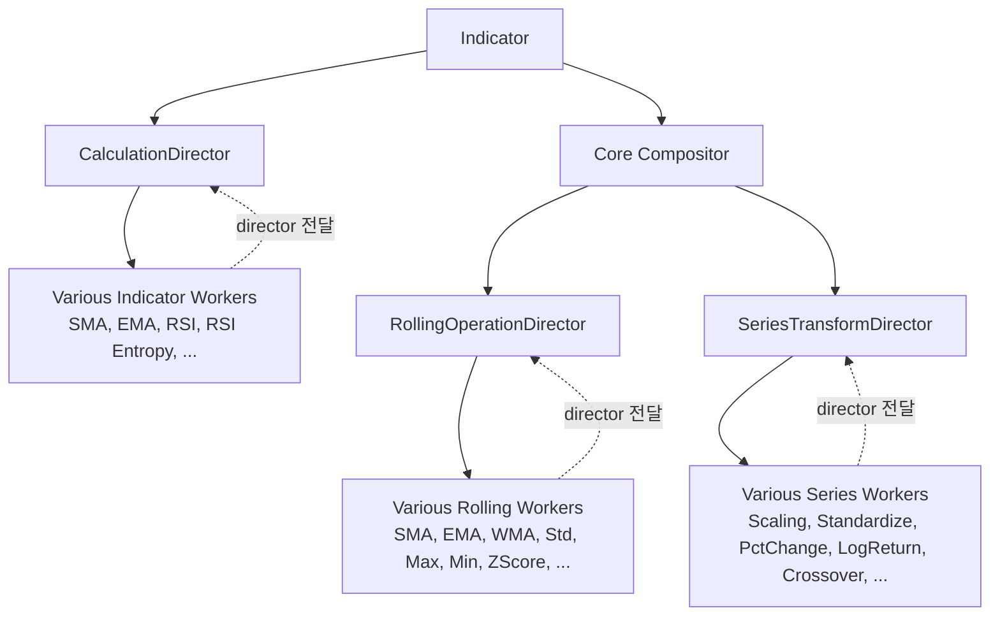
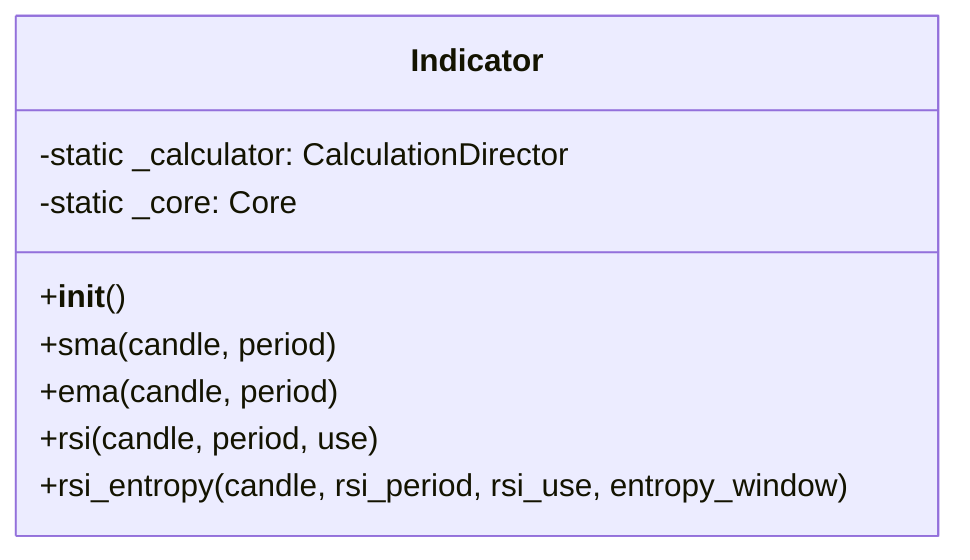
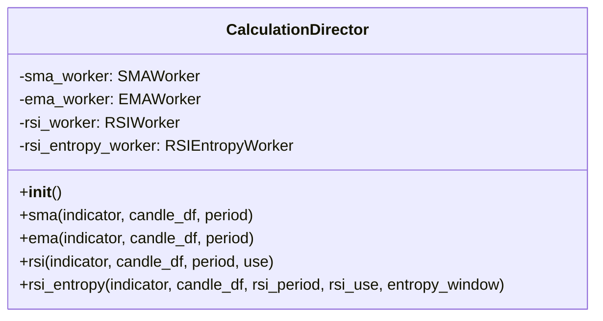
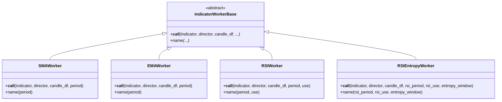
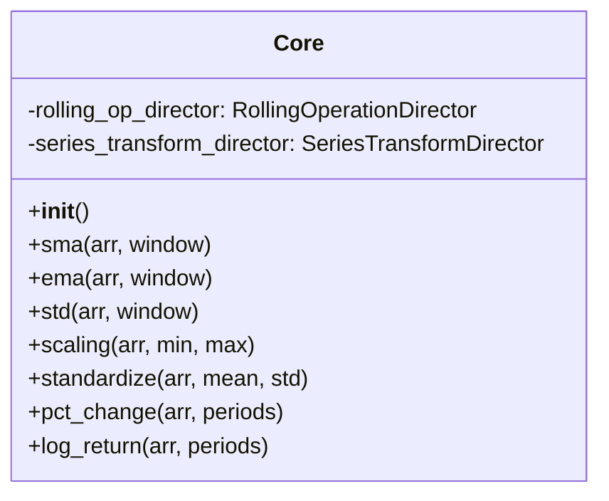
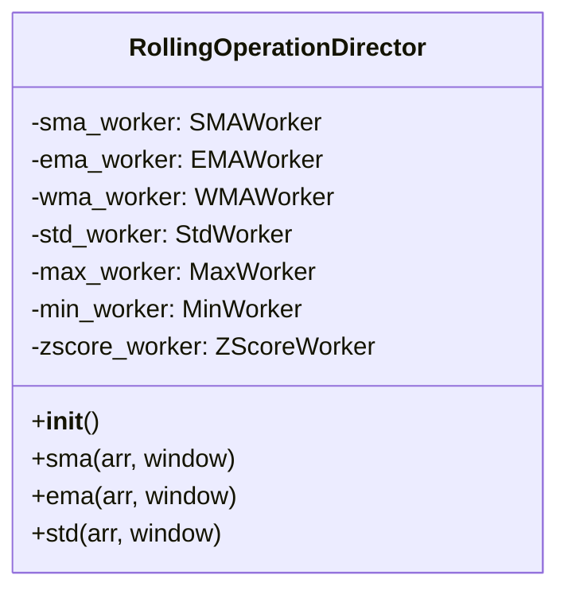
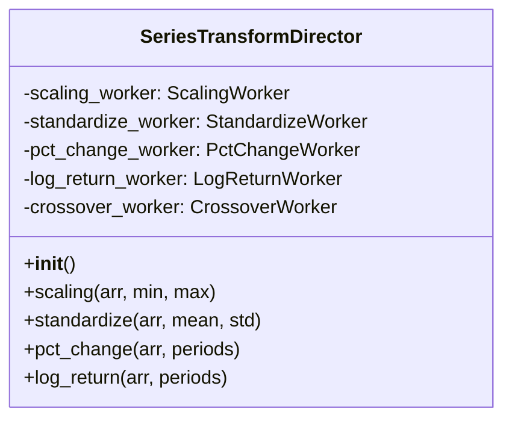
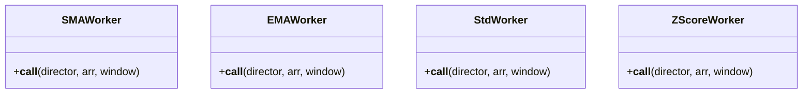

# Architecture - Financial Indicators

## 개요

캔들스틱 데이터를 기반으로 다양한 기술적 지표를 계산하는 모듈.

### 목적

캔들 데이터로부터 기술 지표를 계산하고 관리할 수 있는 **목적성 있는 인터페이스** 제공.

**핵심 기능:**
- 다양한 기술 지표 계산 (SMA, EMA, RSI, RSI Entropy 등)
- 지표별 파라미터 커스터마이징
- 계산 결과 반환 (numpy array 또는 pandas Series)
- 지표 간 의존성 자동 처리 (Director를 통한 재귀 호출)

**데이터 특성:**
- 입력: Candle DataFrame (timestamp, OHLCV)
- 출력: dict[str, np.ndarray] (지표명: 값 배열)
- **중요 원칙**: 출력 배열 길이는 항상 입력과 동일
- 계산 불가능한 초기 값은 NaN 처리

### 설계 전략

**의존성 역전 원칙 (Dependency Inversion)**
- Worker는 Director를 파라미터로 전달받음
- 다른 지표가 필요한 경우 Director를 통해 요청
- Worker 간 직접 의존성 없음, Director를 통한 간접 호출

**계산 최적화**
- numpy 기반 벡터화 연산
- Core 모듈의 순수 계산 함수 재사용
- 불필요한 중복 계산 방지

### 의존성

```toml
dependencies = [
    "pandas>=2.0.0",
    "numpy>=1.24.0",
    "financial-assets",
    "simple-logger"
]
```

**참고:**
- `financial-assets`: Candle 데이터 로드
- `pandas`, `numpy`: 수치 계산
- `simple-logger`: 로깅 (loguru 기반)

## 구조



**레이어 구조:**
1. **Indicator**: 사용자 인터페이스
2. **CalculationDirector**: 지표 Worker 관리 및 의존성 중재
3. **지표 Workers**: 각 지표 계산 (director를 파라미터로 전달받음)
4. **Core Compositor**: 순수 계산 함수 통합 인터페이스
5. **Core Directors**: Rolling/Series 연산 관리
6. **Core Workers**: 순수 계산 로직 구현

**의존성 역전:**
- **지표 Workers**: `__call__(indicator, director, candle_df, ...)`
  - `indicator`: Core 계산 접근용 (`indicator._core.xxx()`)
  - `director`: 다른 지표 계산 호출용 (`director.xxx()`)
- **Core Workers**: `__call__(director, arr: np.ndarray, ...)`
  - Core 레벨은 다른 Core 연산만 의존
- Director는 모든 Worker를 알지만, Worker는 필요한 참조만 의존

## 데이터

### 입력 DataFrame 스키마

Candle 모듈과 동일한 스키마:

| 컬럼명 | 타입 | 설명 |
|--------|------|------|
| timestamp | int | Unix timestamp (초 단위) |
| high | float | 고가 |
| low | float | 저가 |
| open | float | 시가 |
| close | float | 종가 |
| volume | float | 거래량 |

### 출력 형식

**Worker 반환 형식: (str, dict[str, np.ndarray])**

모든 Worker는 `(key, values)` 튜플 반환:
```python
# 반환 형식
(
    "indicator_key",  # 지표 기본 키
    {
        "sub_key_1": np.array([...]),  # 서브 키: 배열
        "sub_key_2": np.array([...])
    }
)
```

**단일 값 지표:**
```python
# SMAWorker 반환
(
    "sma-20",
    {
        "value": np.array([nan, nan, ..., 100.5, 101.2])
    }
)

# CalculationDirector 반환 (Indicator.sma()로 전달)
{
    "sma-20": {
        "value": np.array([nan, nan, ..., 100.5, 101.2])
    }
}

# EMAWorker 반환 → Indicator.ema() 출력
{
    "ema-12": {
        "value": np.array([...])
    }
}

# RSIWorker 반환 → Indicator.rsi() 출력
{
    "rsi-14": {
        "value": np.array([...])
    }
}
```

**다중 값 지표:**
```python
# RSIEntropyWorker 반환
(
    "rsientropy-20-365",
    {
        "base": np.array([...]),
        "z-1": np.array([...]),
        "z+1": np.array([...]),
        "buy": np.array([...]),
        "sell": np.array([...])
    }
)

# CalculationDirector 반환 (Indicator.rsi_entropy()로 전달)
{
    "rsientropy-20-365": {
        "base": np.array([...]),
        "z-1": np.array([...]),
        "z+1": np.array([...]),
        "buy": np.array([...]),
        "sell": np.array([...]
    }
}
```

**중요 원칙:**
- 모든 출력 배열 길이는 입력과 동일
- 계산 불가능한 초기 값은 NaN 처리
- Worker는 `(key, dict)` 튜플 반환
- Director는 `{key: dict}` 형식으로 변환하여 반환
- 각 Indicator 메서드는 해당 Worker의 출력 형식을 그대로 반환

## API

### Indicator



지표 계산의 진입점 (입력 독립적).

**클래스 변수:**
- `_calculator`: CalculationDirector 인스턴스 (클래스 변수 공유)
- `_core`: Core Compositor 인스턴스 (클래스 변수 공유)

**초기화:**
- `__init__()`: 의존성 없음, 인스턴스 상태 없음

#### 입출력

```python
# 단일 값 지표
{"sma-20": {"value": np.array([...])}}
{"ema-12": {"value": np.array([...])}}
{"rsi-14": {"value": np.array([...])}}

# 다중 값 지표
{
    "rsientropy-20-365": {
        "base": np.array([...]),
        "z-1": np.array([...]),
        "z+1": np.array([...]),
        "buy": np.array([...]),
        "sell": np.array([...])
    }
}
```

#### 메서드
- `sma(candle, period=20) -> dict[str, dict]`: SMA 계산
  - 내부적으로 `_calculator.sma(self, candle.candle_df, period)` 호출
  - 반환: {"sma-20": {"value": array}}
- `ema(candle, period=12) -> dict[str, dict]`: EMA 계산
  - 내부적으로 `_calculator.ema(self, candle.candle_df, period)` 호출
  - 반환: {"ema-12": {"value": array}}
- `rsi(candle, period=14, use="close") -> dict[str, dict]`: RSI 계산
  - `use`: 사용할 컬럼 (close, open, high, low 등)
  - 내부적으로 `_calculator.rsi(self, candle.candle_df, period, use)` 호출
  - 반환: {"rsi-14": {"value": array}}
- `rsi_entropy(candle, rsi_period=20, rsi_use="close", entropy_window=365) -> dict[str, dict]`: RSI Entropy 계산
  - `rsi_use`: RSI 계산에 사용할 컬럼
  - `entropy_window`: 엔트로피 계산용 롤링 윈도우
  - 내부적으로 `_calculator.rsi_entropy(self, candle.candle_df, rsi_period, rsi_use, entropy_window)` 호출
  - 반환: {"rsientropy-20-365": {"base": array, "z-1": array, ...}}

**설계 특징:**
- 모든 메서드는 `Candle` 객체를 첫 번째 파라미터로 받음
- 입력 독립적: 외부 환경변수나 설정에 의존하지 않음, 특정 Candle 인스턴스에 의존하지 않음
- 메서드 간 의존성 없음, 독립적으로 호출 가능
- **기본값은 Indicator API에서 정의** (Worker는 전달받은 값만 사용)

### CalculationDirector



지표 Worker 관리 및 의존성 중재.

**Worker 관리 방식:**
- `__init__`에서 모든 Worker 인스턴스 생성 및 캐싱
- 각 메서드는 `indicator`를 첫 번째 파라미터로 받아 Worker에 전달
- Worker는 `indicator._core`를 통해 Core 계산에 접근

**메서드:**
- `__init__() -> None`: 모든 Worker 초기화
- `sma(indicator, candle_df, period) -> dict[str, dict]`: SMAWorker 호출, (key, dict) 튜플을 {key: dict}로 변환
- `ema(indicator, candle_df, period) -> dict[str, dict]`: EMAWorker 호출, (key, dict) 튜플을 {key: dict}로 변환
- `rsi(indicator, candle_df, period, use) -> dict[str, dict]`: RSIWorker 호출, (key, dict) 튜플을 {key: dict}로 변환
- `rsi_entropy(indicator, candle_df, rsi_period, rsi_use, entropy_window) -> dict[str, dict]`: RSIEntropyWorker 호출, (key, dict) 튜플을 {key: dict}로 변환

### 지표 Workers

각 지표별 전용 Worker.



**메서드 시그니처:**
- `__call__(indicator: Indicator, director: CalculationDirector, candle_df: pd.DataFrame, ...) -> tuple[str, dict[str, np.ndarray]]`
- `name(...) -> str`: 지표 키 생성 (예: "sma-20", "rsi-14-close")

**참고:**
- Worker는 기본값을 가지지 않음
- 모든 파라미터는 Indicator API에서 기본값이 적용되어 전달됨

**의존성 호출:**
- 다른 지표 필요 시: `director.xxx()` 호출 (예: RSI 기반 지표는 `director.rsi()` 호출)
- Core 연산 필요 시: `indicator._core.xxx()` 호출 (예: SMA, Std 등)
- 결과 반환: `(key, dict)` 튜플 형식
- 키 생성: `name()` 메서드로 파라미터 기반 키 생성

### Core Compositor



순수 계산 함수의 통합 인터페이스.

**역할:**
- RollingOperationDirector와 SeriesTransformDirector를 조합
- 단일 진입점으로 모든 Core 연산 제공

**메서드:**
- `sma(arr: np.ndarray, window: int) -> np.ndarray`: RollingOperationDirector 위임
- `ema(arr: np.ndarray, window: int) -> np.ndarray`: RollingOperationDirector 위임
- `std(arr: np.ndarray, window: int) -> np.ndarray`: RollingOperationDirector 위임
- `scaling(arr: np.ndarray, min: float, max: float) -> np.ndarray`: SeriesTransformDirector 위임
- `standardize(arr: np.ndarray, mean: float, std: float) -> np.ndarray`: SeriesTransformDirector 위임
- `pct_change(arr: np.ndarray, periods: int) -> np.ndarray`: SeriesTransformDirector 위임
- `log_return(arr: np.ndarray, periods: int) -> np.ndarray`: SeriesTransformDirector 위임

**참고:**
- Core 연산은 단순 배열 반환 (dict 아님)
- 지표 키 생성은 상위 지표 Worker의 책임

### RollingOperationDirector



Rolling 연산 Worker 관리.

**메서드:**
- `sma(arr: np.ndarray, window: int) -> np.ndarray`: SMAWorker 호출 (자신을 director로 전달)
- `ema(arr: np.ndarray, window: int) -> np.ndarray`: EMAWorker 호출 (자신을 director로 전달)
- `wma(arr: np.ndarray, window: int) -> np.ndarray`: WMAWorker 호출 (자신을 director로 전달)
- `std(arr: np.ndarray, window: int) -> np.ndarray`: StdWorker 호출 (자신을 director로 전달)
- `max(arr: np.ndarray, window: int) -> np.ndarray`: MaxWorker 호출 (자신을 director로 전달)
- `min(arr: np.ndarray, window: int) -> np.ndarray`: MinWorker 호출 (자신을 director로 전달)
- `zscore(arr: np.ndarray, window: int) -> np.ndarray`: ZScoreWorker 호출 (자신을 director로 전달)

**특징:**
- **기본값 없음**: 모든 파라미터를 명시적으로 받음 (정확한 동작 보장)

### SeriesTransformDirector



Series 변환 연산 Worker 관리.

**메서드:**
- `scaling(arr: np.ndarray, min: float, max: float) -> np.ndarray`: ScalingWorker 호출 (지정 범위로 Min-Max 스케일링)
- `standardize(arr: np.ndarray, mean: float, std: float) -> np.ndarray`: StandardizeWorker 호출 (지정 평균/표준편차로 표준화)
- `pct_change(arr: np.ndarray, periods: int) -> np.ndarray`: PctChangeWorker 호출 (퍼센트 변화율 계산)
- `log_return(arr: np.ndarray, periods: int) -> np.ndarray`: LogReturnWorker 호출 (로그 수익률 계산)
- `crossover(arr: np.ndarray, reference: np.ndarray) -> np.ndarray`: CrossoverWorker 호출 (arr이 reference를 상향 교차 시 1, 하향 교차 시 -1, 나머지 0)

**특징:**
- **기본값 없음**: 모든 파라미터를 명시적으로 받음 (정확한 동작 보장)

### Core Workers

순수 계산 로직 구현.



**메서드 시그니처:**
- `__call__(director: Director, arr: np.ndarray, ...) -> np.ndarray`

**의존성 호출 예시:**
```python
# ZScoreWorker 내부
def __call__(self, director, arr: np.ndarray, window: int) -> np.ndarray:
    # SMA와 Std 필요 시 director 통해 호출
    mean = director.sma(arr, window)
    std = director.std(arr, window)
    # 0 나누기 방지
    return np.where(std > 0, (arr - mean) / std, 0)
```

**특징:**
- `name()` 메서드 없음 (순수 계산만 담당, 지표 키 생성 불필요)
- Director를 파라미터로 전달받음 (의존성 역전)
- numpy 기반 벡터화 연산
- 최적화된 알고리즘 (convolution, cumsum 등)
- **출력 길이는 항상 입력과 동일**: 각 Worker는 계산 불가능한 초기값을 NaN으로 패딩하여 길이 유지
- **기본값 없음**: 모든 파라미터를 명시적으로 받음 (정확한 동작 보장)

## 디렉토리 구조

```
packages/financial-indicators/
├── Architecture.md
├── pyproject.toml
├── README.md
└── financial_indicators/
    ├── __init__.py
    ├── indicator.py                          # Indicator 클래스
    │
    ├── core/
    │   ├── __init__.py
    │   ├── core.py                           # Core Compositor
    │   │
    │   ├── rolling/
    │   │   ├── __init__.py
    │   │   ├── rolling_operation_director.py
    │   │   └── workers/
    │   │       ├── __init__.py
    │   │       ├── sma_worker.py
    │   │       ├── ema_worker.py
    │   │       ├── wma_worker.py
    │   │       ├── std_worker.py
    │   │       ├── max_worker.py
    │   │       ├── min_worker.py
    │   │       └── zscore_worker.py
    │   │
    │   └── series/
    │       ├── __init__.py
    │       ├── series_transform_director.py
    │       └── workers/
    │           ├── __init__.py
    │           ├── scaling_worker.py
    │           ├── standardize_worker.py
    │           ├── pct_change_worker.py
    │           ├── log_return_worker.py
    │           └── crossover_worker.py
    │
    └── calculation/
        ├── __init__.py
        ├── calculation_director.py           # CalculationDirector
        └── workers/
            ├── __init__.py
            ├── sma_worker.py
            ├── ema_worker.py
            ├── rsi_worker.py
            └── rsi_entropy_worker.py
```

**구조 원칙:**
- `core/`: 순수 계산 함수 (Compositor 패턴)
  - `rolling/`: Rolling 연산 (SMA, EMA, Std 등)
  - `series/`: Series 변환 (Diff, PctChange 등)
- `calculation/`: 지표 계산 (Core 활용, Director 의존성 역전)
  - `workers/`: 각 지표별 전용 Worker

**명명 규칙 및 차이점:**
- **Core Workers**:
  - `__call__(director, arr: np.ndarray, ...)` 시그니처
  - 순수 numpy 배열 연산
  - `name()` 메서드 없음 (순수 계산만 담당)
- **지표 Workers**:
  - `__call__(indicator, director, candle_df, ...)` 시그니처
  - DataFrame 기반 지표 계산
  - `name(params) -> str` 메서드로 지표 키 생성
  - tuple[str, dict[str, np.ndarray]] 반환
