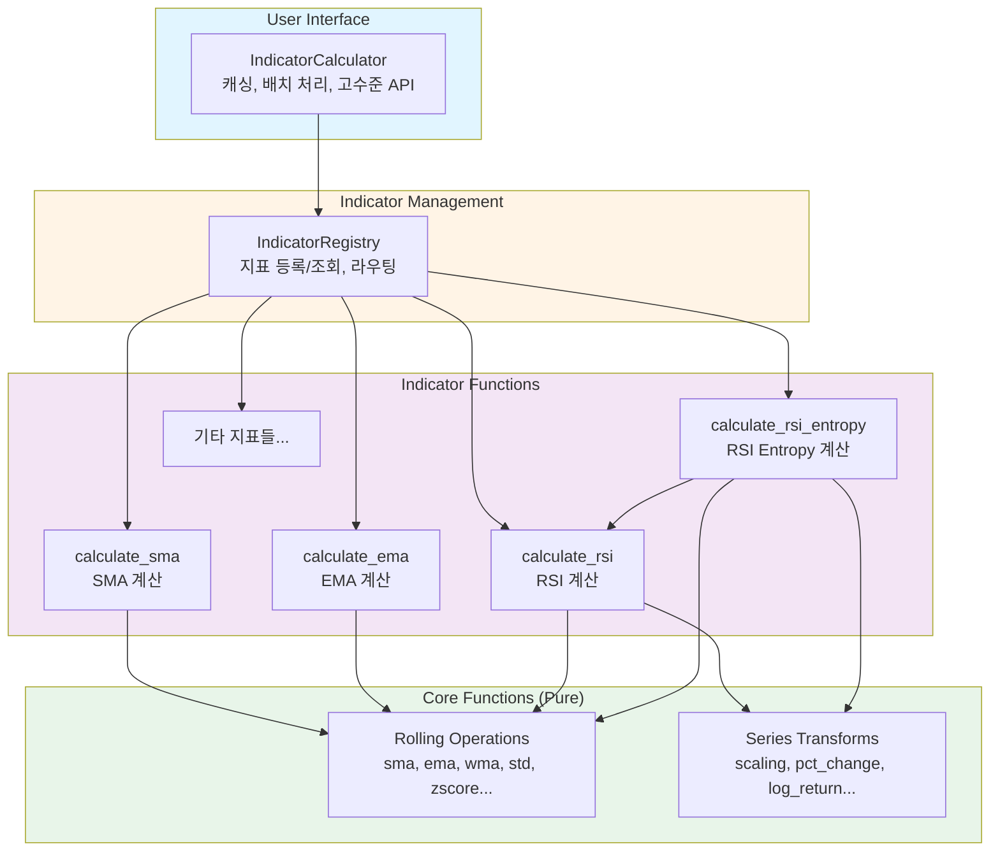

# Architecture - Financial Indicators

## Overview

캔들스틱 데이터를 기반으로 다양한 기술적 지표를 계산하는 모듈. 순수 함수 기반의 간결한 설계와 Registry 패턴을 통한 확장성, 캐싱을 통한 성능 최적화를 제공한다.

### Core Features

- **기술 지표 계산**: SMA, EMA, RSI, RSI Entropy 등 다양한 지표 지원
- **확장 가능한 구조**: Registry 패턴으로 새 지표 추가 시 기존 코드 수정 불필요
- **성능 최적화**: 계산 결과 캐싱, 중복 계산 방지, 배치 처리 지원
- **순수 함수 기반**: Core 연산은 부수효과 없는 순수 함수로 구현
- **명확한 반환 형식**: 단일 값은 배열로, 다중 값은 dict로 일관성 있게 반환

### Design Philosophy

**단순함과 명확함**
- 필요한 추상화만 사용, 불필요한 계층 제거
- 각 컴포넌트의 책임이 명확하고 단일함
- 코드 흐름을 쉽게 추적 가능

**확장성과 유지보수성**
- Registry 패턴으로 OCP(Open-Closed Principle) 준수
- 새 지표 추가 시 기존 코드 수정 불필요
- 플러그인 방식의 지표 확장

**성능과 효율성**
- 계산 결과 캐싱으로 중복 계산 방지
- numpy 벡터화 연산 활용
- 배치 계산으로 의존성 최적화

**테스트 용이성**
- 순수 함수는 독립적으로 테스트 가능
- stateless 설계로 모킹 불필요
- 명확한 입출력으로 검증 용이

### Dependencies

```toml
dependencies = [
    "pandas>=2.0.0",
    "numpy>=1.24.0",
    "financial-assets",
]
```

**Notes:**
- `pandas`: DataFrame 기반 데이터 처리
- `numpy`: 고성능 수치 연산
- `financial-assets`: Candle 데이터 구조

## Structure



**Component Responsibilities:**

- **IndicatorCalculator**: 사용자 진입점, 계산 결과 캐싱, 배치 계산 지원, 의존성 최적화
- **IndicatorRegistry**: 지표 함수 등록 및 조회, 이름 기반 라우팅, 확장 가능한 플러그인 구조
- **Indicator Functions**: 각 지표별 계산 로직, DataFrame → dict 변환, Core Functions 조합
- **Core Functions**: 순수 계산 함수, numpy 배열 연산, 부수효과 없음, 재사용 가능

**Dependencies:**

- IndicatorCalculator → IndicatorRegistry: 지표 조회 및 실행
- IndicatorRegistry → Indicator Functions: 등록된 지표 함수 호출
- Indicator Functions → Core Functions: 순수 계산 재사용
- Indicator Functions → Indicator Functions: 복합 지표는 기본 지표 재사용 (예: RSI Entropy → RSI)

**Data Flow:**

1. 사용자가 `IndicatorCalculator`를 통해 지표 계산 요청
2. `IndicatorCalculator`는 캐시 확인, 없으면 `IndicatorRegistry`에 요청
3. `IndicatorRegistry`는 등록된 지표 함수 조회 및 실행
4. 지표 함수는 `Core Functions`를 조합하여 계산
5. 결과는 캐시에 저장되고 사용자에게 반환

**Key Design Decisions:**

1. **Registry 패턴**: 새 지표 추가 시 decorator로 등록만 하면 됨, 기존 코드 수정 불필요
2. **순수 함수 Core**: 테스트 용이, 부수효과 없음, 재사용 가능
3. **캐싱은 Calculator에만**: 비즈니스 로직과 성능 최적화 분리
4. **단순한 반환 형식**:
   - 단일 값 지표: `np.ndarray` 직접 반환
   - 다중 값 지표: `dict[str, np.ndarray]` 반환
5. **NaN 패딩**: 모든 출력 배열 길이는 입력과 동일, 계산 불가 영역은 NaN

**Notes:**

- Core Functions는 완전히 독립적, 어떤 컨텍스트에서도 재사용 가능
- 지표 함수는 stateless, 모든 파라미터를 명시적으로 받음
- IndicatorCalculator만 상태(캐시)를 가짐
- 각 컴포넌트의 구체적인 API, 데이터 구조, 구현 패턴은 별도 moduleinfo 문서에서 정의

**Development Order and Status:**

1. [Core Functions] Done
2. [Indicator Functions] Done
3. [IndicatorRegistry] Done
4. [IndicatorCalculator] Done
