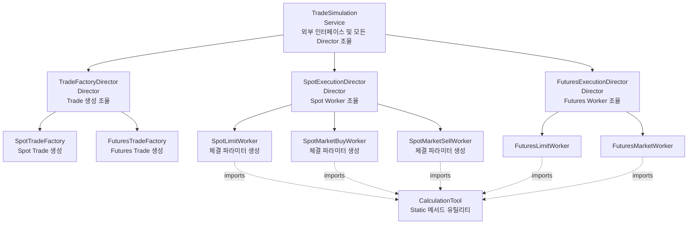
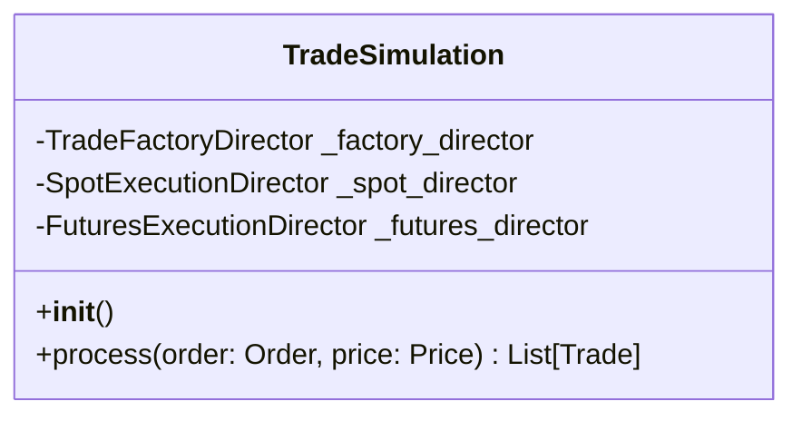
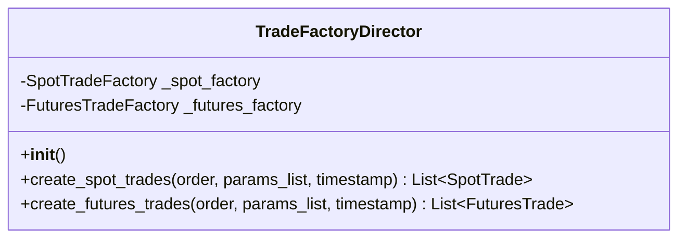
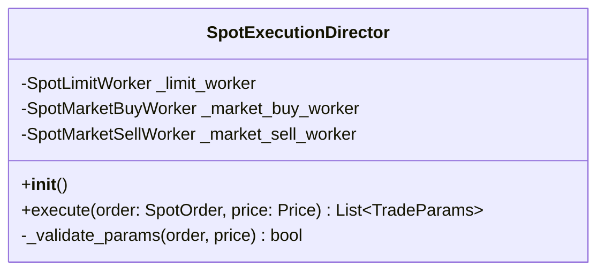
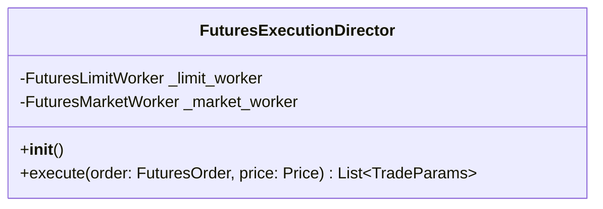
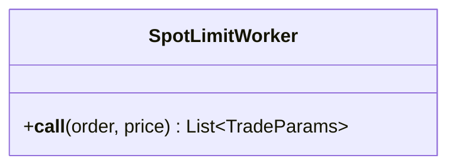
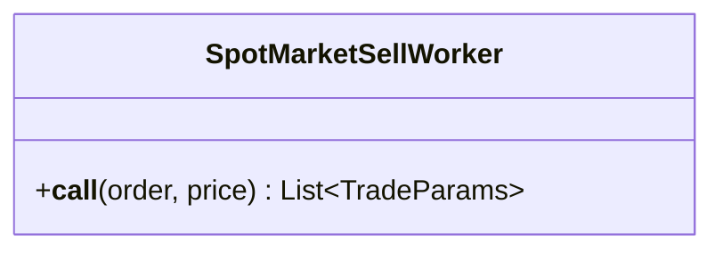
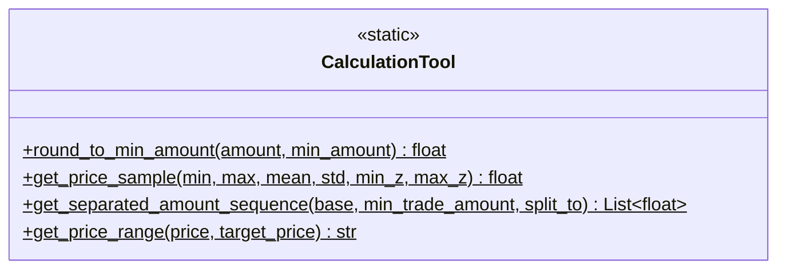
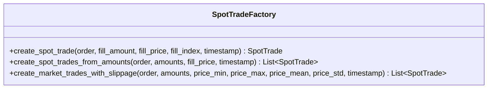
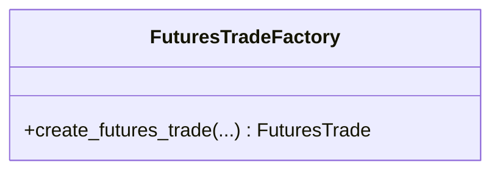

# Architecture - TradeSimulation

## Overview

TradeSimulation은 거래소 주문 체결을 시뮬레이션하는 stateless 서비스입니다. 주문(Order)과 현재 시장 가격(Price)을 입력받아 거래 규칙에 따라 체결을 시뮬레이션하고, 체결된 거래 내역(Trade) 목록을 반환합니다.

이 모듈은 상위 stateful 레이어(시간 관리, Wallet 관리, Request/Response 처리)와 독립적으로 동작하며, 순수하게 "주문이 주어진 가격 환경에서 어떻게 체결되는가"를 시뮬레이션하는 역할만 담당합니다. 실제 거래소의 체결 메커니즘을 모방하여 슬리피지, 부분 체결, 확률적 체결 등을 구현합니다.

### Core Features

- **Limit Order 시뮬레이션**: 지정가 주문의 조건부 체결 (가격 범위에 따른 확률적 체결)
- **Market Order 시뮬레이션**: 시장가 주문의 즉시 체결 (슬리피지 반영)
- **부분 체결 지원**: 주문을 여러 개의 Trade로 분할 체결
- **슬리피지 모델링**: 시장가 주문 시 불리한 가격으로 체결되는 현상 반영
- **Stateless 재사용성**: 외부 상태 없이 입력만으로 결과 생성

### Design Philosophy

**Stateless 순수 함수 설계**
- 모든 Worker는 입력(Order, Price)에만 의존하여 출력(List[Trade]) 생성
- 내부 상태를 가지지 않아 동일 입력에 대해 동일 결과 보장 (난수 시드 제외)
- 상위 레이어에서 다양한 컨텍스트로 재사용 가능

**현실감 있는 시뮬레이션**
- 실제 거래소의 체결 메커니즘 모방
- 가격 위치(body/head/tail)에 따른 차등적 체결 확률
- 시장 충격(market impact)을 슬리피지로 표현
- 부분 체결을 통한 실제와 유사한 체결 패턴 구현

**재사용 가능한 공유 도구**
- CalculationTool: 수치 계산 로직(분할, 범위 판단) 분리
- TradeFactory: Trade 생성 로직 중앙화 (ID 생성, 수수료 계산, 객체 생성)

### Dependencies

```toml
dependencies = [
    "financial-assets>=0.1.0",
    "numpy>=1.20.0",
    "simple-logger>=0.1.0",
]
```

**Notes:**
- `financial-assets`: Order, Trade, Price 데이터 구조
- `numpy`: 확률 분포 샘플링 (Dirichlet, Normal)
- `simple-logger`: 로깅

## Structure



**Pattern:** Service-Director-Worker (복수 Director, Director 간 의존성 없음)

**Component Responsibilities:**
- **TradeSimulation (Service)**: 외부 인터페이스, 모든 Director 조율 (Director 간 의존성 없음)
  - ExecutionDirector로부터 `List[TradeParams]` 받음
  - FactoryDirector에 Trade 생성 요청
  - Trade 리스트 반환
- **CalculationTool**: Static 메서드 유틸리티 (Worker들이 직접 import하여 사용)
- **TradeFactoryDirector (Director)**: Trade 생성 조율, 체결 파라미터 → Trade 객체 변환
- **SpotExecutionDirector (Director)**: Spot Worker 조율, 결과 수집, `List[TradeParams]` 반환
- **FuturesExecutionDirector (Director)**: Futures Worker 조율, 결과 수집, `List[TradeParams]` 반환
- **Workers**: 체결 로직 실행, 체결 파라미터(TradeParams) 생성 반환, CalculationTool 직접 사용
- **Factories**: 파라미터로부터 실제 Trade 객체 생성

## Data

### External Input/Output Data Structures

**Input Data:**

```python
# financial_assets.order.SpotOrder
class SpotOrder:
    order_id: str                           # 주문 ID
    stock_address: StockAddress             # 거래 마켓 주소
    side: Side                              # 매수/매도 (BUY, SELL)
    order_type: OrderType                   # 주문 타입 (LIMIT, MARKET)
    price: Optional[float]                  # 지정가 (시장가는 None)
    amount: float                           # 주문 수량
    timestamp: int                          # 주문 생성 시각
    filled_amount: float                    # 이미 체결된 수량
    status: OrderStatus                     # 주문 상태
    fee_rate: float                         # 수수료율
    min_trade_amount: Optional[float]       # 최소 거래 단위
    # ... 기타 필드
```

```python
# financial_assets.price.Price
@dataclass(frozen=True)
class Price:
    exchange: str       # 거래소
    market: str         # 마켓
    t: int              # 타임스탬프
    h: float            # 고가
    l: float            # 저가
    o: float            # 시가
    c: float            # 종가
    v: float            # 거래량

    # 범위 메서드: bodytop(), bodybottom(), head(), tail()
    # 샘플링 메서드: head_sample(), tail_sample(), body_sample()
```

**Output Data:**

```python
# financial_assets.trade.SpotTrade
@dataclass(frozen=True)
class SpotTrade:
    trade_id: str               # 거래 ID
    order: SpotOrder            # 원본 주문 객체
    pair: Pair                  # 거래 쌍 (asset, value)
    timestamp: int              # 체결 시각
    fee: Optional[Token]        # 수수료 (Token 형태)
    # stock_address, side는 order로부터 자동 설정
```

```python
# financial_assets.pair.Pair
class Pair:
    asset: Token    # 거래 대상 자산 (예: BTC 1.0)
    value: Token    # 교환 가치 (예: USDT 50000.0)
```

### Internal Data Structures

**계산 중간 결과:**

- `List[float]`: 분할된 수량 목록 (부분 체결용)
- `str`: 가격 범위 ("body", "head", "tail", "none")
- `float`: 샘플링된 슬리피지 가격

**데이터 흐름:**
```
Order + Price
    ↓
Worker (체결 조건 확인, 체결 파라미터 생성)
    ↓
List[TradeParams] (체결 파라미터)
    ↓
ExecutionDirector (Worker 결과 수집)
    ↓
List[TradeParams] → Service
    ↓
Service → FactoryDirector (파라미터 + Order → Trade 생성)
    ↓
List[Trade] → Service → 외부
```

### Trade 생성 파라미터 (중간 결과)

**TradeParams (내부 데이터):**
```python
@dataclass
class TradeParams:
    """Worker가 반환하는 체결 파라미터"""
    fill_amount: float      # 체결 수량
    fill_price: float       # 체결 가격
    fill_index: int         # 체결 인덱스 (1부터 시작)
```

**Worker 출력:**
- `List[TradeParams]`: 체결된 각 조각의 파라미터 리스트

## API

### TradeSimulation (Service)



Service 계층 진입점. 외부 인터페이스를 제공하고, 모든 Director를 조율합니다 (Director 간 의존성 없음).

**Initialization:**
- 파라미터 없음
- TradeFactoryDirector 생성
- SpotExecutionDirector 생성
- FuturesExecutionDirector 생성

**Methods:**
- `process(order: Order, price: Price) -> List[Trade]`: 주문 체결 시뮬레이션 실행
  - `order`: 체결할 주문 객체 (SpotOrder 또는 FuturesOrder)
  - `price`: 현재 시장 가격 (OHLCV)
  - Returns: 체결된 Trade 목록 (빈 리스트 가능)
  - Behavior:
    1. Order의 타입(Spot/Futures) 확인
    2. SpotOrder:
       - `params_list = _spot_director.execute(order, price)` 호출
       - `trades = _factory_director.create_spot_trades(order, params_list, price.t)`
    3. FuturesOrder:
       - `params_list = _futures_director.execute(order, price)` 호출
       - `trades = _factory_director.create_futures_trades(order, params_list, price.t)`
    4. Trade 리스트 반환
    - 알 수 없는 타입: ValueError

### TradeFactoryDirector (Director)



Factory 관리 전담 Director. Spot/Futures Factory를 소유하고, 체결 파라미터를 Trade 객체로 변환합니다.

**Initialization:**
- 파라미터 없음
- SpotTradeFactory, FuturesTradeFactory 인스턴스 생성

**Methods:**
- `create_spot_trades(order: SpotOrder, params_list: List[TradeParams], timestamp: int) -> List[SpotTrade]`
  - Worker가 생성한 체결 파라미터 리스트를 받아 SpotTrade 리스트 생성
  - 각 TradeParams에 대해 `_spot_factory.create_spot_trade()` 호출

- `create_futures_trades(order: FuturesOrder, params_list: List[TradeParams], timestamp: int) -> List[FuturesTrade]`
  - Futures 버전 (미구현)

### SpotExecutionDirector (Director)



Spot 주문 전담 Director. Order 타입/Side에 따라 Worker로 라우팅하고, 체결 파라미터를 수집합니다.

**Initialization:**
- 파라미터 없음
- 3개 Spot Worker 인스턴스 생성

**Methods:**
- `execute(order: SpotOrder, price: Price) -> List[TradeParams]`: 체결 실행 및 파라미터 수집
  - `order`: 체결할 Spot 주문
  - `price`: 현재 시장 가격
  - Returns: 체결 파라미터 리스트 (빈 리스트 가능)
  - Behavior:
    1. 파라미터 검증 (`_validate_params`)
    2. Order 타입(LIMIT/MARKET)과 Side(BUY/SELL) 확인
    3. 적절한 Worker에 order, price 전달 → `List[TradeParams]` 획득
    4. 파라미터 리스트 반환 (Service가 FactoryDirector에 전달)
    - 검증 실패 시 ValueError

### FuturesExecutionDirector (Director)



Futures 주문 전담 Director. (미구현 - 향후 확장용)

**Initialization:**
- 파라미터 없음
- Futures Worker 인스턴스 생성 (미구현)

**Methods:**
- `execute(order: FuturesOrder, price: Price) -> List[TradeParams]`: 미구현

### SpotLimitWorker



지정가 주문(BUY/SELL 통합) 체결 시뮬레이션. 시장 가격과 주문 가격의 관계, 주문 가격이 캔들의 어느 범위에 위치하는지에 따라 차등적으로 체결 파라미터를 생성합니다.

**Methods:**
- `__call__(order: SpotOrder, price: Price) -> List[TradeParams]`
  - `order`: 체결할 주문
  - `price`: 현재 시장 가격
  - Returns: 체결 파라미터 리스트
  - Behavior:
    - **체결 조건 확인**: BUY는 `price.c <= order.price`, SELL은 `price.c >= order.price`
    - **가격 범위 판단**: `CalculationTool.get_price_range(price, order.price)` → "body", "head", "tail", "none"
    - **범위별 체결 파라미터 생성**:
      - `body`: 전량 1개 TradeParams
      - `head/tail`: 30% 빈 리스트, 30% 전량 1개, 40% 부분 1~3개
      - `none`: 빈 리스트
    - 체결 가격은 항상 `order.price`
    - fill_amount, fill_price, fill_index를 포함한 TradeParams 생성

### SpotMarketBuyWorker


시장가 매수 주문 시뮬레이션. 항상 체결되며 head 범위(불리한 가격)에서 슬리피지를 반영한 체결 파라미터를 생성합니다.

**Methods:**
- `__call__(order: SpotOrder, price: Price) -> List[TradeParams]`
  - `order`: 체결할 주문
  - `price`: 현재 시장 가격
  - Returns: 체결 파라미터 리스트 (1~3개)
  - Behavior:
    - 슬리피지 범위: `head = (price.bodytop(), price.h)`
    - 수량을 1~3개로 랜덤 분할 (`CalculationTool.get_separated_amount_sequence()`)
    - 각 조각마다 head 범위에서 독립적으로 가격 샘플링 (정규분포)
    - 매수이므로 높은 가격에 체결 (불리)
    - fill_amount, fill_price, fill_index를 포함한 TradeParams 리스트 생성

### SpotMarketSellWorker



시장가 매도 주문 시뮬레이션. 항상 체결되며 tail 범위(불리한 가격)에서 슬리피지를 반영한 체결 파라미터를 생성합니다.

**Methods:**
- `__call__(order: SpotOrder, price: Price) -> List[TradeParams]`
  - `order`: 체결할 주문
  - `price`: 현재 시장 가격
  - Returns: 체결 파라미터 리스트 (1~3개)
  - Behavior:
    - 슬리피지 범위: `tail = (price.l, price.bodybottom())`
    - 수량을 1~3개로 랜덤 분할 (`CalculationTool.get_separated_amount_sequence()`)
    - 각 조각마다 tail 범위에서 독립적으로 가격 샘플링 (정규분포)
    - 매도이므로 낮은 가격에 체결 (불리)
    - fill_amount, fill_price, fill_index를 포함한 TradeParams 리스트 생성

### CalculationTool



Static 메서드 유틸리티 클래스. 완전히 stateless한 순수 계산 함수들을 그룹화합니다. Worker들이 직접 import하여 사용합니다.

**Methods:**
- `round_to_min_amount(amount: float, min_amount: float) -> float`: 최소 단위로 내림
- `get_price_sample(min, max, mean, std, min_z=-2.0, max_z=2.0) -> float`: 정규분포 샘플링 (z-score 클리핑)
- `get_separated_amount_sequence(base: float, min_trade_amount: float, split_to: int) -> List[float]`: Dirichlet 분포로 금액 분할
  - 비율 생성 후 최소 단위로 반올림, 잔여량은 마지막 조각에 추가
- `get_price_range(price: Price, target_price: float) -> str`: 가격이 캔들의 어느 범위에 속하는지 판단
  - Returns: "body", "head", "tail", "none"

**Usage:**
```python
# Worker에서 직접 사용
from ..calculation_tool import CalculationTool

range_type = CalculationTool.get_price_range(price, order.price)
amounts = CalculationTool.get_separated_amount_sequence(base, min_amount, 3)
```

### SpotTradeFactory



SpotTrade 생성 전담 팩토리. Trade ID 생성, 수수료 계산, Pair 구성, **Order 객체 참조 연결**을 담당합니다.

**Methods:**
- `create_spot_trade(order: SpotOrder, fill_amount: float, fill_price: float, fill_index: int, timestamp: int) -> SpotTrade`
  - 단일 Trade 생성
  - trade_id: `{order.order_id}-fill-{fill_index}`
  - **order**: Trade에 원본 Order 객체 전달 (필수)
  - 수수료: `trade_value * order.fee_rate` (quote currency 기준, Token 형태)
  - Pair 구성: `Pair(asset=Token(base, fill_amount), value=Token(quote, fill_price * fill_amount))`
  - timestamp: 체결 시각 (보통 price.t)

- `create_spot_trades_from_amounts(order: SpotOrder, amounts: List[float], fill_price: float, timestamp: int) -> List[SpotTrade]`
  - 분할된 수량으로 여러 Trade 생성 (같은 가격)
  - 각 Trade의 fill_index를 1부터 순차 증가

- `create_market_trades_with_slippage(order: SpotOrder, amounts: List[float], price_min: float, price_max: float, price_mean: float, price_std: float, timestamp: int) -> List[SpotTrade]`
  - 시장가 주문용: 각 Trade마다 다른 가격 샘플링
  - `CalculationTool.get_price_sample()`로 각 Trade의 가격 생성

### FuturesTradeFactory



FuturesTrade 생성 전담 팩토리. (미구현 - 향후 확장용)

## Directory Structure

```
packages/financial-simulation/
└── financial_simulation/
    ├── __init__.py
    ├── Architecture - TradeSimulation.md
    │
    └── tradesim/
        ├── __init__.py
        ├── trade_simulation.py              # TradeSimulation (Service)
        ├── calculation_tool.py              # CalculationTool (stateless)
        │
        ├── spot_execution/
        │   ├── __init__.py
        │   ├── spot_execution_director.py   # SpotExecutionDirector (Director)
        │   ├── spot_limit_worker.py         # SpotLimitWorker
        │   ├── spot_market_buy_worker.py    # SpotMarketBuyWorker
        │   └── spot_market_sell_worker.py   # SpotMarketSellWorker
        │
        ├── futures_execution/
        │   ├── __init__.py
        │   ├── futures_execution_director.py  # FuturesExecutionDirector (미구현)
        │   ├── futures_limit_worker.py        # FuturesLimitWorker (미구현)
        │   └── futures_market_worker.py       # FuturesMarketWorker (미구현)
        │
        └── trade_factory/
            ├── __init__.py
            ├── trade_factory_director.py      # TradeFactoryDirector (Director)
            ├── spot_trade_factory.py          # SpotTradeFactory
            └── futures_trade_factory.py       # FuturesTradeFactory (미구현)
```

**Structure Principles:**
- tradesim 서브패키지로 모든 컴포넌트 격리
- **Service 계층** (`trade_simulation.py`): 외부 인터페이스, 모든 Director 조율
- **공유 도구**: `calculation_tool.py` (Static 메서드 유틸리티, Worker들이 직접 import)
- **Director 디렉토리 구조** (module/director_name/director_name.py):
  - `spot_execution/`: SpotExecutionDirector + Spot Workers
  - `futures_execution/`: FuturesExecutionDirector + Futures Workers
  - `trade_factory/`: TradeFactoryDirector + Spot/Futures Factories
- **의존성 및 데이터 흐름**:
  1. Service → TradeFactoryDirector, ExecutionDirectors 생성
  2. Worker → CalculationTool static 메서드 직접 호출
  3. **실행 흐름 (Director 간 의존성 없음)**:
     - Worker: Order + Price + CalculationTool → `List[TradeParams]` 반환
     - ExecutionDirector: Worker 결과 수집 → `List[TradeParams]` 반환
     - **Service**: ExecutionDirector 결과 → FactoryDirector에 Trade 생성 요청
     - FactoryDirector: Order + TradeParams → Factory 호출 → Trade 생성
     - **Service**: Trade 리스트 반환
  4. **책임 분리**:
     - Worker: 체결 로직 및 파라미터 생성 (ExecutionDirector와 같은 디렉토리)
     - Factory: Trade 객체 생성 (FactoryDirector와 같은 디렉토리)
     - ExecutionDirector: Worker 조율 및 결과 수집 (파라미터 반환)
     - FactoryDirector: Factory 조율 및 Trade 생성
     - **Service: 모든 Director 조율 (Director 간 의존성 제거)**
