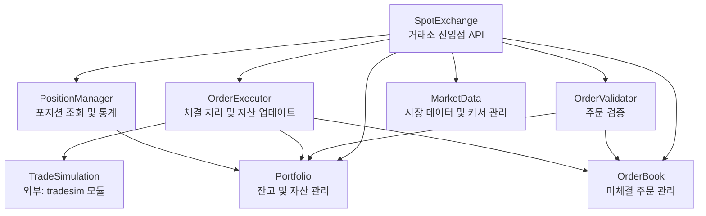

# Architecture - Exchange

## Overview

`exchange` 모듈은 강화학습 환경의 빌딩블록으로, 단일 트레이더의 계정 자산을 관리하고 시뮬레이션된 시장에서 주문을 체결하는 가상 거래소를 제공합니다. 계정 타입(spot/futures/bond 등)별로 별도의 거래소 객체를 제공하며, 현재는 Spot 거래소만 구현합니다.

거래소는 외부 시스템(financial-gateway)으로부터 주문 요청을 받아 자산 검증, 주문 생성, 체결 처리, 자산 업데이트의 전체 라이프사이클을 관리합니다. 실제 체결 시뮬레이션은 tradesim 모듈에 위임하며, 거래소는 계정 관리 및 주문 흐름 제어에 집중합니다.

### Core Features

- **Account Management**: 현금 잔고 및 다수 코인 보유량 관리, 주문 시 자산 잠금/해제
- **Order Validation**: 주문 가능 여부 검증 (자금, 자산 유효성, 미체결 주문 고려)
- **Order Lifecycle**: Order 객체 생성, 미체결 주문 추적, 취소 처리
- **Trade Execution**: tradesim 모듈에 체결 위임 및 결과 반영
- **Market State**: 시장 데이터 틱 처리 및 타임스탬프 관리
- **External Interface**: place_order, cancel_order, get_balance, step 등 거래소 API 제공

### Dependencies

```toml
dependencies = [
    "financial-assets",
    "financial-simulation.tradesim",
]
```

**Notes:**
- `financial-assets`: Order, Trade, Price 등 핵심 도메인 객체 제공. SpotOrder는 생성 시 자체 필드 검증을 수행하므로 Exchange는 이미 유효한 Order 객체를 받는다고 가정
- `financial-simulation.tradesim`: Order + Price → Trade 체결 시뮬레이션

## Structure



**Component Responsibilities:**

**API Layer:**
- **SpotExchange**: Spot 거래소의 외부 인터페이스. 주문 생성, 취소, 잔고 조회, 시장 틱 처리 등 모든 진입점 제공. financial-gateway를 통해 외부 시스템과 연동됨.

**Service Layer:**
- **OrderValidator**: 주문 생성 전 자금 충분성, 자산 보유량 검증. 미체결 주문으로 인한 잠금 자산 고려.
- **OrderExecutor**: 검증된 주문을 tradesim에 위임하여 체결 처리. 체결 결과를 받아 Portfolio 업데이트 및 OrderBook에서 주문 제거.
- **PositionManager**: 현재 보유 포지션 조회 및 통계 제공 (총 자산 가치, 손익률 등).

**Core Layer:**
- **Portfolio**: 현금 잔고 및 다수 코인 보유량 관리. 자산 잠금/해제 (주문 시 필요 자금/자산 예약), 잔고 업데이트.
- **OrderBook**: 미체결 주문 저장 및 조회. order_id 기반 검색, 취소 처리, 조건부 자동 취소 (예: TimeInForce).
- **MarketData**: 심볼별 캔들 데이터 저장 및 관리. 정수 인덱스 커서로 현재 시점 추적, step() 호출 시 다음 틱으로 이동, 심볼별 현재 가격 조회.

**Dependencies:**
- API Layer는 모든 Service 및 Core 컴포넌트에 접근
- Service Layer는 필요한 Core 컴포넌트를 조합하여 사용
- OrderExecutor만 외부 tradesim 모듈에 의존
- Core Layer 컴포넌트들은 서로 독립적

**Notes:**
- 이 문서는 시스템 레벨 컴포넌트 구조와 책임을 정의합니다
- 구체적인 API 명세, 알고리즘, 데이터 구조는 각 컴포넌트의 moduleinfo 문서에서 정의됩니다
- Futures, Bond 등 다른 계정 타입 거래소는 동일한 구조를 따르되 별도 클래스로 구현됩니다

**Development Order and Status:** [Concept Design | Designing | Developing | Testing | Done | Deprecated]
1. [Portfolio] Done
2. [OrderBook] Done
3. [MarketData] Done
4. [OrderValidator] Done
5. [OrderExecutor] Done
6. [PositionManager] Done
7. [SpotExchange] Designing (API 명세 완료, 구현 준비 완료)
