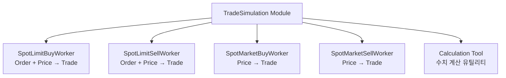

# Architecture - Tradesim

## 개요

`tradesim` 모듈은 금융 거래의 발생을 시뮬레이션하는 핵심 모듈입니다. 클라이언트가 등록한 거래 의도 정보(Order)를 시장 상황과 상호작용시켜 실제 체결(Trade)로 변환하는 과정을 시뮬레이션합니다.

### 핵심 개념

- **Order (주문)**: 클라이언트의 거래 의도를 표현하는 객체 (`SpotOrder`)
  - 지정가(Limit): 특정 가격 이하/이상에서만 체결
  - 시장가(Market): 현재 시장 가격으로 즉시 체결

- **Trade (체결)**: 실제로 발생한 거래를 표현하는 불변 객체 (`SpotTrade`)
  - Order가 시장과 상호작용하여 체결된 결과
  - Wallet에 등록되어 자산 변동 및 장부 작성에 사용

- **시뮬레이션**: 실제 거래소 API 없이 시장 데이터(가격, 거래량)를 기반으로 체결 과정을 재현

## 의존성

- **financial-assets**: Order, Trade, Pair, Token, StockAddress 등 핵심 데이터 구조
- **numpy**: 수치 계산 (슬리피지, 난수 등)

## 데이터

### SpotOrder (financial-assets.order)

```python
class SpotOrder:
    order_id: str                    # 주문 식별자
    stock_address: StockAddress      # 시장 정보
    side: SpotSide                   # BUY / SELL
    order_type: str                  # "limit" / "market"
    price: Optional[float]           # 지정가 (market은 None)
    amount: float                    # 주문 자산 수량
    filled_amount: float             # 체결된 수량 (기본값: 0.0)
    status: str                      # "pending" / "partial" / "filled" / "canceled"
    timestamp: int                   # 주문 생성 시각
    stop_price: Optional[float]      # 스탑 가격 (기본값: None)
    fee_rate: float                  # 수수료율 (기본값: 0.0)

    # 주요 메서드
    def fill_by_asset_amount(amount: float) -> SpotOrder
    def fill_by_value_amount(amount: float) -> SpotOrder
    def remaining_asset() -> float
    def remaining_value() -> float
    def is_filled() -> bool
    def to_canceled_state() -> SpotOrder
```

### SpotTrade (financial-assets.trade)

```python
@dataclass(frozen=True)
class SpotTrade:
    stock_address: StockAddress      # 시장 정보
    trade_id: str                    # 거래 식별자
    fill_id: str                     # 체결 식별자
    side: SpotSide                   # BUY / SELL
    pair: Pair                       # 거래된 자산 쌍 (Token 쌍)
    timestamp: int                   # 체결 시각
    fee: Optional[Token]             # 거래 수수료 (기본값: None)
```

### SpotSide (financial-assets.trade)

```python
class SpotSide(Enum):
    BUY = "buy"      # 매수
    SELL = "sell"    # 매도
```

### Price (financial-assets.price)

```python
@dataclass(frozen=True)
class Price:
    exchange: str    # 거래소
    market: str      # 마켓
    t: int           # timestamp
    h: float         # high (고가)
    l: float         # low (저가)
    o: float         # open (시가)
    c: float         # close (종가)
    v: float         # volume (거래량)

    # 주요 메서드
    def bodytop() -> float          # 몸통 상단
    def bodybottom() -> float       # 몸통 하단
    def body() -> tuple[float, float]       # 몸통 범위
    def head() -> tuple[float, float]       # 위 꼬리 범위
    def tail() -> tuple[float, float]       # 아래 꼬리 범위
    def body_sample() -> float      # 몸통 범위 랜덤 샘플
    def head_sample() -> float      # 위 꼬리 랜덤 샘플
    def tail_sample() -> float      # 아래 꼬리 랜덤 샘플
```

## 모듈 구조



### Calculation Tool

값 정합, 반올림, 슬리피지 계산 등 시뮬레이션에 필요한 수치 계산 유틸리티 함수 모음

**주요 기능:**
- `round_to_min_amount(amount: float, min_amount: float) -> float`: 최소 거래 단위 배수로 내림
- 슬리피지 계산
- 기타 수치 정합 유틸리티

### SpotLimitBuyWorker

지정가 매수 주문 체결 시뮬레이션

**시그니처:** `__call__(sim: TradeSimulation, order: SpotOrder, price: Price) -> List[SpotTrade]`

**동작:**

1. **체결 조건 확인:** 시장 가격(price.c) ≤ 주문 가격(order.price)

2. **가격 범위별 체결 전략:**

   **Body 범위 (price.bodybottom ~ price.bodytop):**
   - 항상 전량 체결
   - 체결 가격: order.price

   **Head/Tail 범위:**
   - 30% 확률: 체결 실패 (빈 리스트 반환)
   - 30% 확률: 전량 체결
   - 40% 확률: 부분 체결
     - `get_price_sample`로 체결 수량 결정
     - `get_separated_amount_sequence`로 1~3개 Trade 분할
     - 각 Trade마다 독립적인 fill_id 생성

### SpotLimitSellWorker

지정가 매도 주문 체결 시뮬레이션

**시그니처:** `__call__(sim: TradeSimulation, order: SpotOrder, price: Price) -> List[SpotTrade]`

**동작:**

1. **체결 조건 확인:** 시장 가격(price.c) ≥ 주문 가격(order.price)

2. **가격 범위별 체결 전략:**

   **Body 범위:**
   - 항상 전량 체결
   - 체결 가격: order.price

   **Head/Tail 범위:**
   - 30% 확률: 체결 실패
   - 30% 확률: 전량 체결
   - 40% 확률: 부분 체결 (1~3개로 랜덤 분할)

### SpotMarketBuyWorker

시장가 매수 주문 즉시 체결 시뮬레이션

**시그니처:** `__call__(sim: TradeSimulation, order: SpotOrder, price: Price) -> List[SpotTrade]`

**동작:**

1. **항상 체결:** 시장가는 무조건 체결

2. **가격 결정:**
   - Head 범위(price.head_sample)에서 가격 샘플링
   - 슬리피지 반영: 매수는 상위 꼬리에서 불리한 가격

3. **수량 분할:**
   - `get_separated_amount_sequence`로 1~3개 Trade 분할
   - 각 Trade마다 다른 가격 적용 (head 범위 내 재샘플링)

### SpotMarketSellWorker

시장가 매도 주문 즉시 체결 시뮬레이션

**시그니처:** `__call__(sim: TradeSimulation, order: SpotOrder, price: Price) -> List[SpotTrade]`

**동작:**

1. **항상 체결:** 시장가는 무조건 체결

2. **가격 결정:**
   - Tail 범위(price.tail_sample)에서 가격 샘플링
   - 슬리피지 반영: 매도는 하위 꼬리에서 불리한 가격

3. **수량 분할:**
   - `get_separated_amount_sequence`로 1~3개 Trade 분할
   - 각 Trade마다 다른 가격 적용 (tail 범위 내 재샘플링)

## 명세

### TradeSimulation

Order와 Price를 받아 적절한 워커로 라우팅하여 Trade 리스트를 반환하는 코어 클래스

**초기화:**
- `calc_tool`: CalculationTool 인스턴스
- 4개 워커 인스턴스 (limit/market × buy/sell)

**주요 메서드:**

`process(order, price: Price) -> List[SpotTrade]`

Order 객체의 타입(limit/market)과 side(buy/sell)를 검사하여 적절한 워커로 라우팅합니다.
워커 호출 시 자신(self)을 첫 번째 파라미터로 전달하여 워커가 계산 도구에 접근할 수 있게 합니다.

`_validate_process_param(order, price: Price) -> bool`

파라미터 타입 검사를 수행합니다.

### CalculationTool

시뮬레이션에 필요한 수치 계산 유틸리티 함수 모음

**메서드 목록:**

#### `round_to_min_amount(amount: float, min_amount: float) -> float`

최소 거래 단위의 배수로 내림합니다.

#### `get_price_sample(min: float, max: float, mean: float, std: float, min_z: float = -2.0, max_z: float = 2.0) -> float`

주어진 가격 범위 내에서 정규분포를 사용하여 가격을 샘플링합니다.

**파라미터:**
- `min`: 최소 가격 (하한)
- `max`: 최대 가격 (상한)
- `mean`: 정규분포의 평균
- `std`: 정규분포의 표준편차
- `min_z`: 최소 z-score (기본값: -2.0)
- `max_z`: 최대 z-score (기본값: +2.0)

**동작:**
1. 정규분포 N(mean, std)에서 랜덤 샘플링
2. z-score를 [min_z, max_z] 범위로 제한
3. 결과를 [min, max] 범위로 클리핑

**활용:**
- 시장가 주문의 슬리피지 시뮬레이션
- 지정가 주문의 부분 체결 시 평균 체결 가격 생성
- 실제 거래소의 호가 분포를 반영한 체결가 생성

#### `get_separated_amount_sequence(base: float, min_trade_amount: float, split_to: int) -> list[float]`

기본 수량을 최소 거래 단위 제약을 지키면서 지정된 개수로 랜덤 분할합니다.

**파라미터:**
- `base`: 분할할 전체 수량
- `min_trade_amount`: 최소 거래 단위 (각 조각은 이 값의 배수)
- `split_to`: 분할할 조각 개수

**동작:**
1. 전체 수량을 랜덤하게 split_to 개로 초기 분할 (Dirichlet 분포)
2. 각 조각을 min_trade_amount의 배수로 조정
3. 남은 잔여량을 마지막 조각에 추가하여 합계 보장

**활용:**
- 부분 체결 시뮬레이션 (한 주문을 여러 Trade로 분할)
- 지정가 주문의 점진적 체결 재현
- 유동성 제한을 고려한 체결 패턴 생성

### 워커 인터페이스

모든 워커는 동일한 시그니처를 따릅니다:

`__call__(sim: TradeSimulation, order: SpotOrder, price: Price) -> List[SpotTrade]`

**파라미터:**
- `sim`: TradeSimulation 객체 (계산 도구 접근용)
- `order`: 처리할 주문
- `price`: 시장 가격 정보

**반환값:**
- 체결된 Trade 리스트 (부분 체결 가능)
