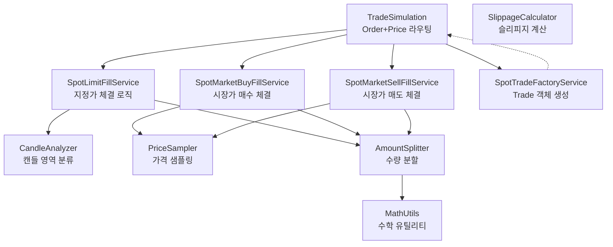

# Architecture - Tradesim

## Overview

`tradesim` 모듈은 금융 거래 주문(Order)을 시장 가격 데이터(Price)와 결합하여 실제 체결(Trade)로 변환하는 시뮬레이션을 제공합니다. 실제 거래소 API 없이 백테스팅 및 전략 검증이 가능하도록 설계되었습니다.

### Core Features

- **Order Processing**: SpotOrder(현물 주문)를 주문 타입(limit/market)과 side(buy/sell)에 따라 적절히 라우팅
- **Fill Simulation**: 캔들 데이터 기반으로 체결 여부, 체결 수량, 체결 가격을 확률적으로 결정
- **Trade Generation**: 체결 파라미터를 받아 SpotTrade 객체 생성 및 수수료 계산

### Dependencies

```toml
dependencies = [
    "financial-assets",
    "numpy>=1.20.0",
    "simple-logger",
]
```

**Notes:**
- `financial-assets`: Order, Trade, Price 등 핵심 도메인 객체 제공
- `numpy`: 확률 분포 샘플링 및 수치 계산
- `simple-logger`: 로깅 데코레이터

## Structure



**Component Responsibilities:**

**API Layer:**
- **TradeSimulation**: Order와 Price를 받아 주문 타입과 side에 따라 적절한 FillService로 라우팅하고, 최종적으로 Trade 리스트를 반환하는 진입점

**Service Layer:**
- **SpotLimitFillService**: 지정가 주문을 캔들 영역(body/head/tail)에 따라 체결 여부와 수량을 결정하고 TradeParams 리스트 생성
- **SpotMarketBuyFillService**: 시장가 매수 주문을 즉시 체결하되, head 영역에서 불리한 가격 샘플링 및 수량 분할
- **SpotMarketSellFillService**: 시장가 매도 주문을 즉시 체결하되, tail 영역에서 불리한 가격 샘플링 및 수량 분할
- **SpotTradeFactoryService**: TradeParams 리스트를 받아 SpotTrade 객체 리스트 생성 및 수수료 계산

**Core Layer:**
- **CandleAnalyzer**: 목표 가격이 캔들의 어느 영역(body/head/tail/none)에 속하는지 분류
- **PriceSampler**: 정규분포 기반으로 가격 범위 내에서 체결 가격 샘플링
- **AmountSplitter**: Dirichlet 분포를 사용하여 주문 수량을 여러 조각으로 분할 (부분 체결 시뮬레이션)
- **SlippageCalculator**: 시장 충격에 따른 슬리피지 계산
- **MathUtils**: 최소 거래 단위 반올림 등 수치 계산 유틸리티

**Dependencies:**
- API Layer는 모든 Service Layer 컴포넌트에 의존
- Service Layer는 필요에 따라 Core Layer 컴포넌트를 조합하여 사용
- Core Layer 컴포넌트들은 서로 독립적이며 재사용 가능

**Notes:**
- 이 문서는 시스템 레벨 컴포넌트 구조와 책임을 정의합니다
- 구체적인 API 명세, 알고리즘, 데이터 구조는 각 컴포넌트의 moduleinfo 문서에서 정의됩니다
