# Architecture - StateCells

## Overview

StateCells는 실시간 제어 로직을 위한 조건부 상태 관리 라이브러리입니다. 히스테리시스, 래치, 디바운스 등 다양한 상태 전환 패턴을 제공하여 센서 데이터 처리, 트레이딩 로직, 임베디드 시스템 제어 등에서 노이즈에 강건하고 예측 가능한 상태 관리를 가능하게 합니다.

각 Cell은 입력 값을 받아 내부 상태를 업데이트하고, 현재 상태를 반환하는 단순하고 일관된 인터페이스를 제공합니다. 복잡한 조건은 여러 Cell을 조합하여 구성할 수 있습니다.

### Core Features

- **Threshold-based Cells**: 임계값 기반 상태 전환 (Hysteresis, Threshold, MultiThreshold)
- **Temporal Cells**: 시간 및 카운트 기반 확정 (Debounce, TimeWindow, Counter)
- **Memory Cells**: 값 유지 및 상태 기억 (Latch, Toggle, EdgeDetect)
- **Change Detection**: 변화율 및 변화량 감지 (RateLimit, ChangeDetect)
- **Composite Cells**: 여러 Cell의 논리적 조합 (Composite, Sequence)
- **Consistent Interface**: 모든 Cell은 update()/get_state() 공통 인터페이스 사용

### Design Philosophy

**단순성과 조합성**
- 각 Cell은 단일 책임을 가지며 독립적으로 동작
- 복잡한 로직은 단순한 Cell들의 조합으로 구성
- 명시적 상태 전환 규칙으로 예측 가능한 동작 보장

**노이즈 내성**
- 센서 노이즈, 일시적 스파이크에 강건한 상태 전환
- Debounce, Hysteresis 등으로 불안정한 입력 처리
- 시간 기반 확정으로 우발적 상태 변경 방지

**범용성**
- 도메인 독립적 설계 (트레이딩, IoT, 로봇 제어 등 모든 분야 적용 가능)
- 타입에 구애받지 않는 값 처리 (숫자, bool, 문자열 등)
- 확장 가능한 구조로 새로운 Cell 타입 추가 용이

### Dependencies

```toml
dependencies = [
    "portion>=2.5.0"
]
```

**Notes:**
- `portion`: 수학적 구간(Interval) 표현 및 포함 검사 (HysteresisCell 등에서 사용)

## Structure

```mermaid
graph TB
    StateCell[StateCell<br/>Base abstract class defining common interface]

    ThresholdGroup[Threshold Group<br/>Value-based state transitions]
    TemporalGroup[Temporal Group<br/>Time/count-based confirmations]
    MemoryGroup[Memory Group<br/>State retention and latching]
    ChangeGroup[Change Group<br/>Rate and delta detection]
    CompositeGroup[Composite Group<br/>Logical combinations]

    HysteresisCell[HysteresisCell<br/>Interval-based with overlap]
    ThresholdCell[ThresholdCell<br/>Auto-generated continuous ranges]

    DebounceCell[DebounceCell<br/>N-consecutive confirmation]
    TimeWindowCell[TimeWindowCell<br/>Duration-based confirmation]
    CounterCell[CounterCell<br/>Event counting]

    LatchCell[LatchCell<br/>Set/Reset latch]
    ToggleCell[ToggleCell<br/>Toggle switch]
    EdgeDetectCell[EdgeDetectCell<br/>Rising/Falling edge detection]

    RateLimitCell[RateLimitCell<br/>Rate of change limiting]
    ChangeDetectCell[ChangeDetectCell<br/>Delta threshold detection]

    CompositeCell[CompositeCell<br/>AND/OR/XOR combinations]
    SequenceCell[SequenceCell<br/>Pattern sequence detection]

    StateCell --> ThresholdGroup
    StateCell --> TemporalGroup
    StateCell --> MemoryGroup
    StateCell --> ChangeGroup
    StateCell --> CompositeGroup

    ThresholdGroup --> HysteresisCell
    ThresholdGroup --> ThresholdCell

    TemporalGroup --> DebounceCell
    TemporalGroup --> TimeWindowCell
    TemporalGroup --> CounterCell

    MemoryGroup --> LatchCell
    MemoryGroup --> ToggleCell
    MemoryGroup --> EdgeDetectCell

    ChangeGroup --> RateLimitCell
    ChangeGroup --> ChangeDetectCell

    CompositeGroup --> CompositeCell
    CompositeGroup --> SequenceCell

    CompositeCell -.uses.-> StateCell
    SequenceCell -.uses.-> StateCell
```



**Component Responsibilities:**

- **StateCell**: 모든 Cell의 기본 인터페이스 정의. update() 메서드로 상태 갱신, get_state()로 현재 상태 조회, reset()으로 초기화하는 프로토콜 제공

- **Threshold Group**: 값 기반 임계값 비교 및 상태 전환 담당
  - **HysteresisCell**: 구간 직접 지정, 겹침 허용 (히스테리시스 효과)
  - **ThresholdCell**: N개 threshold로 N+1개 연속 구간 자동 생성, 경계 교차 시 상태 전환

- **Temporal Group**: 시간 및 발생 횟수 기반 상태 확정
  - **DebounceCell**: N번 연속 동일한 값이어야 상태 확정 (버튼 디바운스, 노이즈 제거)
  - **TimeWindowCell**: 일정 시간 동안 조건이 유지되어야 상태 전환
  - **CounterCell**: 특정 조건이 N번 발생해야 상태 전환

- **Memory Group**: 상태 유지 및 메모리 기능
  - **LatchCell**: Set 신호로 ON, Reset 신호로 OFF (SR Latch)
  - **ToggleCell**: Trigger 신호마다 상태 반전
  - **EdgeDetectCell**: Rising/Falling edge 감지 및 펄스 출력

- **Change Group**: 값의 변화량 및 변화율 감지
  - **RateLimitCell**: 값의 변화율을 제한하여 급격한 변화 방지 (Slew Rate Limiter)
  - **ChangeDetectCell**: 이전 값 대비 일정 이상 변화시 감지

- **Composite Group**: 여러 Cell의 논리적 조합
  - **CompositeCell**: 여러 Cell의 상태를 AND/OR/XOR/NOT 등으로 조합
  - **SequenceCell**: 특정 순서의 이벤트 패턴 감지

**Dependencies:**
- 모든 구체 Cell 클래스는 StateCell 추상 클래스를 상속
- CompositeCell과 SequenceCell은 다른 StateCell 인스턴스를 내부적으로 사용하여 복합 로직 구성
- 각 그룹 내의 Cell들은 서로 독립적이며 직접적인 의존성 없음

**Notes:**
- 이 문서는 시스템 레벨의 컴포넌트 식별 및 관계를 정의
- 각 Cell의 구체적인 구현 패턴, API, 데이터 구조는 별도의 moduleinfo 문서에서 정의
- 1차 구현 우선순위: HysteresisCell, ThresholdCell, DebounceCell, LatchCell
- 2차 구현: TimeWindowCell, CounterCell, ToggleCell, EdgeDetectCell
- 3차 구현: RateLimitCell, ChangeDetectCell, CompositeCell, SequenceCell

**Development Order and Status:**
1. [StateCell (Base)] Done
2. [StateManager] Done
3. [HysteresisCell] Done
4. [ThresholdCell] Done
5. [DebounceCell] Concept Design
6. [LatchCell] Concept Design
7. [TimeWindowCell] Concept Design
8. [CounterCell] Concept Design
9. [ToggleCell] Concept Design
10. [EdgeDetectCell] Concept Design
11. [RateLimitCell] Concept Design
12. [ChangeDetectCell] Concept Design
13. [CompositeCell] Concept Design
14. [SequenceCell] Concept Design