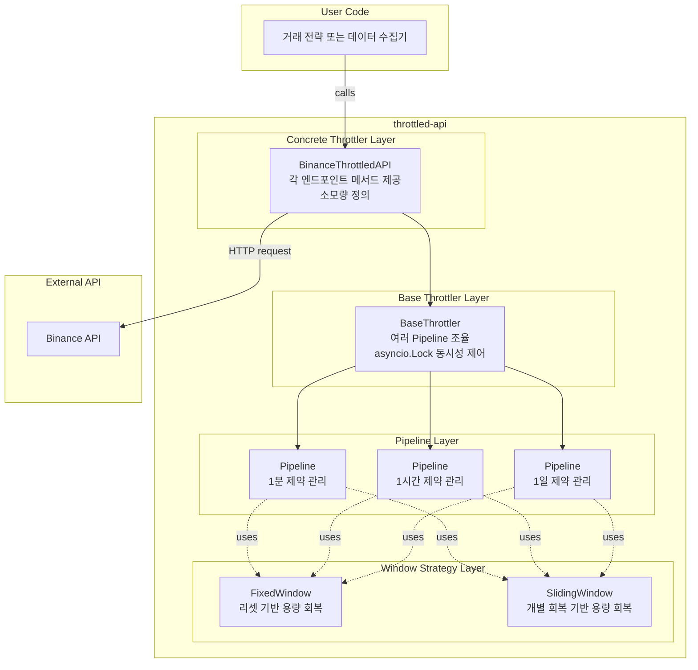

# Architecture - Throttled API

## Overview

`throttled-api`는 외부 API(거래소, 데이터 제공자 등)의 레이트 제한을 자동으로 관리하는 쓰로틀링 래퍼 시스템입니다. 각 API 엔드포인트별 사용량을 추적하고, 제약을 초과하기 전에 자동으로 요청을 지연시켜 API 제한 위반을 방지합니다.

사용자는 구체 API(예: Binance API)를 감싼 쓰로틀 적용 래퍼 객체를 통해 API를 호출하며, 내부적으로 제약 초과 시 자동 대기가 수행됩니다. asyncio 기반 비동기 처리로 대기 중에도 다른 작업을 병렬 처리할 수 있습니다. 요청 실패 시 결과를 그대로 반환하며, 재시도는 호출자의 책임입니다.

### Core Features

- **Multi-Window Strategy**: Fixed Window(특정 시간 리셋)와 Sliding Window(개별 회복) 전략 지원
- **Multi-Timeframe Constraints**: 1초당, 1분당, 1시간당 등 여러 타임프레임 제약을 동시에 관리
- **Async Auto-Wait**: asyncio 기반으로 제약 초과 시 자동 대기, 대기 중 다른 작업 병렬 수행 가능
- **Cost Calculation**: 각 엔드포인트 메서드 내부에서 파라미터에 따른 소모량 계산
- **Event Emission**: 사용률 임계값 하회 시 노티피케이션 이벤트 발행 (옵저버 패턴)
- **Refund Mechanism**: 요청 실패 시 소모량 환불 지원

### Design Philosophy

**쓰로틀러의 단순한 책임**

쓰로틀러는 "지금 보낼 수 있는가?"를 판단하고 사용량을 차감하는 것에만 집중합니다. 복잡한 큐 관리나 워커 프로세스를 만들지 않으며, asyncio의 스케줄링에 의존하여 단순하게 설계됩니다. 각 요청이 스스로 대기하고, 조건이 만족되면 자동으로 진행됩니다.

**차감식 용량 관리**

모든 Window 전략은 `remaining` 값으로 남은 용량을 차감식으로 관리합니다. 초기값 `remaining = limit`에서 시작하여, `consume(cost)` 호출 시 `remaining -= cost`로 차감합니다. `can_send(cost)` 판단은 `remaining >= cost` 조건으로 이루어집니다.

**Fixed vs Sliding의 본질적 차이**

- **Fixed Window**: 특정 시점(예: 매분 0초)에 전체 용량이 리셋됩니다. 단일 카운터(`remaining`)로 간단히 관리되며, 리셋 시각 도달 시 `remaining = limit`으로 회복됩니다.
- **Sliding Window**: 각 사용 시점부터 정확히 N 시간 후 개별 회복됩니다. `(timestamp, cost)` 히스토리를 큐로 관리하며, `can_send()` 호출 시 만료된 항목을 제거하고 그 cost만큼 `remaining += cost`로 회복시킵니다.

두 방식 모두 사용자에게는 동일한 `can_send()`, `consume()` 인터페이스를 제공하지만, 내부 구현은 완전히 다릅니다.

**소모량 계산**

구체 쓰로틀러의 각 엔드포인트 메서드는 파라미터를 검사하여 소모량을 직접 계산합니다. 예를 들어, `get_kline(limit=100)`은 1 포인트, `get_kline(limit=1000)`은 2 포인트처럼 메서드 내부에서 분기 처리합니다. 이를 통해 엔드포인트와 소모량 규칙의 정합성이 자연스럽게 보장됩니다.

**동시성 안전성**

여러 코루틴이 동시에 같은 쓰로틀러 인스턴스를 호출할 수 있으므로, `asyncio.Lock`을 사용하여 상태 변경(can_send + consume)을 원자적으로 처리합니다. 락은 체크-차감 블록에만 적용되며, 실제 API 호출은 락 해제 후 수행되어 블로킹을 최소화합니다.

**래퍼 패턴**

구체 쓰로틀러(예: `BinanceThrottledAPI`)는 실제 API 클라이언트를 내부에 보유하며, 각 엔드포인트 메서드를 제공합니다. 사용자는 래퍼를 통해 API를 호출하고, 내부적으로 쓰로틀 체크 → API 호출 → 결과 반환이 수행됩니다. 쓰로틀링이 투명하게 적용되어 사용자는 평범한 API 호출처럼 사용할 수 있습니다.

**이벤트 발행과 옵저버 패턴**

각 Pipeline은 사용률이 지정 임계값(예: 0.5 = 50% 소모)을 하회하면 노티피케이션 이벤트를 발행합니다. 이벤트는 `timeframe`, `remaining_rate`, `remaining_cap` 정보를 담고 있으며, 옵저버 패턴으로 외부 리스너에게 전달됩니다.

Pipeline이 이벤트를 발행하면, BaseThrottler가 등록된 모든 리스너에게 전달합니다. 임계값과 이벤트 발행 여부는 각 Pipeline 초기화 시 개별 설정 가능하며, 외부에서 이벤트를 어떻게 처리할지는 리스너 구현에 달려 있습니다.

**Soft Rate Limiting (균등 분배 방식)**

남은 용량을 남은 시간 동안 균등하게 분배하여 자동으로 요청 간격을 조절합니다. 이를 통해 burst를 방지하고 용량을 효율적으로 분산시킵니다.

- **계산식**: `delay = cost × (time_left / remaining)`
  - FixedWindow: `time_left` = 리셋까지 남은 시간
  - SlidingWindow: `time_left` = 가장 오래된 항목 만료까지 남은 시간
- **최대 딜레이**: `max_soft_delay` (기본 0.5초)로 제한
- **경고 로깅**: 계산된 딜레이가 max 초과 시 WARNING 로깅

예시 (limit=6000, 20초에 3000 소비, 40초 남음):
- delay_per_unit = 40 / 3000 = 0.0133초
- cost=1 → 0.013초 대기
- cost=25 → 0.33초 대기
- cost=100 → 1.33초 계산되지만 0.5초로 cap + 경고

경고 메시지는 사용자가 요청 패턴(빈도, cost)을 재조정해야 함을 의미합니다. 대기 시간이 max_soft_delay를 초과한다는 것은 남은 용량 대비 요청 속도가 과도함을 나타냅니다.

### External Dependencies

```toml
dependencies = []  # 코어 쓰로틀링은 외부 의존성 없음

[project.optional-dependencies]
binance = ["binance-connector>=3.12.0"]
upbit = ["upbit-client>=1.0.0"]
all = ["binance-connector>=3.12.0", "upbit-client>=1.0.0"]
```

**Optional Dependencies:**
- `binance`: Binance API 래퍼 사용 시 필요 (`pip install throttled-api[binance]`)
- `upbit`: Upbit API 래퍼 사용 시 필요 (`pip install throttled-api[upbit]`)
- `all`: 모든 거래소 래퍼 사용 시 필요 (`pip install throttled-api[all]`)

## Structure

### High-Level Architecture



### Component Responsibilities

**Concrete Throttler Layer:**

- **BinanceSpotThrottler**: Binance Spot API의 각 엔드포인트를 메서드로 제공하며, 각 메서드는 파라미터를 기반으로 weight를 직접 계산합니다. BaseThrottler를 상속받아 `_check_and_wait(cost)` 메서드를 사용하여 쓰로틀 체크를 수행한 후 실제 API를 호출합니다. REQUEST_WEIGHT(분당 6000), RAW_REQUESTS(5분당 61000) 등 다중 제약을 관리합니다.

- **UpbitSpotThrottler**: Upbit Spot API의 각 엔드포인트를 카테고리(QUOTATION, EXCHANGE_ORDER, EXCHANGE_NON_ORDER)별로 제공합니다. 각 카테고리는 초당/분당 독립적인 제약을 가지며, 총 6개 Pipeline을 동시에 관리합니다. Binance와 달리 weight가 아닌 요청 횟수 기반 제약입니다.

**Base Throttler Layer:**

- **BaseThrottler**: 여러 Pipeline을 관리하며, `_check_and_wait(cost)` 메서드를 제공합니다. 이 메서드는 모든 Pipeline이 통과할 때까지 asyncio로 대기하고, 통과 시 모든 Pipeline에 소모량을 차감합니다. `asyncio.Lock`을 사용하여 동시성을 제어하며, 각 Pipeline에 대한 초기화 설정(타임프레임, 전략, 제한값, 이벤트 임계값)을 받아 Pipeline 객체를 생성합니다. Pipeline에서 발행된 이벤트를 등록된 외부 리스너에게 전달하는 옵저버 패턴의 Subject 역할도 수행합니다.

**Pipeline Layer:**

- **Pipeline**: 단일 타임프레임(1분, 1시간 등) 제약을 관리합니다. Window 전략 객체를 내부에서 사용하며, `can_send(cost)`, `consume(cost)`, `wait_time()` 메서드를 Window에 위임합니다. Pipeline의 독자적 책임은 사용률 모니터링과 이벤트 발행입니다. `consume()` 호출 시 남은 용량을 확인하여 임계값 하회 시 노티피케이션 이벤트를 발행합니다. 요청 실패 시 `refund(timestamp, cost)` 메서드를 통해 소모량을 환불하며, 이는 Window 전략에 위임됩니다.

**Window Strategy Layer:**

- **FixedWindow**: 특정 시간에 전체 용량을 리셋하는 전략입니다. `remaining` 카운터와 `next_reset_time`을 관리하며, `can_send(cost)` 시 현재 시각을 먼저 확인하여 리셋 시각 도달 시 `remaining = limit`으로 회복합니다. `consume(cost)`는 `remaining -= cost`로 차감하고, `refund(timestamp, cost)`는 `remaining += cost`로 환불합니다.

- **SlidingWindow**: 개별 사용 시점부터 정확히 N 시간 후 회복하는 전략입니다. `remaining` 값과 `(timestamp, cost)` 히스토리 큐를 함께 관리합니다. `can_send(cost)` 호출 시 만료된 항목을 큐에서 제거하고 해당 cost만큼 `remaining += cost`로 회복시킵니다. `consume(cost)`는 히스토리에 `(now, cost)`를 추가하고 `remaining -= cost`로 차감합니다. `refund(timestamp, cost)` 호출 시 큐를 역순으로 순회하며 동일한 timestamp와 cost를 가진 첫 번째 항목을 찾아 제거하고 `remaining += cost`로 환불합니다. 정확히 어떤 요청인지는 중요하지 않으며, 같은 시점의 같은 cost면 총 가치가 동일합니다.

### Component Dependencies

```
Window Strategy (FixedWindow, SlidingWindow)
    ↑
Pipeline (타임프레임별 제약 관리 + 이벤트 발행)
    ↑
BaseThrottler (여러 Pipeline 조율 + 이벤트 전달)
    ↑
Concrete Throttler (각 API 래퍼 구현)
    ↑
User Code
```

**Data Flow:**
1. 사용자가 구체 쓰로틀러 메서드 호출
   - Binance 예: `await binance.get_kline(...)`
   - Upbit 예: `await upbit.get_ticker(markets=["KRW-BTC"])`
2. 메서드 내부에서 파라미터 검사 후 소모량 계산
   - Binance: weight 계산 (엔드포인트 + 파라미터 기반)
   - Upbit: cost=1 (모든 요청 동일), category 결정
3. `await self._check_and_wait(cost, category=...)` 호출
4. BaseThrottler가 해당 카테고리의 Pipeline들 체크:
   - 모든 Pipeline의 `can_send(cost)` 확인
   - 하나라도 실패 시 `max(pipeline.wait_time())` 대기
   - 모두 통과 시 모든 Pipeline에 `consume(cost)` 호출 및 timestamp 기록
   - `consume()` 시 Pipeline이 임계값 체크하여 필요 시 이벤트 발행
5. 실제 API 호출 (거래소별 HTTP 클라이언트 사용)
6. 결과 반환 (실패 시 `refund(timestamp, cost)` 호출)

### Notes

- 이 문서는 시스템 레벨 컴포넌트 구조와 책임을 정의합니다
- 구체적인 API 명세, 메서드 시그니처, 알고리즘, 데이터 구조는 각 컴포넌트의 moduleinfo 문서에서 정의됩니다
- 패턴 선택(CPSCP, SDW 등)과 디렉토리 구조는 design-module-implementation 단계에서 결정됩니다

**Development Order and Status:** [Concept Design | Designing | Developing | Testing | Done | Deprecated]
1. [Done] FixedWindow - 고정 윈도우 전략
2. [Done] SlidingWindow - 슬라이딩 윈도우 전략
3. [Done] Pipeline - 타임프레임별 제약 관리
4. [Done] BaseThrottler - 다중 Pipeline 조율
5. [Done] BinanceSpotThrottler - Binance Spot API 구현
6. [Done] UpbitSpotThrottler - Upbit Spot API 구현
